## Great mathematicians
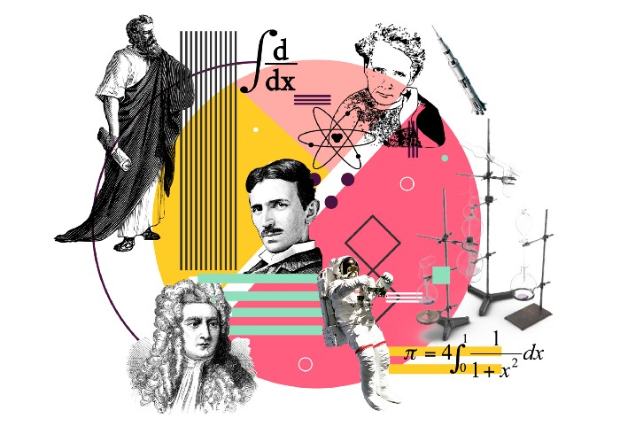

Archimedes used calculus as a simple way of thinking that was never seen before. On the other hand, [Richard Feynman held that calculus was the language that God had used when creating this universe](https://www.amazon.com/Language-God-Talks-Science-Religion/dp/031607845X). In reality, both are correct. Not only is calculus a form of thinking, but it is also a way to explain an unknown occurrence. If we look further into it, we can assume they are the same thing. After all, language is the spoken form of thoughts. (*Let us ignore those who talk without thinking*).

Ever since [Leibniz](https://en.wikipedia.org/wiki/Gottfried_Wilhelm_Leibniz) proposed calculus to the world, mathematicians and physicists alike have applied calculus to physics laws that they believed to be true that they could not prove. Aside from that, those with a grasp of mathematical thinking have always used calculus’s foundation, mathematical thinking, to solve complex problems around them.

**Therefore it is no exaggeration to say that anything and everything around us is tied to calculus.**

Calculus deals with things that are constantly changing. More specifically, calculus analyzes constant changes and helps us act with more foresight. It also helps us find optimal solutions to problems that occur because of continuous changes.

## Two branches
The calculus we use and teach today is split into two main branches: [differential calculus](https://en.wikipedia.org/wiki/Differential_calculus) and [integral calculus](https://en.wikipedia.org/wiki/Integral). These two are like opposite siblings to each other. That is because if you take the derivative of a function and then take the integral of it, you return to where you started.

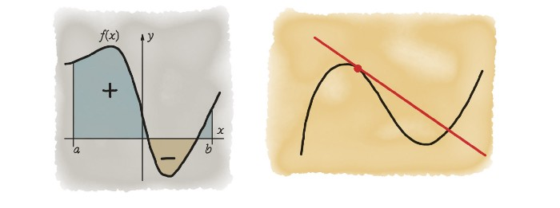




Examples include continually changing things that we need to make graphs of. **Blood pressure, heart rate, stock markets, the weight of rockets, the speed of a runner, air pressure and temperature, and the population of bacteria** are some of the many vital examples. We use differential calculus when analyzing the curved graphs, or parabolas, that map these events to find instantaneous rates. That means that **if we zoom in far enough into a parabola and see a linear line**, we can find the average or the slope. An example is if you look at a photograph of Usain Bolt running, you don't see him running. However, it is clear that he is running. We use differential calculus to find the speed at which he is running at that exact instance (instantaneous rate).




In this article, I will talk about calculus’s applications, a subject I have been researching for a long time and have tried to simplify above. I want to mention that I have greatly benefited from the lectures of incredible mathematicians such as [Ali Nesin](https://www.alinesin.org) and [Steven Strogatz](http://www.stevenstrogatz.com) while writing this article. In my own words, I will attempt to share with you the examples that they taught their students during their lessons.


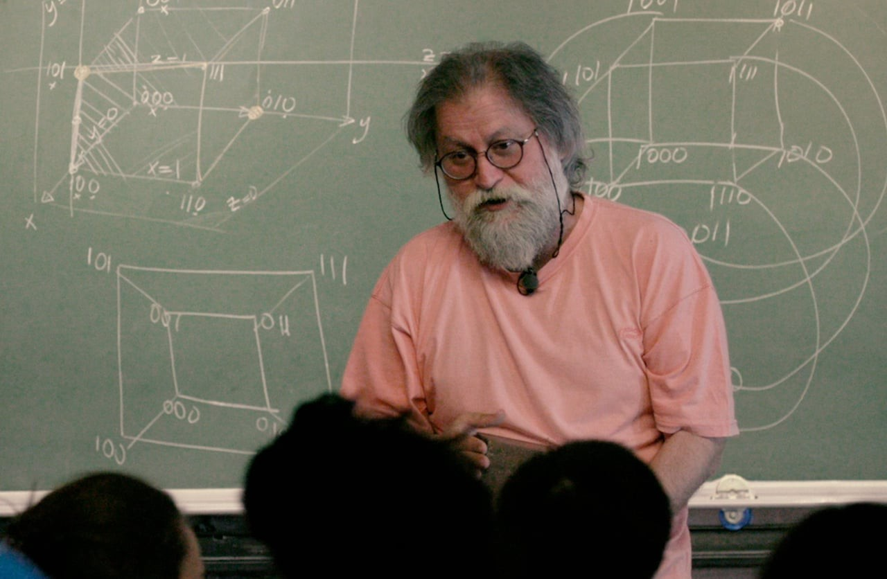
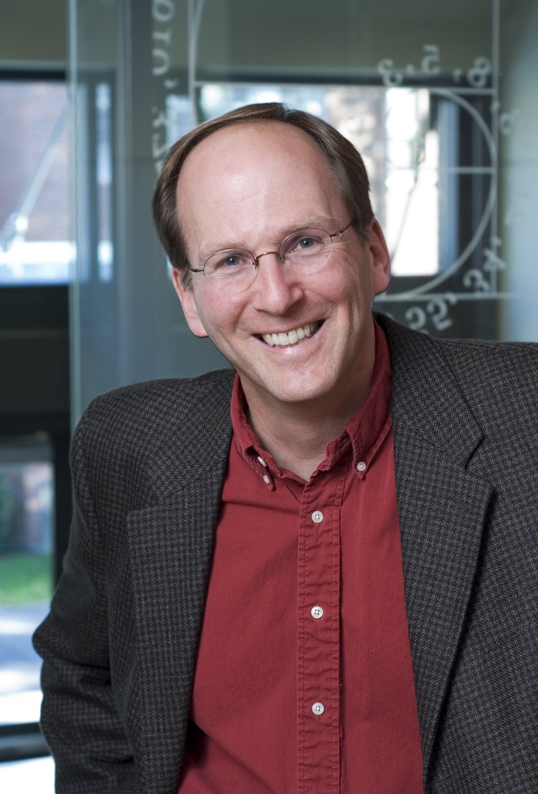


I have had the honor of receiving part of my university mathematics education from one of today’s greatest mathematicians, Ali Nesin. My professor, a true mathematics fanatic, constantly urged us to learn to think like a mathematician. He stated that everyone, including the shop owner from whom we would get bread, our next-door neighbor, and even the politicians that lead our country. Yes, even the politicians that run the country. While that last statement might seem like a utopian saying, some politicians possess this sort of thinking.

## Abraham Lincoln
As a young lawyer living in a dormitory, every night, when everyone retreated to their beds to sleep, [Abraham Lincoln](https://en.wikipedia.org/wiki/Abraham_Lincoln) would read a book that possibly no other law student had read before. The book was written 2300 years ago by a Greek mathematician named Euclid, [Euclid's Elements](https://www.amazon.com/Oliver-Byrne-First-Elements-Euclid/dp/3836544717). Contrary to popular belief, Elements of Euclid wasn't merely a geometry book. **Using triangles, lines, and circles, Euclid explained to humanity why certain things were absolute.** After reading that book, Lincoln changed how he thought and spoke. Lincoln associated the reason he read that book with wanting to learn how to respond to situations he came across rationally. Soon after, Lincoln would come to lead a large nation, and the decisions he would make would affect millions of lives. As a lawyer, he had to master rational thinking to impress the judges that he would go in front.

The above story comes from an excerpt from [Carl Sandburg’s “Abraham Lincoln, the Prairie Years and the War Years.”](https://www.amazon.com/Abraham-Lincoln-Prairie-Library-Presidents/dp/0883658321) It is also explained in [William Dunham’s “Journey Through Genius.”](https://www.amazon.com/Journey-through-Genius-Theorems-Mathematics/dp/014014739X)


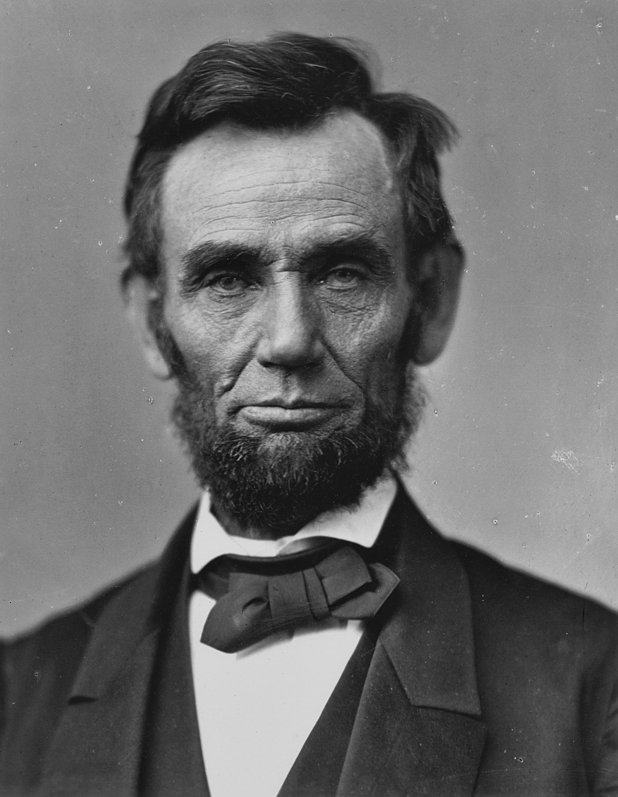



In reality, Lincoln’s obsession with [Euclid’s Elements](https://www.amazon.com/Byrne-Six-Books-Euclid-Multilingual/dp/3836559382) is a perfect example of how we can apply mathematics to the real world. **In a theoretical educational system, a teacher would be deemed successful if they taught students how to associate the things they learn with the real world.** In other words, if a student can recognize something they have learned in the real world, it will have a more meaningful place in their mind.

## Meaningful MATH
As a mathematics teacher, I was mesmerized when I learned about this approach. Every mathematician and physicist since humankind’s creation has applied mathematics to understand and teach others the world we live in, our universe, and even the God they believe in. Ancient Greeks’ curiosity about geometry resulted from their struggle to understand this universe and the God that created it. If we look at it from this perspective, we can assume that humanity figured out the correct education system thousands of years ago. Even further, we can assume that today’s mathematics and physics teachers are fortunate.

Unfortunately, I don’t think we can come to the same conclusion when we look at the statistics. Mathematics remains a nightmare for a vast majority of students. A[ccording to the Institute of Education Sciences, approximately 93 percent of Americans experience some level of math anxiety.](https://eric.ed.gov/?id=ED536509) However, mathematics is the foundational bridge between everything we possess in the real world.


The odds of a student not being able to apply what they learn in a math classroom outside of it are zero.


Then why, as teachers in general, can we not achieve this? There are many direct and indirect reasons for this. Reasons such as the teacher performing in relation to the salary they receive, the fact that they have to do more paperwork than teach, the irrelevant requests of the school administration, or the use of incorrect methods are at the top of the list. In my opinion, however, this is more due to the **contents of the curriculum**. When teaching the material related to their curriculum, teachers today put the direct result in front of the student, and they don’t delve into the question of why the thing they teach works. ***Whenever a student asks, “why are we learning this?” they completely miss the opportunity to mesmerize the student by replying with something out of the cut and dry, pre-determined, cliche answer choices.***

At the top of the list of things that depress me the most in this life is that students are introduced to the **concept of proof** very late. ***The idea of “proof” should be taught to the student as soon as their brain develops abstract thinking.*** For example, when a student starts learning to find the area of a circle, they memorize the **`πr²` (pi times r square)** formula, solve a few standard questions, and then move on to the next topic. That is, in my opinion, the greatest mistake that is made in mathematics education. As teachers, **we must also explain where the formula πr² derives from**. Therefore, we have to teach mathematical thinking, or in other words, “calculus.”


While it may seem absurd to you, I believe that a child learning how to prove something is one of their fundamental rights, next to water, electricity, and access to the internet.


Even further, teaching this method of thinking isn’t hard at all. For example, [Steven Strogatz](https://www.amazon.com/s?k=Steven+Strogatz) explains brilliantly in his latest book “[Infinite Powers: How Calculus Reveals the Secrets of the Universe](https://www.amazon.com/Infinite-Powers-Calculus-Language-Universe/dp/1786492970)” what is accepted as calculus’s birth, how we measured the area of a circle.

In the past, it was straightforward for man to find the area of proper shapes. For example, the area of a square could easily be calculated with the `base x height`  formula. But how would we find the area of curved shapes like circles? This question was one that the real father of calculus would ponder extensively.

Many people today know [Archimedes](https://www.amazon.com/Works-Archimedes-Dover-Books-Mathematics/dp/0486420841) as the one who discovered water’s floating properties [[Archimedes’ principle]](https://en.wikipedia.org/wiki/Archimedes'_principle). However, that was not Archimedes’ most significant discovery. **His greatest gift to humanity was the method of mathematical thinking that he applied when attempting to find the area of the circle.**

There was a complex problem in front of Archimedes, and he did not know how to overcome it. After a while, Archimedes figured out that he had to approach the problem from a different standpoint. First, he split the problem into smaller pieces. After all, managing small problems is a lot easier. He split the circle into four smaller pieces first and then arranged them as shown below. The area of the new shape had to be the same as that of the circle anyways.

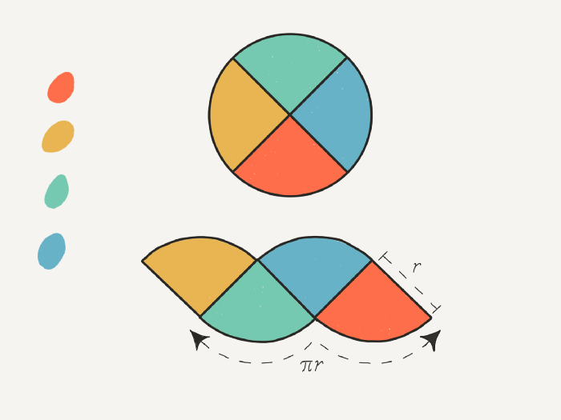

**Archimedes had solved the problem.** He quickly went one step further, split the circle into eight smaller pieces, and arranged them as shown below. Archimedes was delighted. The resulting shape was pretty much a parallelogram. Meaning it was a shape he could use the base*height formula to find the area.

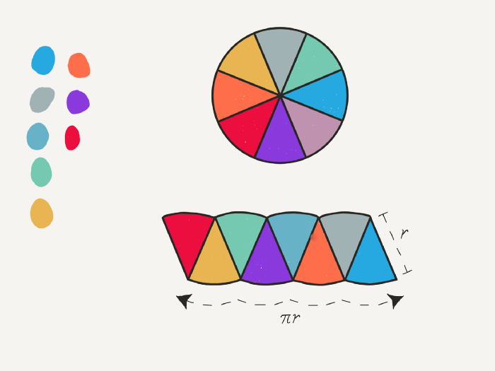

Archimedes then split the circle into 16, 32, and 64 pieces, which you may have expected if you approached the incident instinctively. **The more pieces the circle was divided into, the more the resulting shape resembled a parallelogram.** Archimedes concluded that **if we were to do this operation infinitely, we would have the area of the circle and develop the πr² formula.**

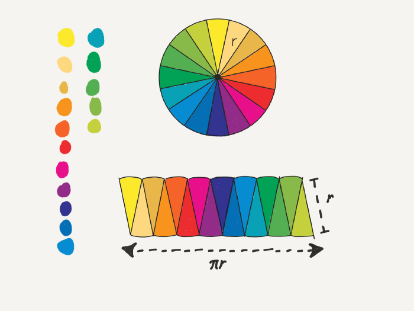

**The miraculous example above is a summary of calculus.** Breaking apart the problems that people can’t solve into smaller portions and then solving them individually before combining them is calculus’s basic idea.

Yes, calculus is a straightforward method of thinking. When solving a Calculus problem, the **infinite division into smaller parts is the only thing done differently**. When acquiring a derivative or integral, you are doing an action infinitely.

Unfortunately, we don’t teach this idea to our students. ***I sincerely do not know why an education system that believes in students applying their knowledge to the real world fails to teach students such a magnificent and straightforward thing.*** That is, even though calculus is an unfathomable blessing for mathematics and science teachers. That is because calculus is a language we can use to explain everything around us.

As you recall, I started the article with a truth that [Richard Feynman](https://www.amazon.com/Richard-P-Feynman/e/B000AQ47U8) believed in. To Feynman, “calculus is the language in which God speaks.” Some of you may refute this claim by saying that Feynman didn’t believe in God. However, Steven Strogatz explains brilliantly why Feynman made this claim in his “[🎥 The Beauty of Calculus](https://www.youtube.com/watch?v=1r6893ga_So)” lecture at Yale University.

[Harman Wouk](https://www.amazon.com/Herman-Wouk/e/B000APY7U4) is an award-winning writer. He generally writes historical novels. He wants to write a very detailed novel about World War II. The result of the [Manhattan Project](https://en.wikipedia.org/wiki/Manhattan_Project), the atomic bomb, would determine the war’s end. That is why Herman Wouk wants to speak with the then-young scientist who worked on the Manhattan Project, Richard Feynman. That is because one of the most well-known scientists of the modern era is Richard Feynman. After a pleasant conversation, Feynman asks Wouk if he knows calculus. When Wouk gives a negative response, “[You had better learn it; it’s the language God talks](https://www.amazon.com/Language-God-Talks-Science-Religion/dp/B005DIALXU),” says Feynman.

Herman Wouk was a believer and did as Feynman said. He hired a private teacher to learn calculus, and he wanted to enroll in a high school and learn from the basics. Afterward, he wrote a book about religion and science called “The Language God Talks.” In his book, this paragraph is written:


I picked up and skimmed freshman texts in college bookstores, hoping to come across one that might help a mathematical ignoramus like me, who had spent his college year in the humanities...


Feynman didn’t just say this for the sake of conversation, either. Many recognized scientists before him were also aware of this truth. For example, [Newton](https://en.wikipedia.org/wiki/Isaac_Newton) wondered why the Moon in the sky didn’t fall to Earth. He had some things in mind but could never explain them; neither his Latin nor his English was enough to explain them. After learning calculus, **he explained the miraculous situation to humanity in explicit detail using differential equations**. After Newton, mathematicians and physicists constructed the modern world step-by-step using calculus.

For example, they were curious about the people living on the other side of the world and invented wireless communication to reach them instantly. They became curious about the Moon, which they saw every night, and sent a man up there. **They wanted to free fall from the edge of space and were able to calculate the exact spot the free faller would land at.** Invisible to the naked eye, they thought the atom must have an incredible amount of energy, so they split it and discovered nuclear energy. **They were tired of waiting nine months to see the gender of a baby, so they invented a way to know the baby's state of health.** They made maps detailed enough to see singular streets from the satellite images they took and effectively erased the struggle of finding your way home.

The examples that I have listed above all have calculus behind them. Steven Strogatz supports this claim in his lecture mentioned above at Yale University by explaining how calculus helped us discover electromagnetic fields.


Calculus is one of the most imaginative and consequential triumphs of human creativity. In this talk, famed mathematician Steven Strogatz will investigate its origins and then show how it, in partnership with medicine, philosophy, science, and technology, reshaped the course of civilization and helped make the world modern.  The Franke Program in Science and the Humanities is a new initiative at Yale that aims to foster communication, mutual understanding, collaborative research and teaching among diverse scientific and humanistic disciplines. It is made possible through the generosity of Richard (‘53) and Barbara Franke.

 

    start: 0,
    allowfullscreen: 1,
    autoplay: 0,
    hl: en,
    cc_lang_pref: en,
    cc_load_policy: 1,
    color: white,
    controls: 1,
    disablekb: 0,
    enablejsapi: 1,
    fs: 0,
    iv_load_policy: 3,
    loop: 0,
    modestbranding: 1,
    playsinline: 0,
    privacy_mode: yes,
    rel: 0,
    showinfo: 0,
    origin: blog.richiebartlett.com,
    widget_referrer: blog.richiebartlett.com



Almost everyone has played with magnets in their youth. And, very naturally, you were probably mesmerized by the invisible field around them. That is because children have a particular interest in designs and symmetry. That is why middle and high school students are interested in the patterns that iron powder forms around a magnet. That occurrence, now called [electromagnetism](https://en.wikipedia.org/wiki/Electromagnetism), could not be explained until the 1800s. Everyone saw the mesmerizing shapes formed around a magnet, but no one could explain why. [Michael Faraday](https://en.wikipedia.org/wiki/Michael_Faraday) pondered this question extensively but could not explain it to the people around him because he lacked sufficient mathematical knowledge. Then, an incredible mathematician named [James Maxwell](https://en.wikipedia.org/wiki/James_Clerk_Maxwell) thought he could use what Newton used to explain gravity, calculus, to describe this phenomenon.

First, Maxwell took all of Faraday's physics notes and mathematically formulated them with calculus's help. Then, without changing them, he rewrote those formulas differently. Using one formula, he discovered others, and he tried to comprehend them using a different perspective. Finally, one of the equations he found was the answer to the question he was looking for. He turned all of Faraday's knowledge into twenty differential equations with 20 equations. Those equations would explain how the magnetic field that Faraday described created electromagnetic waves. His work was later published as "[On Physical Lines of Force](https://www.amazon.com/Physical-Lines-Force-Four-Parts/dp/B08NLJ5MZZ)" in March 1861.

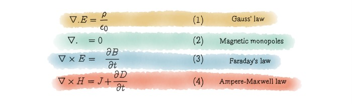

When Maxwell analyzed the equations he had found more deeply, he discovered something even more critical. [Maxwell was the first to find that the light that lit humanity’s world was an electromagnetic wave.](https://en.wikipedia.org/wiki/James_Clerk_Maxwell#:~:text=With%20the%20publication%20of%20%22A,of%20electric%20and%20magnetic%20phenomena.) Meaning, as mankind, we would finally know what light was. Later, when Maxwell plugged the correct variables into the equations he found, he discovered an even more magnificent finding; **the speed of light**.

As you can see, Maxwell learned, through calculus, how God created this universe and how we can use the things that God created. ***Everything in this universe serves a purpose***, and we can’t expect light from far away to tell us where it came from. Through calculus, however, we can tell how that light moves, where it comes from, and how we can use it.

**This scientific journey that Maxwell and Faraday went through is actually what Richard Feynman was telling Wouk about.** The thing we have to do to understand the universe is to use the opportunities that calculus presents to us. Soon after, [Einstein](https://www.amazon.com/Einstein-Life-Universe-Walter-Isaacson/dp/0743264746) and [Tesla](https://www.amazon.com/My-Inventions-Autobiography-Nikola-Tesla/dp/1684222060) would do the same thing that Maxwell and Faraday had done before changing the world. Maxwell had done the same thing the genius Newton had done before him.

Discovering calculus and learning how to use it took humanity thousands of years. However, the design of the modern world using calculus came incredibly quickly. That is because **calculus was a bridge for mathematicians with immense imaginations to apply their ideas to the real world**. Every new mathematician and physicist added to the knowledge and discoveries of previous scientists to make incredible discoveries.

This process continues today at an accelerated rate. **Although we ordinary people don’t see it**, calculus’s use to further modernize and enhance our world continues nonetheless. That is because, by definition, calculus means “**the mathematics of change**.” Because this change is continuous, Prof. Strogatz calls calculus “**the mathematics of continuous change**.” Therefore, the application of calculus continues to increase daily.

For example, graphic designers use calculus in the animations we watch, whether they mean to or not. That is because for their characters to be three-dimensional or even hyperrealistic, **they must use millions of polygons and triangles that are as small as possible**.


The folks at Pixar are widely known as some of the world's best storytellers and animators. They are perhaps less recognized as some of the most innovative math whizzes around. Pixar Research Lead Tony DeRose delves into the math behind the animations, explaining how arithmetic, trigonometry and geometry help bring Woody and the rest of your favorite characters to life.

Talk by Tony DeRose.

https://ed.ted.com/lessons/pixar-the-math-behind-the-movies-tony-derose

 

    start: 0,
    allowfullscreen: 1,
    autoplay: 0,
    hl: en,
    cc_lang_pref: en,
    cc_load_policy: 1,
    color: white,
    controls: 1,
    disablekb: 0,
    enablejsapi: 1,
    fs: 0,
    iv_load_policy: 3,
    loop: 0,
    modestbranding: 1,
    playsinline: 0,
    privacy_mode: yes,
    rel: 0,
    showinfo: 0,
    origin: blog.richiebartlett.com,
    widget_referrer: blog.richiebartlett.com



This technique came to be when Archimedes found the area of a curved shape by repeatedly dividing it into smaller sections. Meaning to find the area of a parabola, **Archimedes drew a triangle as big as he could inside of it. Then, as big as possible, he drew more triangles in the parabola's empty spaces. Since he could find the area of those triangles, their combination must have been close to the area of the parabola.** The more triangles he could fit into the parabola, the closer he would get to find the area of it.

This occurrence can also be used to find the area of the circle. We know that a circle is just a polygon with infinitely many sides. So while a hexagon is not a circle, a dodecagon (12-sided polygon) slightly resembles a circle. If we draw a dodecacontagon (120-sided polygon), we seem to have drawn a circle. *If we draw a chiliagon (1000-sided polygon), it looks like we have drawn a perfect circle.* Using this exact logic, calculus is used today to make animations.

The medical field also uses the technique to prepare animated films. The near-human replicas that doctors practice surgery on are made entirely using calculus techniques. *Before a heart transplant, a doctor must practice perfecting their method countless times because a minor mistake could lead to the patient’s death.* Therefore, the prepared models must be made with perfect detail, and those details can only be acquired using calculus.

In recent times, doctors at the [🎥 New York Face Transplant Program successfully transplanted a face onto Joe Dimeo](https://www.youtube.com/watch?v=x0nAI5buVKM), a burn survivor who lost his entire face. The types of models that are made for these types of plastic surgery are also made using calculus.

However, calculus applications are not limited to curved shapes. Calculus also deals closely with [instantaneous rates of change](https://brilliant.org/wiki/instantaneous-rate-of-change/) in speed. For example, while cruising in traffic, you notice a cop car with its lights on waiting for you to pull over. When we pulled over, the police officer could tell us that at a given moment in time, we were going 98km/h. As you may have thought, the *radar gun he holds uses a program that applies calculus to find that speed*. Using a very simple mathematical operation, that radar gun can find our car’s average speed.

Many of you know that average speed is measured by dividing the distance traveled by the time it takes to travel said distance. If you travel 60 miles in one hour, your average speed would be 60 mi/h. If you go 20 meters in 1 second, your speed would be 20m/s. If you would like, given the required technology, you could find the average speed at one-thousandth of a second. Therefore, police radar machines measure the time it takes to travel between two points. They split that timeframe nearly infinitely many times to get your instantaneous speed. This operation, taking a derivative, is another branch of calculus.

## The Mathematics Behind Usain Bolt’s Olympic Record
We use the same technique police officers use in traffic to measure the speed of Olympic runners too. I am sure that whenever we mention Olympic runners, one of the names that come to mind is [Usain Bolt](https://en.wikipedia.org/wiki/Usain_Bolt). We all know him breaking the unimaginable world record with his yellow uniform and sympathetic demeanor. *Usain Bolt broke the 100-meter world record in 2009 by running it in 9.58 seconds.*

Using a straightforward process, we can get an average speed of 10.43m/s from `100m ÷ 9.58s`. This speed doesn’t hold much Meaning to us, however. Getting his average speed in a given distance doesn’t help us analyze the run. For example, if we find the maximum speed he ran during that race, we can talk more deeply about the human limit.

How can we find his maximum speed, then? The time it took him to run the 100 meters gives us the average speed. Let's shorten the distance and do the operation again, then. For example, let's make a measurement every 10 meters and take his average speed every 10 meters. Doing that shows us that in some parts, he was faster, while in others, he was slower.
Will these measurements give us his maximum speed? If we look at it with the same logic, no. That is because every 10 meters is a long distance for finding the maximum speed. Therefore, if we take measurements every meter, we will have 100 measurements and have a more solid result. When you analyze the graph, you will notice that in some parts, he is slower. That is because of the friction that occurs whenever he puts his foot down.
If we approach it instinctively, we know that we can find his average speed every second or an even smaller amount of time. Of course, to do this, we would need very powerful machines.


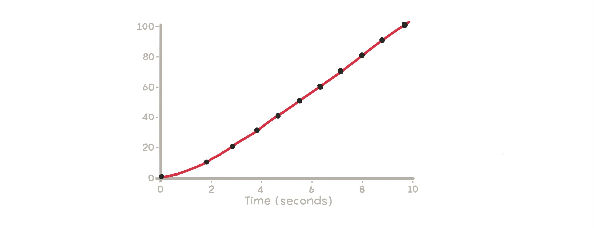
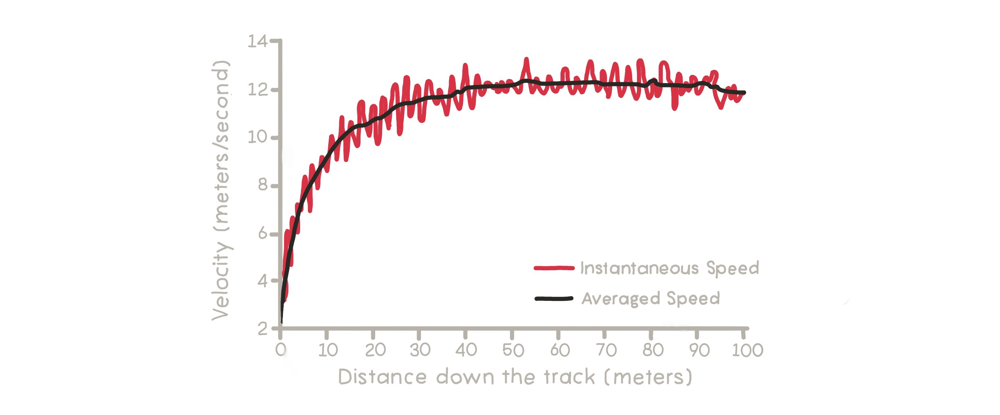


## Calculus for Space
The examples of speed variation analysis that I have provided above are vital in our daily lives. We have almost made it our goal as humankind to live in space one day, but doing so isn’t as simple as getting on a rocket and flying away. At the simplest, *we have to know precisely when a rocket going to the Moon will leave the atmosphere and where it will be in space at all times*.

Meaning we have to monitor the rocket's speed continually. However, *countless factors constantly affect the speed of a rocket*. As you may have thought, the rocket carries fuel and uses it to propel itself forward. The fuel's mass is constantly changing, changing the rocket's mass and affecting its speed. On the other hand, the rocket's thrust propels it in the opposite direction with incredible force. That is because, according to [Newton's third law](https://www.grc.nasa.gov/www/k-12/airplane/newton3.html), **there is an equal and opposite reaction for every action**. On another note, the rocket has to shed parts of itself at given moments. When we consider all of these parameters, we need to find the rate of change of momentum for the rocket. **We can only do that with derivatives.**

The number of examples I have mentioned above can be multiplied unimaginably. In summary, we use calculus in our daily lives to mathematically model and analyze anything we want. When we make robots, video games, wind roses, talk about blood flow, analyze any piece of data, and work on viruses, bacteria, and other organisms that spread rapidly, we always use calculus when we go to space.

*That is why I need to thank Archimedes, Leibniz, and Newton personally.*