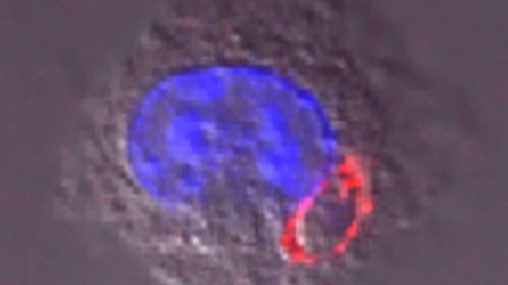


How about this "shit..." 😎


It has been estimated that a [third of the world’s population](https://www.thelancet.com/journals/lancet/article/PIIS0140-6736%2804%2916412-X/fulltext) is affected by *Toxoplasma gondii*, a parasite that prefers living in feline intestines. While it produces no or mild symptoms for most people, it can be fatal for those who are seriously immunocompromised. Scientists have found a way to make the parasite’s actions work for good by reprogramming it to team up with the immune system to attack cancer cells. The research was conducted by David Bzik of Dartmouth University.

"We know biologically this parasite has figured out how to stimulate the exact immune responses you want to fight cancer,” Bzik said in a [press release](http://cancer.dartmouth.edu/focus/Tgondii_cps.html).

Cancer cells can disrupt the immune response for self-preservation purposes. In the presence of *T. gondii*, those responses are restored and the body will create cytotoxic T cells as well as natural killer cells in order to fight off infection, and these cells are also responsible for fighting cancer cells. Of course, it would be too risky to inject *T. gondii* into a cancer patient, researchers needed to find the best way to alter it.

[Prior research by Bzik](http://www.pnas.org/content/111/17/6437.short) indicated that while virulent strains of T. gondii attack cells on the surface, avirulent strains are actually ingested by phagocytes. Instead of getting digested, they will invade the cell from the inside and then continue to divide and spread once it has escaped the cell. This “trojan horse” approach was an attractive opportunity to modify the parasite in order to fight cancer more effectively.

A gene that is critical to the parasite’s ability to self-replicate was removed, creating a safe version that can trigger the desired immune response without posing any threat of its own. Bzik and his colleague Barbara Fox have named it “cps.”

"The biology of this organism is inherently different from other microbe-based immunotherapeutic strategies that typically just tickle immune cells from the outside," Fox explained. "By gaining preferential access to the inside of powerful innate immune cell types, our mutated strain of *T. gondii* reprograms the natural power of the immune system to clear tumor cells and cancer."

Cps was injected into mice that had lethal forms of ovarian cancer and melanoma and resulted in high rates of survival. In the future, cps could be a very potent treatment or vaccine for cancer patients that could even be highly personalized. Cells would be taken from the patient and exposed to cps in vitro, creating the desired immune response. The cps-containing cells would then be returned to the patient to fight the cancer and could even provide immunity against recurrence of that cancer type.

"Cps stimulates amazingly effective immunotherapy against cancers, superior to anything seen before," said Bzik. "The ability of cps to communicate in different and unique ways with the cancer and special cells of the immune system breaks the control that cancer has leveraged over the immune system.”

Though the testing has gone well in the mice, human trials aren’t ready to begin. Researchers need to learn more about the mechanism that allows it to work so well in addition to identifying all molecular targets.