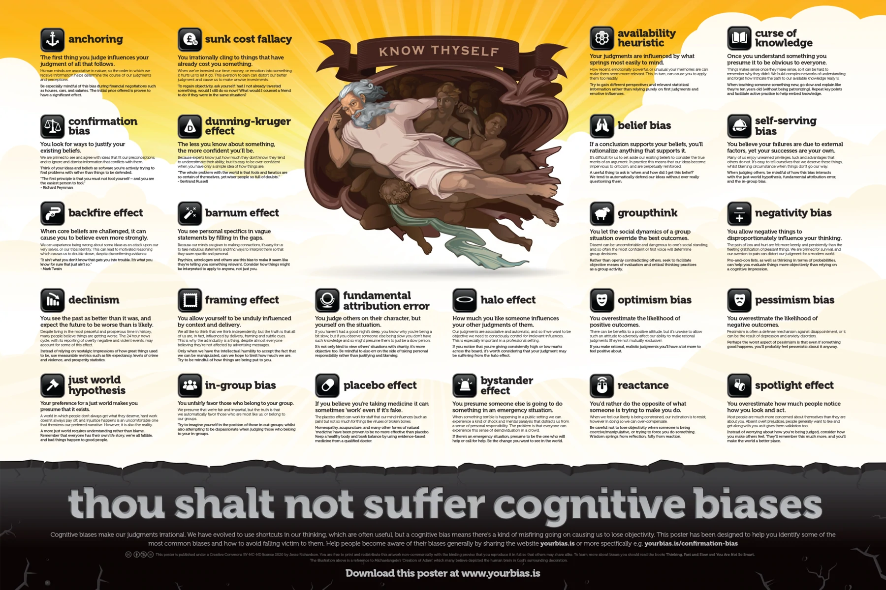
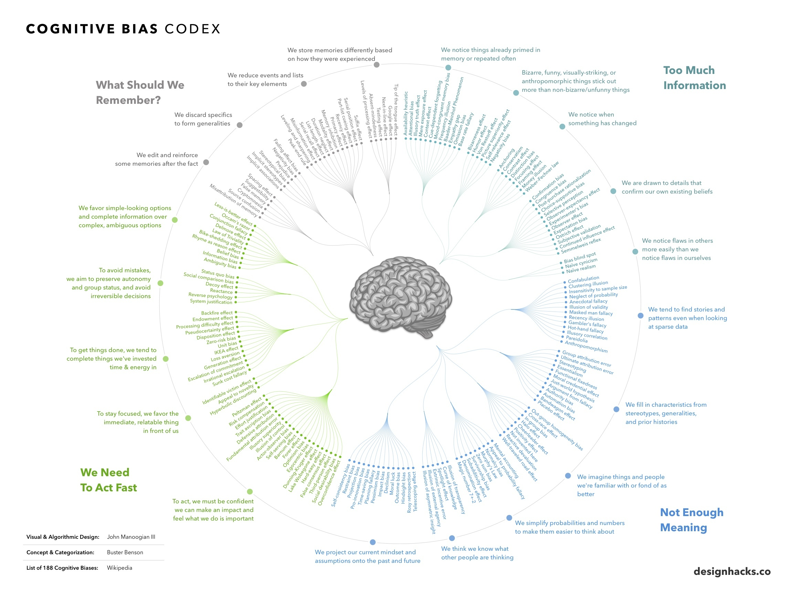


At the beginning of the infographic, you may have noticed illustrations of two gentlemen.

In case you were wondering, those happen to represent [Daniel Kahneman](https://en.wikipedia.org/wiki/Daniel_Kahneman) and [Amos Tversky](https://en.wikipedia.org/wiki/Amos_Tversky), two of the leading social scientists known for their contributions to this field. Not only did they pioneer work around cognitive biases starting in the late 1960s, but their partnership also resulted in a [Nobel Prize in Economics in 2002](https://en.wikipedia.org/wiki/Nobel_Memorial_Prize_in_Economic_Sciences).


We are each entitled to our own personal world view.

But unfortunately, when it comes to interpreting information and trying to make objective sense of reality, human brains are hard-wired to make all kinds of mental mistakes that can impact our ability to make rational judgments.

In total, there are over 180 cognitive biases that interfere with how we process data, think critically, and perceive reality.





## What is a Cognitive Bias?
Humans have a tendency to think in particular ways that can lead to systematic deviations from making rational judgments.

These tendencies usually arise from:

* Information processing shortcuts
* The limited processing ability of the brain
* Emotional and moral motivations
* Distortions in storing and retrieving memories
* Social influence

Cognitive biases have been studied for decades by academics in the fields of cognitive science, social psychology, and behavioral economics, but they are especially relevant in today’s information-packed world. They influence the way we think and act, and such irrational mental shortcuts can lead to all kinds of problems in entrepreneurship, investing, or management.

## 24 Biases Distorting Reality
### Anchoring
**The first thing you judge influences your judgement of all that follows.**
Human minds are associative in nature, so the order in which we receive information helps determine the course of our judgement and perceptions
Be especially mindful of this bias during financial negotiations such as houses, cars, and salaries. The initial price offered is proven to have significant effect.
 ℹ: https://en.wikipedia.org/wiki/Anchoring_(cognitive_bias)

### Sunk cost fallacy
**You irrationally cling to things that have already cost you something.**
When we've invested our time, money, or emotion into something, it hurts us to let it go. The aversion to pain can distort our better judgement and cause us to make unwise investments.
To regain objectivity, ask yourself: had I not already invested something, would I still do so now? What would I counsel a friend to do if they were in the same situation?
 ℹ: https://en.wikipedia.org/wiki/Sunk_cost

### Confirmation bias
**You look for ways to justify your existing beliefs.**
We are primed to see and agree with ideas that fit our preconceptions, and to ignore and dismiss conflicting information. 
Think of your ideas and beliefs as software you are actively trying to find problems with rather than things to defend.
 ℹ: https://en.wikipedia.org/wiki/Confirmation_bias

The first principle is that you must not fool yourself &mdash; and you are the easiest person to fool.


### Dunning-Kruger effect
**The more you know, the less confident you're likely to be.**
Because experts know just how much they don't know, they tend to underestimate their ability; but it's easy to be over-confident when you have only a simple idea of how things are.
 ℹ: https://en.wikipedia.org/wiki/Dunning%E2%80%93Kruger_effect

The whole problem with the world is that fools and fanatics are always so certain of themselves, but wiser people so full of doubts.


### Backfire effect
**When your core beliefs are challenged, it can cause you to believe even more strongly.**
We can experience being wrong about some ideas as an attack upon our very selves, or our tribal identity. This can lead to motivated reasoning which causes us to double-down, despite disconfirming evidence.
 ℹ: https://en.wikipedia.org/wiki/Belief_perseverance

It ain't what you don't know that gets you into trouble. It's what you know for sure that ain't so.


### Barnum effect
**You see personal specifics in vague statements by filling in the gaps.**
Because our minds are given to making connections, it's easy for us to take nebulous statements and find ways to interpret them so that they seem specific and personal.
Psychics, astrologers and other use this bias to make it seem like they're telling you something relevant. Consider how things might be interpreted to apply to anyone, not just you.
 ℹ: https://en.wikipedia.org/wiki/Barnum_effect

### Declinism
**You remember the past as better than it was, and expect the future to be worse than it is likely to be.**
Despite living in the most peaceful and prosperous time in history, many people believe things are getting worse. The 24-hours news cycle, with its reporting of overtly negative and violent events, may account for some of this effect.
Instead of relying on nostalgic impression of how great things used to be, use measurable metrics such as life expectancy, levels of crime and violence, and prosperity statistics.
*This is an interesting one, since statistically this is one of the most peaceful and prosperous times in history—yet the 24-hour news cycle rarely reflects this.*
 ℹ: https://en.wikipedia.org/wiki/Declinism

### Framing Effect
**You allow yourself to be unduly influenced by context and delivery.**
We all like to think that we think independently, but the truth is that all of us are, in fact, influenced by delivery, framing and subtle cues. This is why the ad industry is a thing, despite almost everyone believing they're not affected by advertising messages. 
Only when we have the intellectual humility to accept the fact that we can be manipulated, can we hope to limit how much we are. Try to be mindful of how things are being put to you.
*Context and delivery can have a big impact on how a story is interpreted. We must have the humility to recognize that we can be manipulated, and work to limit the effect that framing has on our critical thinking.*
 ℹ: https://en.wikipedia.org/wiki/Framing_effect_(psychology)

### Just-World Hypothesis
**Your preference for a just world makes you presume that it exists.**
A world in which people don't always get what they deserve, hard work doesn't always pay off, and injustice happens is an uncomfortable one that threatens our preferred narrative. However, it's also reality.
A more just world requires understanding rather than blame. Remember that everyone has their own life story, we're all fallible, and bad things happen to good people.
*Of course, it’s much more uncomfortable to think that the world is unfair, but by understanding this you will make more accurate judgments about people and situations.*
 ℹ: https://en.wikipedia.org/wiki/Just-world_hypothesis

### In-group bias
**You unfairly favor those who belong to your group.**
We presume that we're fair and impartial, but the truth is that we automatically favor those who are most like us, or belong to our groups.
Try to imagine yourself in the position of those in out-groups; whilst also attempting to be dispassionate when judging those who belong to your in-groups.
 ℹ: https://en.wikipedia.org/wiki/In-group_favoritism

### Fundamental attribution error
**You judge others on their character, but yourself on the situation.**
If you haven't had a good night's sleep, you know why you're being a bit slow; but if you observe someone else being slow you don't have such knowledge and so might presume them to just be a slow person.
It's not only kind to view others' situation with charity, it's more objective too. Be mindful to also err on the side of taking personal responsibility rather than justifying and blaming.
 ℹ: https://en.wikipedia.org/wiki/Fundamental_attribution_error

### Halo effect
**How much you like someone, or how attractive they are, influences you other judgement of them.**
Our judgement are associative and automatic, and so if we want to be objective we need to consciously control for irrelevant influences. This is especially important in a professional setting.
If you notice that you're giving consistently high or low marks across the board, it's worth considering that your judgement may be suffering from the "halo effect."
 ℹ: https://en.wikipedia.org/wiki/Halo_effect

### Placebo effect
**If you believe you're taking medicine it can sometimes "work" even if it's fake.**
The "placebo effect" can work for stuff that our mind influences (*i.e.* pain) but not so much for things like viruses or broken bones.
Homeopathy, acupuncture, and many other forms of natural "medicine" have been proven to be no more effective than placebo. Keep a healthy body and bank balance by using evidence-based medicine from a qualified doctor.
 ℹ: https://en.wikipedia.org/wiki/Placebo#Effects

### Bystander effect
**You presume someone else is going to do something in an emergency situation.**
When something terrible is happening in a public setting we can experience a kind of shock and mental paralysis that distracts us from a sense of personal responsibility. The problem is that everyone can experiences this sense of deindividuation in a crowd.
If there's an emergency situation, presume to be the one who will help or call for help. Be the change you want to see in the world!
 ℹ: https://en.wikipedia.org/wiki/Bystander_effect

### Availability heuristic
**You judgments are influenced by what springs most easily to mind.**
How recent, emotionally powerful, or unusual your memories are can make them seem more relevant. This, in turn, can cause you to apply them too readily.
Try to gain different perspectives and relevant statistical information rather than relying purely on first judgments and emotive influences. 
 ℹ: https://en.wikipedia.org/wiki/Availability_heuristic

### The Curse of Knowledge
**Once you understand something, you presume it to be obvious to everyone**
Things make sense once they make sense, so it can be hard to remember why they didn't. We build complex networks of understanding and forget how intricate the path to our available knowledge really is.
When teaching someone something new, go slow and explain like they are "ten years old" (without patronizing). Repeat key points and facilitate active practice to help embed knowledge.
Ever try to explain something you know intricately and have worked on for many years? It’s hard, because you’ve internalized everything you’ve learned, and now you forget how to explain it. This bias is similar—you know something inside and out, and what is obvious to you is not to others.
 ℹ: https://en.wikipedia.org/wiki/Curse_of_knowledge

### Belief Bias
**If a conclusion supports your existing beliefs, you’ll rationalize anything that supports it.**
It's difficult for us to set aside our existing beliefs to consider the true merits of an argument. In practice, this means that our ideas become impervious to criticisms, and are perpetually reinforced.
A useful thing to ask is "when and how did I get this belief?" We tend to automatically defend our ideas without ever really questioning them.
*In other words, instead of willingly looking at new information, we are primed to defend our own ideas without actually questioning them.*
 ℹ: https://en.wikipedia.org/wiki/Belief_bias

### Self-serving bias
**You believe your failures are due to external factors, yet you're personally responsible for you successes.**
Many of us enjoy unearned privileges, luck and advantages that others do not. It's easy to tell ourselves that we deserve these things, while blaming circumstance when things don't go our way.
When judging others, be mindful of how this bias interacts with the just-world hypothesis, fundamental attribution error, and the in-group bias. 
 ℹ: https://en.wikipedia.org/wiki/Self-serving_bias

### Groupthink
**You let the social dynamics of a group situation override the best outcomes.**
Dissent can be uncomfortable and dangerous to one's social standing, and so the most confident or first voice will determine group decisions.
Rather than openly contradicting others, seek to facilitate objective means of evaluation and critical thinking practices as a group activity.
 ℹ: https://en.wikipedia.org/wiki/Groupthink

### Negativity bias
**You allow negative things to disproportionately influence your thinking.**
The pain of loss and hurt are felt more keenly and persistently than the fleeting gratification of pleasant things. We are primed for survival, and our aversion to pain can distort our judgments for a modern world.
Pro-and-con lists, as well as thinking in terms of probabilities, can help you evaluate things more objectively than relying on a cognitive impression.
 ℹ: https://en.wikipedia.org/wiki/Negativity_bias

### Optimism bias
**You overestimate the likelihood of positive outcomes.**
There can be benefits to a positive attitude, but it's unwise to allow such an attitude to adversely affect our ability to make rational judgments (they're not mutually exclusive).
If you make rational, realistic judgments you'll have a lot more to feel positive about.
 ℹ: https://en.wikipedia.org/wiki/Optimism_bias

### Pessimism bias
**You overestimate the likelihood of negative outcomes.**
Pessimism is often a defense mechanism against disappointment, or it can be the result of depression and anxiety disorders.
Perhaps the worst aspect of pessimism is that even if something good happens, you'll probably fell pessimistic about it anyway.
 ℹ: https://en.wikipedia.org/wiki/Optimism_bias

### Reactance
**You would rather do the opposite of what someone is trying to make you do.**
When you feel our liberty is being constrained, our inclination is to resist, however in doing so, we can overcompensate.
Be careful not to lose objectivity when someone is being coercive/manipulative, or trying to force you to do something. Wisdom springs from reflection, folly from reaction.
*Sometimes we all get the urge to do the opposite of what we’re told. Nobody likes being constrained. The only problem is that when we’re in this situation, there is a tendency to overreact and to throw any logic out of the window.*
 ℹ: https://en.wikipedia.org/wiki/Reactance_(psychology)

### Spotlight Effect
**You overestimate how much people notice how you look and act.**
Most people are much more concerned about themselves than they are about you. Absent overt prejudices, people generally want to like and get along with you as it gives them validation too.
Instead of worrying about how you're bing judged, consider how you make others feel. They'll remember this much more, and you'll make the world a better place.
*Because we each live inside our own heads, our natural focus is on what we’re thinking and doing. We project this onto others, and we overestimate how much they notice about how we look or how we act.*
 ℹ: https://en.wikipedia.org/wiki/Spotlight_effect
