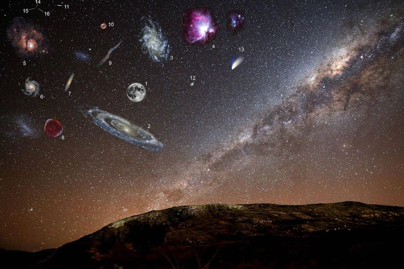


August 14, 2014
The actual sizes of various different deep space objects. If they were brighter, this is how they would appear in our night sky. The images are in scale with one another, including the Moon, but not to the Milky Way background.
1. The Moon.
2. Andromeda Galaxy.
3. Triangulum Galaxy.
4. Orion Nebula.
5. Lagoon Nebula.
6. Pinwheel Galaxy.
7. Sculptor Galaxy.
8. Supernova remnant 1006.
9. Veil Nebula.
10. Helix Nebula.
11. Sombrero Galaxy.
12. Crab Nebula.
13. Comet Hale-Bopp (c. 1997)
14. Venus.
15. Jupiter.
16. International Space Station.
Image by u/aerospacerocket on Reddit.
Original photograph http://bit.ly/1cJp0PR
