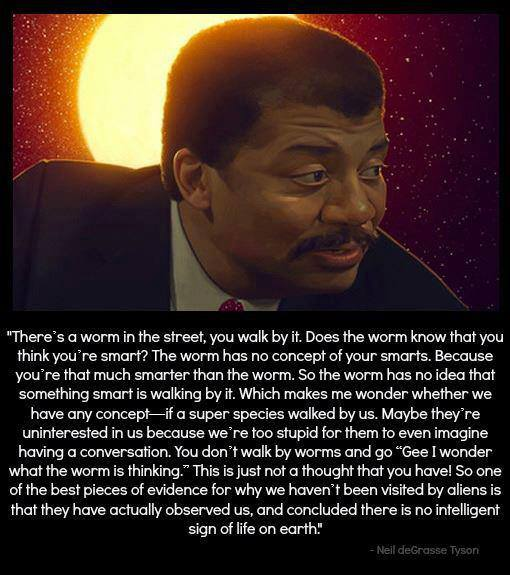

> LOL...
> 
> This is how I see some "people" as well...



There’s a worm in the street, you walk by it. Does the worm know that you think you’re smart? The worm has no concept of your smarts. Because you’re that much smarter than the worm. So the worm has no idea that something smart is walking by it. Which makes me wonder whether we have any concept—if a super species walked by us. Maybe they’re uninterested in us because we’re too stupid for them to even imagine having a conversation. You don’t walk by worms and go “*Gee I wonder what the worm is thinking.*” This is just not a thought that you have! So one of the best pieces of evidence for why we haven’t been visited by aliens is that they have *actually* observed us, and concluded there is no intelligent sign of life on earth.



While I found this amusing at the time, I also see it as a *wiseguy*'s take on mentally *lazy* logic for extraterrestrials. Not to mention how very *specious* this comment truly is. All but saying that Humans are the apex of intelligence in this corner of the galaxy.