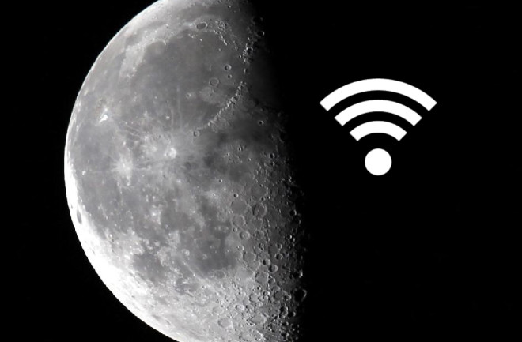



New article claims that we are now able to send WiFi signals to the moon. 

Why is this "news??" The technology to send radio waves into space has been around for almost a century!!

They may not have applied the general protocols used by WiFi devices until now, but this tech has been around for quite some time...

On a side note: why does it matter that the Moon has a slow WiFi hot-spot while only the wealthy countries on Earth have these hot-spots for its citizens? What about the rest of Earth?



## WiFi for the Moon

Complimentary Wi-Fi is so commonplace that a business advertising its “hotspot” in the window seems somewhat passé. But a new hotspot location should impress even the most jaded among us: For the first time, scientists have demonstrated it’s possible to beam a wireless Internet signal across the 238,900 miles separating Earth from the moon.

The demonstration, done by researchers at NASA and MIT, means that future moon explorers could theoretically check in at Mare Imbrium and post lunar selfies with greater speed than you do from your home network.

The team will present its findings June 9 at the CLEO laser technology [conference in California](http://www.osa.org/en-us/about_osa/newsroom/news_releases/2014/first_broadband_wireless_connection…to_the_moon_!/).

## Not Your Starbucks Wi-Fi
In order to bring broadband to the moon, scientists used four separate telescopes based in New Mexico to send an uplink signal to a receiver mounted on a satellite orbiting the moon. Each telescope is about 6 inches in diameter and is fed by a laser transmitter that beams information in coded pulses of infrared light.

Since our atmosphere bends the signal as it travels to the moon, the four telescopes transmit the light through different columns of air, each with different bending effects. This setup increases the chance that at least one of the laser beams will interact with the receiver, and establish a connection with the moon.

And if you’re fixing to binge on Netflix on the moon, the connection isn’t too bad, either. Scientists managed to send data from Earth to the moon at a rate of 19.44 megabits per second — on par with slower broadband speeds — and could download information from the moon at a rate of whopping 622 megabits per second. According to [Wired UK](http://www.wired.co.uk/news/archive/2014-05/23/internet-on-the-moon), that’s over 4,000 times faster than current radio transmission speeds.

So, in light of all that, there’s really only question that remains… “*What’s the password?*”

