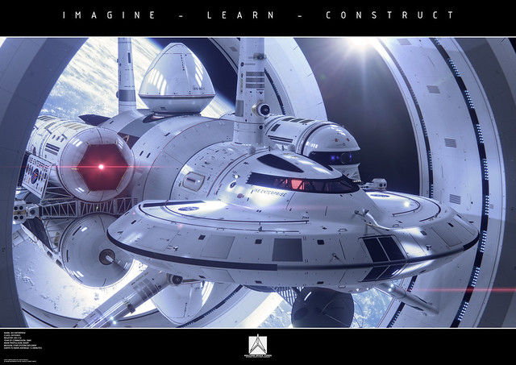

# NASA's real life Enterprise may take us to other star systems one day
 [Dr. Harold "Sonny" White is still working on a warp drive](http://gizmodo.com/nasa-starts-work-on-real-life-star-trek-warp-drive-5942634) at NASA's Johnson Space Center. His work is still in the experimental stage but that doesn't mean he can't imagine what the real life *Enterprise* ship would look like according to his math.

 You're looking at it right now.

 This is the starship that may take us where no human has gone before. And it has me screaming like a little Klingon girl.

 [Concept 3D artist Mark Rademaker told io9](https://gizmodo.com/heres-nasas-new-design-for-a-warp-drive-ship-1588948192) that "he worked with White to create the updated model, which includes a sleek ship nestled at the center of two enormous rings, which create the warp bubble."

 

 The updated model is the one you can see above, a variation of the original concept which, according to Dr. White, was rendered by Rademaker based on an idea by Matthew Jeffries, the guy who came with "the familiar Star Trek look." This is the original warp drive spaceship concept:

 Dr. White &mdash; whose daily life is working in future propulsion solutions for interplanetary travel in the near future, like ion and plasma thrusters &mdash; developed new theoretical work that solved the problems of the Alcubierre Drive concept, a theory that allowed faster-than-light travel based on Einstein's field equations in general relativity, developed by theoretical physicist [Miguel Alcubierre](http://en.wikipedia.org/wiki/Miguel_Alcubierre).

 A spaceship equipped with a warp drive would allow faster-than-light travel by bending the space around it, making distances shorter. At the local level, however, the spaceship wouldn't be moving faster than light. Therefore, warp drive travel doesn't violate the first Einstein commandment: *Thou shall not travel faster than light*.

 Here's more views of the **IXS Enterprise** during its construction phase, the concept that Dr. White developed with Rademaker:


 
 
 
 
 
 
 
 
 
 
 
 
 
 
 
 
 
 
 
 
 
 


 You can watch the fascinating talk that Dr. White gave at the SpaceVision 2013 conference here:

## Video (58:59 minutes)
 Faster than Light: Warp Drive - SpaceVision 2013

 Faster than Light -- Warp Drive -- Is it possible to travel faster than light? NASA's Advanced Propulsion Lead, Dr. Harold White, has modified a previously unsuccessful FTL model called the Alcubbierre Drive, and has successfully proven that faster than light travel might just be possible. Join Dr. White to discuss the hard facts behind this technology as well as road-blocks to exploring our closest stars.

 SpaceVision is the largest student-organized space conference in the nation and is orchestrated by the Students for the Exploration and Development of Space (SEDS) as the SEDS-USA annual national conference. SpaceVision is dedicated to facilitating networking between college students, professionals, and the public, and furthering the development of the organization's goals.



    start: 0,
    allowfullscreen: 1,
    autoplay: 0,
    hl: en,
    cc_lang_pref: en,
    cc_load_policy: 1,
    color: white,
    controls: 1,
    disablekb: 0,
    enablejsapi: 1,
    fs: 0,
    iv_load_policy: 3,
    loop: 0,
    modestbranding: 1,
    playsinline: 0,
    privacy_mode: yes,
    rel: 0,
    showinfo: 0,
    origin: blog.richiebartlett.com,
    widget_referrer: blog.richiebartlett.com


 The spacecraft reminds me a bit to the spaceship in Chris Nolan's *Interstellar*, a film that &mdash; in theory &mdash; will portray realistic faster-than-light travel. This is partial view of the ship in the movie, which also has a ring of some sort around it.

 

## Not a fantasy, but real science
 But *Interstellar* is just science fiction. Dr. White's work at the Advanced Propulsion Theme Lead for the NASA Engineering Directorate is science. And while his department only gets peanuts compared to NASA's budget (not to talk about the Pentagon's) I find his words comforting:



 Perhaps a Star Trek experience within our lifetime is not such a remote possibility.



 See, Dr. White and his colleagues aren't making a movie or coming up with 3D renders for the sake of it. They just don't just *believe* a real life warp drive is theoretically possible; [they've already started the work to create one](http://gizmodo.com/nasa-starts-work-on-real-life-star-trek-warp-drive-5942634):



Working at [NASA Eagleworks](http://ntrs.nasa.gov/search.jsp?R=20110023492)  &mdash;  a skunkworks operation deep at NASA's Johnson Space Center &mdash; Dr. White's team is trying to find proof of those loopholes. They have "initiated an interferometer test bed that will try to generate and detect a microscopic instance of a little warp bubble" using an instrument called the White-Juday Warp Field Interferometer.



 It may sound like a small thing now, but the implications of the research huge. In his own words:



Although this is just a tiny instance of the phenomena, it will be existence proof for the idea of perturbing space time  &mdash;  a "Chicago pile" moment, as it were. Recall that December of 1942 saw the first demonstration of a controlled nuclear reaction that generated a whopping half watt. This existence proof was followed by the activation of a ~ four megawatt reactor in November of 1943. Existence proof for the practical application of a scientific idea can be a tipping point for technology development.



## The roadmap to the warp drive
 According to Dr. White, this is a roadmap that they need to follow to achieve that final objective of *rapid interstellar travel*. He explains this roadmap in the video above.

 If his work is successful, he says that we would be able to create an engine that will get us to Alpha Centauri "in two weeks as measured by clocks here on Earth." The time will be the same in the spaceship and on Earth, he claims, and there will not be "tidal forces inside the bubble, no undue issues, and the proper acceleration is zero. When you turn the field on, everybody doesn't go slamming against the bulkhead, which would be a very short and sad trip."

 Every time I read that paragraph I smile &mdash; and these renders just make my smile so wide it looks stupid.

 OK, Dr. White, you got our attention. *Make it so.*

## Interested in more science-based space travel concepts?
 Check out the amazing Kalpana One, a sub-light speed space settlement designed for hundreds of families.

 
