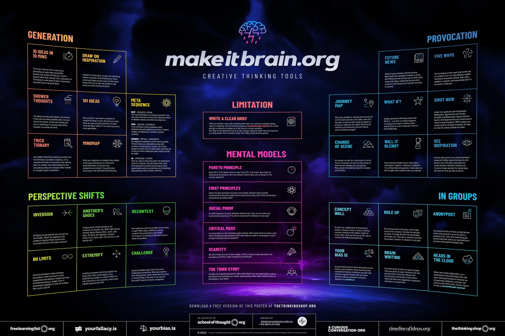

Below are a list of creative thinking tools that one could use for business or in life.

## Generation
### 10 ideas in 10 minutes
Force your internal critic to shut-up by generating as many ideas as possible. Quantity over quality will help your mind to expand rather than contract. Set a stopwatch for 10 minutes to write down 10 ideas. Importantly, they don't have to be good ideas.

### Draw on inspiration
Instead of writing ideas, simply start sketching relevant concepts. By activating your visual context you'll open up new ways to think about things. Don't try to solve the problem right away, just start moving the pencil.

### Shower thoughts
The reason we have great ideas in the shower is that we're not doing anything else. Use your time in the shower, on the train, during your run, or meditating in sensory deprivation chamber to consider the brief.

### 101 ideas
Give yourself or your team a deadline to compile 101 ideas in a list. By having so many ideas you give yourself permission to have more bad ideas, which in turn opens you up to more good ideas.

### Trick-tionary
Use random stimuli like reading out words from the dictionary to provide a response, or by using the last letter of one word as the starting letter for another word. Alternatively, try free associating words and concepts either verbally or visually to spark connections.

### Mind map
Write your objective in a bubble in the middle of the page and branch out nested and associated ideas to discover new perspectives as stimuli. Try putting your mind map on the wall while brainstorming.

### Meta-sequence
**Deep** - Research / Define
The more information you expose yourself to, the more your brain has to work with... Deep dive before an ideation session and define the objective.

**Wide** - Creative / Divergent
Try to minimize critical evaluation while brainstorming and exploring new ideas. Creative insights are helped by a mindset of playful curiosity.

**Narrow** - Critical / Convergent
Use objective evaluation criteria where possible. The best ideas are vulnerable as they don't conform to expectations; so don't use critical analysis to leave on the safest ideas standing, but to find out which challenging ideas might actually be viable.

**Up** - Synthesize / Iterate
Once you have an idea that works, it's tempting to cling to it. However, the best ideas often come from having the curiosity and courage to push beyond what works to something more interesting. Keep playing to find a deeper synthesis. 

## Perspective Shifts
### Inversion
By flipping the perspective, you can open up new insights. What's the opposite of the problem or solution? What would be the worst idea? Who isn't the target audience?

### Another's Shoes
Imagine you're a historical figure, the customer, an inventor, *etc.* What might Gordon Ramsay, Barack Obama, Hitler, Lady Gaga, Napoleon, Einstein, Atticus Finch, Steve Jobs, The Fab Five, or the narrator do?

### Recontext
How would you solve the problem in the future or past? What about a different cultural context? How would aliens see things? Try five ideas in five minutes on different ways to frame the problem.

### No Limits
Removing limitations means removing assumptions, which can result in novel perspectives and solutions. Imagine you have unlimited superpowers, budget, time, or technological capabilities to solve the problem? What would a "god" do?

### Extremify
Looking at extremes can bring insights into sharp relief. What would happen if you amplified the problem or solution? What if it was miniscule or all-consuming; what would a global response look like?

### Challenge
Creative breakthroughs often arise from challenging conventions. What assumptions have already been made? Could they be wrong, or shifted? What if the brief is too narrow? Too wide? Pretend to be your competitor.

## Limitation
### Write a clear brief
Failing to provide a clear and compelling brief does not, contrary to popular opinion, "open up" creativity. Use the [briefing template](./Creative-thinking-tools/Make%20It%20Brain%20-%20Briefing%20Template.pdf) or at least provide an objective to deliver in the form of a simple sentence.
Ask: Why are we doing this? Focus on the strategic objective rather than the execution (*e.g.* "help people thinking creatively" rather than "make a brainstorming poster").

## Mental Models
### Pareto Principle
About 80% of the output tends to come from 20% of the input. How might we optimize by focusing on the most relevant factors? How can we design for the primary audience?

### First Principles
Define the base principles to reason more clearly. Question what's actually fundamental to bring the problem (& solution) into sharp view. What unnecessary assumptions are being made?

### Social Proof
As tribal creatures, we want validation before we act. How can we create and communicate social buy-in? Could the crowd itself contribute in some way?

### Critical Mass
A critical mass is a self-sustaining chain reaction. What could we do to create a viral effect whereby the idea spreads itself? Howe might we make it remarkable or useful enough to become its own amplifier?

### Scarcity
We value things that are in short supply. Is there a way to create demand or the perception of it? How might limitations beneficial?

### The third story
Consider the impartial perspective. W're often blind to our own assumptions, and our perceptions are colored by our insider understating. What might someone with no knowledge or bias think?

## Provocation
### Future News
Pretend you've already achieved success. What would the newspaper headline or article say? Writing this out will spur your to think of big, newsworthy ideas. Explaining how and why it worked so well forces you to consider the steps to success.

### Five Whys
This technique is often used to get to the root of a problem, but it can also discover insights that lead to innovative thinking. Start with a problem of solution, then keep asking "why" to see where it leads you.

### Journey Map
Write your problem or starting point at one end and hte ideal outcome at the other. Now fill in the gaps to map out what needs to happen to bring your objective into reality. What are the mediums and milestones that will need to occur at different stages?

### What If?
Simply starting the thinking process with "what if..." will elicit a creative response. Try saying it out loud or writing it down several times in a list to hack your brain to think differently. 

### SWOT now
Create four quadrants and list: Strengths, Weaknesses, Opportunities, and Threats. Strengths and Weaknesses relate to internal factors, while Opportunities and Threats tend to relate to external aspects. SWOT analyses are usually used for strategic evaluation, but they can also be used to provoke new ideas.

### Change of scene
Go outside, to a bar for a few drinks, or to the top of a mountain and see how the change of environment changes your perspective. Many people find walking helpful for ideation and stimulus. 

### Will it bend?
How could you combine two or more ideas / techniques / aspects / solutions / problems? Try writing relevant keywords or ideas down on bits of paper. Then mashing them up randomly.

### See Inspiration
Use the room you're in as a visual inspiration canvas by finding visual references to print and put up on the walls, along with your rough concepts, sketches, headlines, *etc.* Try some image searches for related ideas and save the ones you like as stimuli.

## In Groups
### Concept Wall
To start your collaborative brainstorming session, everyone writes or draws a few key concepts relating to the subject matter on the sticky notes. Then put them up on the wall as stimulus for further brainstorming.

### Role Up
Give each person in the group a role to play such as the customer, the rebel, the narrator, the joker, the safe, the CEO, the shareholder, the lunatic, etc. Then give a scenario involving the product, problem, or situation to role play.

### Anonypost
Each person writes or draws a single idea per sticky note and puts it up on the wall in a separate room. Take turns nominating your favorite idea that wasn't your own (and hasn't yet been nominated) and explain why.

### Your bias is...
Group brainstorming is often affect ted by social factors, and confident voices thwarting more considered thinking. Familiarize yourself with [common biases](/2022/0530/Science_科学/Cognitive-biases-that-warp-your-perception-of-reality.html) that can affect decision making, evaluation and group dynamics.

### Brain writing
Everyone writes an idea on a piece of paper. Pass your piece of paper clockwise, they next person builds on the idea. Repeat until everyone has contributed to each other's ideas with their own suggestions, extensions, iterations or perfectives. 

### Heads in the cloud
Rather tha verbal collaboration, use a cloud-based service like Google docs with open sharing permission so everyone can anonymously collaborate, comment, and build on each other's ideas.

## Reference
* https://www.kickstarter.com/projects/schoolofthought/creative-thinking-cards