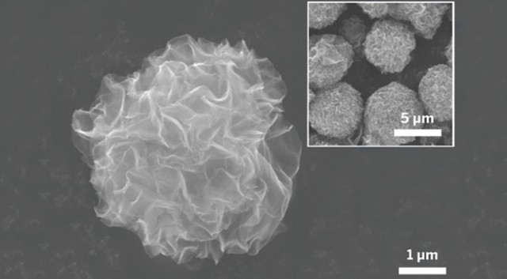


Cool! 😎


It’s easy to forget that graphene was first discovered, and first intentionally manufactured, by sticking and unsticking scotch tape over and over. Literally, that was all that was needed to create short, single-atom sheets of carbon; surely, creating graphene must be a breeze if it can happen so accidentally! In reality, graphene manufacturing is by far the hardest part about using the super material. It has great *theoretical* potential for energy storage, and now new research could help make that potential a reality.

Electrodes, while complex in many ways, do most of their actual work through the simplest mechanism possible: physical contact. As such, when you want to improve the capacity of an electrode to interact with an electrolyte (say, lithium ions), one of the biggest concerns in increasing its surface area; the more space over which the electrode-electrolyte interaction can occur, the faster all the electrolyte can be processed. [Graphene](https://extremetechprd.wpengine.com/tag/graphene) has thus always presented problems for electrode production, since it’s so difficult to lay down in reliable confirmations. Even flat, ordered sheets woven out of short straight strands are difficult, let alone complex structures with large surface areas.

 To get around this, [the researchers created](http://cen.acs.org/articles/93/web/2015/01/Deep-Frying-Graphene-Spheres-Energy.html) tiny spheres of a related material called graphene oxide. Large (by graphene standards) flakes of the oxide material are fed to an ultrasonic sprayer which atomizes them and shoots them out as micro-droplets (our micro-spheres) into a super-heated liquid. Through the heat of the liquid and its chemical power as a reducing agent, this results in the rapid boiling away of moisture at the surface of the spheres — though it’s something of a metaphor, the process is rather like deep-frying and each micro-particle has the water in its surface flash-boiled away. 

It’s the rapidity of this boiling reaction that the researchers think is responsible for the increased electrode performance. As the graphene spheres are quickly reduced and dehydrated, the leaving water seems to pull the graphene strands outward into radial sheets — like molecular-scale pompoms. While graphene spheres have been created before, they’ve usually been cages or crumpled sheets, not radial spheres pitted with nano-channels. These pompoms naturally precipitate out of the solution, even allowing easy collection.

 The results are significant. Graphene has been made into more conventional (non-spherical) electrode materials in the past, through much more expensive and time consuming methods than this, and produced a capacitance of about 118 farad per gram, compared with 151 farad per gram for these 3D-structured graphene balls. By disbursing complex arrangements of graphene in all directions they can maximized the surface area, or at least come close. Hollow graphene spheres, while an important goal in other areas of science, would be useless in this case.

The researchers even think it could allow incorporation of nano-particles into the final structure, simply by having them incorporated into the original graphene-oxide flakes. We can imagine that these nano-particles might give off fluorescent light when electrically charged, to give visual feedback about the sphere’s charge state. Perhaps they could be associated with one another, allowing a sort of lock-and-key mechanism for building larger structures out of these pompoms.

 Battery tech is becoming one of *the*, if not the, weakest link in high-level technology. “Modern” batteries don’t just hold back consumer electronics through their large size, limited charge, low heat resistance, and hefty expense, they also cost us a lot of energy due to inefficiency. Batteries still can’t give even high-end electric cars much more than half the range of a decent gas-guzzler, nor can they currently offer what we need for practical grid storage. ([This rather amazing story](https://extremetechprd.wpengine.com/extreme/194552-worlds-largest-lithium-ion-battery-to-be-built-in-southern-california-dwarfs-previous-installations), notwithstanding.)

Graphene has only been around for a few years but people are already getting jaded about it. The public simply is not ready for the onslaught of graphene devices that will arrive as soon as a few fundamental manufacturing breakthroughs are made. On the small scale, with extreme difficulty, graphene can be used to do seemingly anything, while on the practical scale, with anything less than physical research budgets to spend, seemingly nothing. Breakthroughs like this one, while specialized, are exactly the what we need if the alleged super-material is ever going to come into its own.