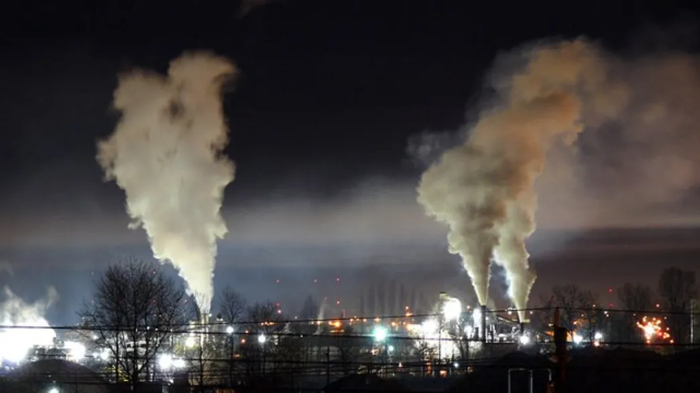

A bill passed through the US House of Representatives is designed to prevent qualified, independent scientists from advising the Environmental Protection Agency (EPA). They will be replaced with industry affiliated choices, who may or may not have relevant scientific expertise, but whose paychecks benefit from telling the EPA what their employers want to hear.

The EPA's [Science Advisory Board](http://yosemite.epa.gov/sab/sabpeople.nsf/WebCommittees/BOARD) (SAB) was established in 1978 to ensure the EPA uses the most up to date and relevant scientific research for its decision making and that the EPA's programs reflect this advice. It has served in this role, most often uncontroversially, through 36 years and six presidents. If the new bill passes the Senate and wins presidential approval, however, that is about to change.

It's hard to be against “balance”, which no doubt helped Rep Chris Stewart (R-Utah) gather 229-191 support for his bill [H.R. 1422](https://www.govtrack.us/congress/bills/113/hr1422/text) to overhaul the way appointments to the SAB are made. Of the 51 members of the SAB, three come from the industries the EPA is regulating. Stewart wants more, saying, "All we're asking is that there be some balance to those experts…We're losing valuable insight and valuable guidance because we don't include them in the process."

However, deeper investigation suggests the agenda involves more than getting input from a wider range of backgrounds. For one thing, the vote was largely on party lines with [four Democrats supporting](https://www.govtrack.us/congress/votes/113-2014/h525) and [one brave Republican opposed](https://www.govtrack.us/congress/members/christopher_gibson/412453). Moreover, Stewart doesn't have much of a record for listening to genuine scientific expertise, considering [98% of qualified scientists' assessments irrelevant](http://www.motherjones.com/politics/2013/03/chair-climate-change-subcommittee-jury-still-out-climate-change). 

Moreover, Stewart has made clear he doesn't believe the EPA should exist at all, [calling for its scrapping](http://www.stgeorgeutah.com/news/archive/2012/08/25/republican-congressional-candidate-visits-st-george-tells-crowd-to-keep-faith-in-america/#.VHClntKUeQe) because it “thwarts energy development”. Axing a body that [ensures water is drinkable and air doesn't kill you](http://www.epa.gov/40th/achieve.html) is politically hard, but nobbling is easier.

The legislation has been under consideration since 2013. At an early hearing on the bill Dr Francesca Grifo, previously director of the Center for Biodiversity and Conservation at the American Museum of Natural History [testified](http://www.ucsusa.org/sites/default/files/legacy/assets/documents/scientific_integrity/fgrifo-testimony-3-20-13.pdf), “Conflicts of interest threaten the integrity of science. Specifically, the objectivity of the members of an advisory committee and the public's trust in the advice rendered by that committee are damaged when a member of an advisory committee has a secondary interest that creates a risk of undue influence on decisions or actions affecting the matters in front of the committee.”

The bill would prevent scientists from voting on the release into the environment of a chemical by their employers. Nevertheless, they would be allowed to vote to release a nearly identical chemical, Grifo notes, including some that would set a precedent that would be very useful to the company in future decisions.

More insidiously, research scientists are barred under the act from advising on any topic that might “directly or indirectly involve review and evaluation of their own work”. In other words, the only people barred from advising the EPA on a particular chemical are those who have actually studied its toxicity or effect on the environment.