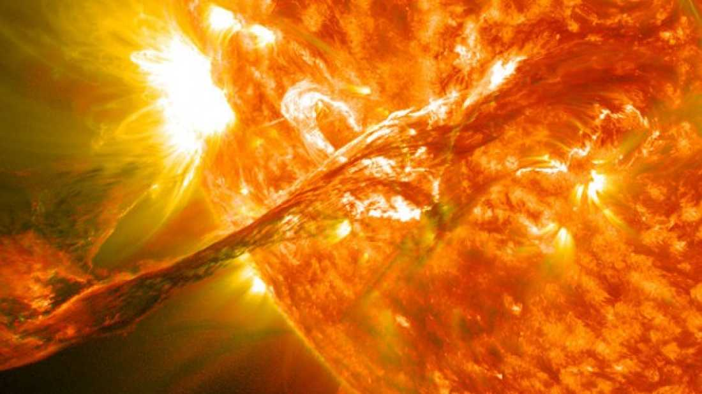


Be prepared for all comm's to go down when we don't miss the solar storm...

Best to have spare supplies and survival gear already on-hand...


# Earth Narrowly Missed A Potentially Devastating Solar Superstorm In 2012

Earth narrowly missed a catastrophic solar storm in 2012 that could have rudely thrown civilization back to the [18th century](http://science.nasa.gov/science-news/science-at-nasa/2014/23jul_superstorm/). It would have been slathered over tabloids and news channels (not that you would be able to get signal) and the subject of chat all across the world for many years. So how come a tantalizingly close call with an event that could have been this devastating went unnoticed by the vast majority of us Earthlings?

On [July 23, 2012](http://science.nasa.gov/science-news/science-at-nasa/2014/23jul_superstorm/), the most powerful solar storm in over 150 years resulted in a coronal mass ejection (CME) ripping through Earth’s orbit. Fortunately for us we were not hit, but the same cannot be said for the STEREO-A solar observatory that was in the firing line. According to Daniel Baker of the University of Colorado, if the event had occurred just one week earlier, we wouldn’t have been so lucky. “If it had hit, we would still be picking up the pieces,” Baker said in a NASA [news-release](http://science.nasa.gov/science-news/science-at-nasa/2014/23jul_superstorm/).

Solar storms start off with an explosion called a solar flare that fires X-rays and UV radiation to Earth at incredible speeds, ionizing the upper layers of our atmosphere. This can muck up GPS systems and cause radio blackouts. Shortly after this, more energetic particles reach Earth that can frazzle satellites. Finally, the CMEs make an appearance, which can take more than a day to cross the Sun-Earth divide. [CMEs](http://helios.gsfc.nasa.gov/cme.html) are balloon-shaped bursts of gas intertwined with [magnetic field lines](http://solarscience.msfc.nasa.gov/CMEs.shtml) that are spewed out from the Sun. Each event releases up to [100 billion kilograms](http://helios.gsfc.nasa.gov/cme.html) of [magnetized plasma](http://science.nasa.gov/science-news/science-at-nasa/2014/23jul_superstorm/) into space, making them the biggest explosions in our solar system. 

These extreme solar storms are not alien to us. Back in 1859, a similarly powerful event, the iconic “Carrington Event,” affected telegraph lines all across the globe and even set fire to some telegraph offices. Had that happened today, it would have likely cost in excess of [$2 trillion](http://science.nasa.gov/science-news/science-at-nasa/2014/23jul_superstorm/), according to the National Academy of Sciences.

Thanks to the STEREO-A observatory taking one for the team, scientists know a fair amount about the July 23 storm. This spacecraft is able to measure the parameters of events such as this. Using this information, Baker and colleagues estimated “disturbance- storm time” for the event, which is a measurement of how much the Earth’s magnetic field trembles after the CME hits. They predict that it would have been comparable to the Carrington Event and twice as great as the 1989 solar storm that caused the “Quebec blackout.” Furthermore, it transpires that many CMEs were spewed into space during the storm, rather than just one.

Physicist Pete Riley has been studying records of solar storms for the past 50 years in order to calculate the odds of an event similar to Carrington hitting Earth within the next 10 years. In a recently published paper, he states that the odds are 12%. “It’s a sobering figure,” [he said](http://science.nasa.gov/science-news/science-at-nasa/2014/23jul_superstorm/). 

[Via [NASA](http://science.nasa.gov/science-news/science-at-nasa/2014/23jul_superstorm/)]

