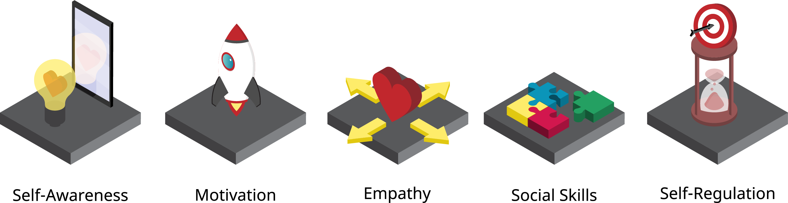


There are certain emotions that will kill your drive; frustration and confusion. You can change these to a positive force. Frustration means you are on the verge of a breakthrough. Confusion can mean you are about to learn something. Expect the breakthrough and expect to learn.


## It is the ability to manage our own emotions and react to the emotions of others.
People who exhibit emotional intelligence have the less obvious skills necessary to get ahead in life, such as managing conflict resolution, reading and responding to the needs of others, and keeping their own emotions from overflowing and disrupting their lives.

## 5 key areas of emotional intelligence

1. **Self-awareness**: involves knowing your own feelings.
2. **Self-management**: involves being able to keep your emotions in check when they become disruptive.
3. **Motivation**: is for the sake of personal joy, curiosity, or the satisfaction of being productive.
4. **Empathy**: the skill and practice of reading the emotions of others and responding appropriately.
5. **Social skills**: this can include finding common ground with others, managing others in a work environment, and being persuasive.

### Improving self-awareness

* **Keep a journal** of your emotions. At the end of every day, write down what happened to you, how you felt, and how you dealt with it.
* **Ask for input** from people who know you well about where your strengths and weaknesses lie, to gauge your perception from another’s point of view.
* **Slow down (or meditate)**. The next time you have an emotional reaction to something, try to pause before you react.

### Self-management
**Proper self-management means controlling your outbursts, distinguishing between external triggers and internal over-reactions, and doing what’s best for your needs.**

If you’re stuck in an emotional loop, give yourself a “snap out of it” slap. Anything that can give a slight shock to your system or break the existing routine can help. (try counting to 10 for e.g.)

### Motivation
It’s your inner drive to accomplish something.

**In order to start making use of that motivation, you first need to identify your own values.** Use a journal to find times when you’ve felt fulfilled. Create a list of things you value. Most of all, accept the uncertainty in life and just build something.

### Practice Empathy

* You can’t experience everyone else’s lives to fully understand them, but **you can listen**. Put aside your preconceptions or skepticism and allow the person you’re talking to a chance to explain how they feel.
* **Take up a contrary position to your own**: If you think your boss is being unreasonable, try defending their actions in your head.
* **Understanding is key to having empathy.** When someone tells you about an experience that’s not your own, take some time to mull over how your life might be different if you experienced that on a daily basis.

### Resolving Disagreements
* Identify and deal with your emotions: Take time apart to vent, then return to the problem.
* Address legitimate problems once you’re both calm: Before you jump to solutions, make sure you and the other person agree on what the problems really are. Propose solutions that are mutually beneficial.
* End on a cooperative note: Make sure that the last intention you communicate is a cooperative one.