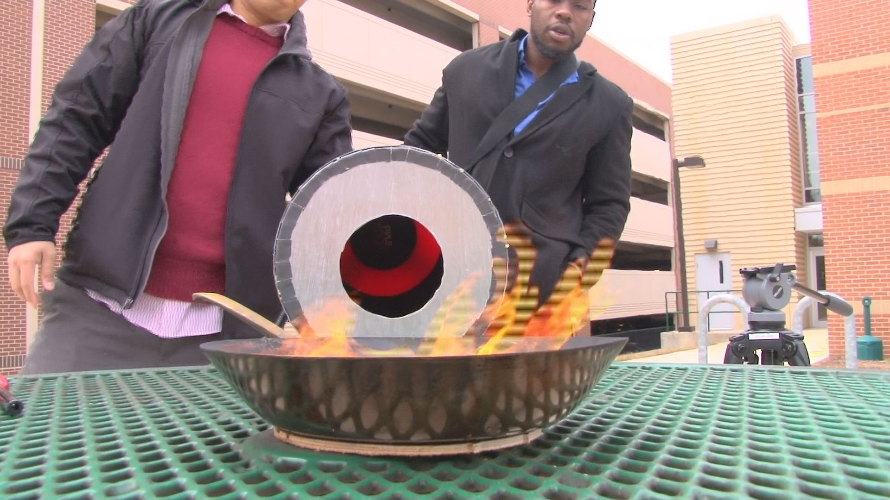
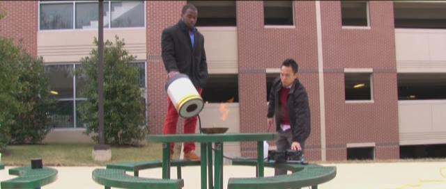

*Two George Mason University students have designed a device that uses sound waves to put out fires.*

Seth Robertson and Viet Tran's wave extinguisher douses burning rubbing alcohol with just its rumbling bass note.

Using $600 of equipment including amps, a speaker and something thing they call a *collimater*, the students starve the flame of oxygen, causing it to go out.

Robertson and Tran struggled with skeptics, both professors and students, and their original design didn't work. They went back to the drawing board, and found the right low note.

Sound in the 30 to 60 hertz range seems to vibrate the oxygen away from the fuel, effectively suffocating the fire. So far they've just used it on small alcohol fires, but a local fire department is offering to test it on a structure fire.

They don't think there's anything in principal to keep them from scaling up. They think the principal might work for much bigger fires.

They have a preliminary patent, and they're still trying to decide whether to seek a full patent, which would be pricey for a couple of college students.

