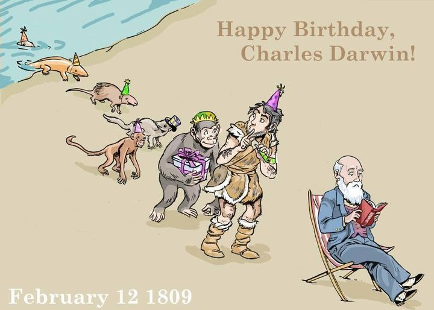


February 13, 2015

Happy birthday, Charles Darwin!
In honor of Darwin Day, don’t forget that you can read ALL of his published work online, including On the Origin of Species, completely free of charge. 

Check it out here: http://bit.ly/19UWNTR 
Artwork via www.trufflebeetles.com
