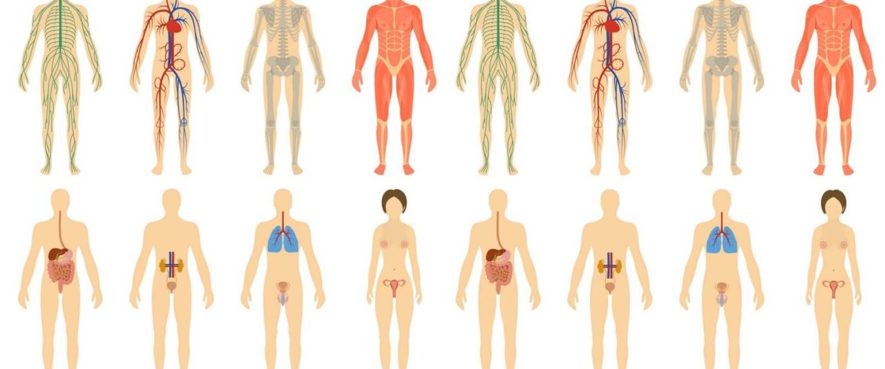

 People go plant-based for lots of reasons. These include losing weight, feeling more energetic, reducing the risk of heart disease, decreasing the number of pills they take … there are dozens of great reasons! For even more inspiration, check out these other benefits you can expect when you go plant-based.

 

## You'll reduce inflammation in your body
 If you are eating meat, cheese, and highly processed foods, chances are you have [elevated levels of inflammation](http://www.ncbi.nlm.nih.gov/pubmed/23865797) in your body. While short-term inflammation (such as after an injury) is normal and necessary, inflammation that lasts for months or years is not. Chronic inflammation has been linked to the development of atherosclerosis, heart attacks, strokes, diabetes, and autoimmune diseases, among other conditions.

 In contrast, plant-based diets are [naturally anti-inflammatory](http://www.ncbi.nlm.nih.gov/pubmed/23865797), because they are high in fiber, antioxidants, and other phytonutrients, and much lower in inflammatory triggers such as saturated fat and endotoxins (toxins released from bacteria commonly found in animal foods). Studies have shown that people who adopt plant-based diets can [dramatically lower their level of C-reactive protein](http://www.ncbi.nlm.nih.gov/pubmed/25637150) (CRP), an indicator of inflammation in the body.

## Your blood cholesterol levels will plummet
 Elevated blood cholesterol is a key risk factor for [heart disease](http://www.pcrm.org/health/health-topics/cholesterol-and-heart-disease) and strokes, two of the leading killers in the United States. Saturated fat &mdash; primarily found in meat, poultry, cheese, and other animal products&mdash;is a major driver of our blood cholesterol levels. [Cholesterol](http://www.forksoverknives.com/why-cholesterol-still-matters/) in our food also plays a role.

 Studies consistently show that when people go plant based, their blood cholesterol levels drop [by up to 35%](http://www.ncbi.nlm.nih.gov/pubmed/19766762). In many cases, the decrease is equal to that seen with drug therapy &mdash; with many positive side effects! People who require cholesterol-lowering drugs can further slash their cholesterol levels and cardiovascular risk by adopting a plant-based diet.

 Whole-food, plant-based (aka "WFPB") diets reduce blood cholesterol because they tend to be very low in saturated fat and they contain zero cholesterol. Moreover, plant-based diets are high in fiber, which [further reduces blood cholesterol](http://www.ncbi.nlm.nih.gov/pubmed/19766762) levels. [Soy](http://jama.jamanetwork.com/article.aspx?articleid=196970) has also been shown to play a role in lowering cholesterol, for those who choose to include it.

## You'll give your microbiome a makeover
 The trillions of microorganisms living in our bodies are collectively called the microbiome. Increasingly, these microorganisms are recognized as [crucial to our overall health](http://nutritionfacts.org/video/microbiome-the-inside-story/): not only do they help us digest our food, but they produce critical nutrients, train our immune systems, turn genes on and off, keep our gut tissue healthy, and help protect us from cancer. [Studies](http://www.ncbi.nlm.nih.gov/pubmed/24652102) have also shown they play a role in obesity, diabetes, atherosclerosis, autoimmune disease, inflammatory bowel disease, and liver disease.

 Plant foods help shape a healthy intestinal microbiome. The fiber in plant foods promotes the growth of “friendly” bacteria in our guts. On the other hand, fiber-poor diets (such as those that are high in dairy, eggs, and meat) can [foster the growth of disease-promoting bacteria](http://www.ncbi.nlm.nih.gov/pubmed/24652102). Landmark studies have shown that when omnivores eat choline or carnitine (found in meat, poultry, seafood, eggs, and dairy), gut bacteria make a substance that is converted by our liver to a toxic product called [TMAO](http://www.forksoverknives.com/tmao-a-toxic-substance-formed-when-you-eat-meat-can-make-you-dead-meat/). TMAO leads to worsening cholesterol plaques in our blood vessels and escalates the risk of heart attack and stroke.

 Interestingly, people eating plant-based diets make [little or no TMAO](http://www.ncbi.nlm.nih.gov/pubmed/23563705) after a meat-containing meal, because they have a totally different gut microbiome. It [takes only a few days](http://www.ncbi.nlm.nih.gov/pubmed/?term=Diet+rapidly+and+reproducibly+alters+the+human+gut+microbiome) for our gut bacterial patterns to change – the benefits of a plant-based diet start quickly!

## You'll change how your genes work
 Scientists have made the remarkable discovery that environmental and lifestyle factors can turn genes on and off. For example, the antioxidants and other nutrients we eat in whole plant foods can change gene expression to optimize how our cells repair damaged DNA. Research has also shown that lifestyle changes, including a plant-based diet, can [decrease the expression of cancer genes](http://www.ncbi.nlm.nih.gov/pubmed/18559852) in men with low-risk prostate cancer. We’ve even seen that a plant-based diet, along with other lifestyle changes, can [lengthen our telomeres](http://www.ncbi.nlm.nih.gov/pubmed/24051140) &mdash; the caps at the end of our chromosomes that help keep our DNA stable. This might mean that our cells and tissues age more slowly since shortened telomeres are associated with aging and earlier death.

## You'll dramatically reduce your chances of getting Type-2 Diabetes
 An estimated [38 percent of Americans have prediabetes](http://www.ncbi.nlm.nih.gov/pubmed/26348752) &mdash; a precursor to type 2 diabetes. Animal protein, especially red and processed meat, has been shown in [study](http://www.ncbi.nlm.nih.gov/pmc/articles/PMC3942738/pdf/nutrients-06-00897.pdf) after [study](http://www.ncbi.nlm.nih.gov/pubmed/24722499) to increase the risk of type 2 diabetes. In the Adventist population, omnivores have [double the rate of diabetes](http://www.ncbi.nlm.nih.gov/pmc/articles/PMC2671114/) compared with vegans, even accounting for differences in body weight. In fact, in this population, eating meat once a week or more over a 17-year period [increased the risk of diabetes by 74 percent](http://www.ncbi.nlm.nih.gov/pubmed/?term=vang+ann+nutr+metab+2008)! Similarly, in the Health Professionals Follow-up Study and Nurses Health Study, increasing red meat intake by more than just half a serving per day was associated with a [48 percent increased risk in diabetes](http://www.ncbi.nlm.nih.gov/pmc/articles/PMC3847817/pdf/nihms530233.pdf) over 4 years.

 Why would [meat cause type 2 diabetes](http://www.ncbi.nlm.nih.gov/pmc/articles/PMC3942738/pdf/nutrients-06-00897.pdf)? Several reasons: animal fat, animal-based (heme) iron, and nitrate preservatives in meat have been found to damage pancreatic cells, worsen inflammation, cause weight gain, and impair the way our insulin functions.

 You will dramatically lessen your chances of getting type 2 diabetes by leaving animal products off of your plate and eating a diet based in whole plant foods. This is especially true if you eat [whole grains](http://www.ncbi.nlm.nih.gov/m/pubmed/22649266/), which are highly protective against type 2 diabetes. You read that right: carbs actually protect you from diabetes! Also, a plant-based diet can [improve or even reverse](http://ajcn.nutrition.org/content/89/5/1588S.long) your diabetes if you’ve already been diagnosed.

## You'll get the right amount (and the right type) of protein
 The average omnivore in the US gets [more than 1.5 times](http://nchstats.com/category/protein/) the optimal amount of protein, most of it from animal sources.

 Contrary to popular perception, this excess protein does not make us stronger or leaner. Excess protein is stored as fat or turned into waste, and animal protein is a major cause of [weight gain](http://www.ncbi.nlm.nih.gov/pubmed/21139559), [heart disease](http://www.ncbi.nlm.nih.gov/pubmed/22677895), [diabetes](http://www.ncbi.nlm.nih.gov/pubmed/24722499), [inflammation](http://www.ncbi.nlm.nih.gov/pubmed/23865797), and [cancer](http://hwcdn.libsyn.com/p/4/7/c/47cbc2420ba85e53/Proteinaholic_Chapter13.pdf?c_id=10141917&expiration=1452459236&hwt=68bde0752f631763068fa3b5c6315e3a).

 On the other hand, the protein found in whole plant foods protects us from many chronic diseases. There is no need to track protein intake or use protein supplements with plant-based diets; if you are meeting your daily calorie needs, you will get plenty of protein. The longest-lived people on Earth, those living in the [“Blue Zones](http://www.forksoverknives.com/longevity-diet/),” get about 10 percent of their calories from protein, compared with the US average of 15 to 20 percent.

## You'll make a huge impact on the health of our planet and its inhabitants
 Animal agriculture is extremely destructive to the planet. It is the single largest contributor to [greenhouse gas emissions](http://www.psmag.com/nature-and-technology/gluttony-global-warming-eating-warmer-planet-96495) and is a [leading cause](http://www.cowspiracy.com/facts/) of land and [water use](http://www.forksoverknives.com/freshwater-abuse-and-loss-where-is-it-all-going/), deforestation, wildlife destruction, and species extinction. About 2,000 gallons of water are needed to produce just one pound of beef in the U.S. Our oceans are rapidly becoming depleted of fish; by some estimates, [oceans may be fishless by 2048](http://www.cowspiracy.com/facts/). The current food system, based on meat and dairy production, also contributes to [world hunger(http://www.forksoverknives.com/animal-agriculture-hunger-and-how-to-feed-a-growing-global-population-part-one-of-two/)] &mdash; the majority of crops grown worldwide go toward feeding livestock, not feeding people.

 Equally important, animals raised for food are sentient beings who suffer, whether raised in industrial factory farms or in farms labeled "[humane](http://humanefacts.org/overview/).” Eating a plant-based diet helps us lead a more compassionate life. After all, being healthy is not just about the food we eat; it’s also about our consciousness &mdash; our awareness of how our choices affect the planet and all of those with whom we share it.
