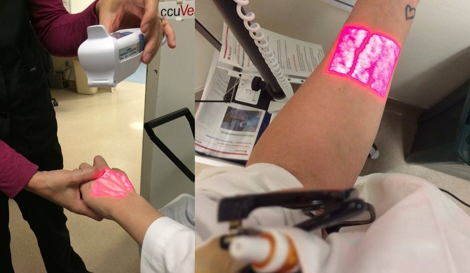


Very cool!


This device uses infrared technology to help find veins!

---
NOW YOU SEE IT! In venipuncture, you have very little margin for error. Imagine how much more effective you'd be if you could locate the veins beneath the skin. Now you can - with AccuVein vein illumination. Visit our website at [accuvein.com](https://www.accuvein.com)