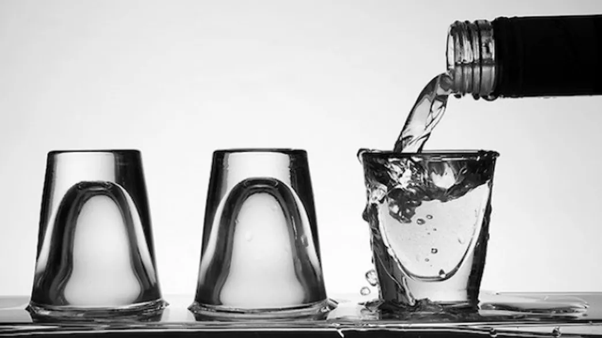

Just one night of binge drinking affects the immune system, and it can happen within just 20 minutes of ingesting alcohol. The [findings](http://www.alcoholjournal.org/article/S0741-8329(14)20186-8/abstract), published in the journal Alcohol last month, are the first to document the immediate effects of alcohol on the human immune system. TGIF! 

That binge drinking alters behavior is well known. “But there is less awareness of alcohol’s harmful effects in other areas, such as the immune system,” [Loyola University Chicago’s Elizabeth Kovacs](http://www.stritch.luc.edu/alcohol_research/node/20) says in a [news release](http://loyolamedicine.org/newswire/news/binge-drinking-disrupts-immune-system-young-adults-loyola-researcher-finds). Previous studies in both humans and animals revealed that alcohol intoxication exerts effects on the immune system several hours to days after the exposure—when blood alcohol is no longer detectable.

Now, to study the effects while blood alcohol is still elevated, a team led by [Majid Afshar of Loyola University Health Systems](http://loyolamedicine.org/people/majid-afshar) collected blood from seven men and eight women before they voluntarily became intoxicated after “high-dose alcohol consumption.” This was achieved by downing up to five shots of vodka within 20 minutes. A 1.5-ounce shot of vodka is the equivalent of one 5-ounce glass of wine or 12-ounce can of beer. 

The team also collected blood 20 minutes, two hours, and five hours after the participants first imbibed (these are the times when intoxicated patients typically arrive at trauma centers for alcohol-related injuries). The researchers isolated immune cells from the blood sample, and then measured their response to introduced proteins from potentially harmful bacteria, [New Scientist explains](http://www.newscientist.com/article/mg22530031.800-booze-binge-has-immediate-effect-on-immune-system.html#.VLCJR2SR82t). An early pro-inflammatory state was already evident at 20 minutes when blood alcohol levels were about 130 milligrams per deciliter. The immune system was revving up: There was an increase in total circulating leukocytes, monocytes, and natural killer cells. Additionally, there was also an increase in cytokines, a protein that signals the immune system to ramp up. 

The responses eventually diminished, and the immune system became more sluggish than when the volunteers were sober. At the two and five hour post-peak-intoxication intervals, the team found an anti-inflammatory state with reduced numbers of monocytes and natural killer cells circulating in the blood. This was accompanied by higher levels of a different kind of cytokine that signals for the immune system to become less active.