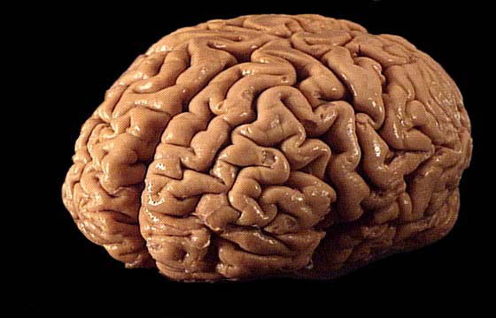


Curious


There are lots of advantages to having wealthy parents; such children go to the best schools, get top medical care, hob-nob with other members of the elite, are welcomed in prestigious golf and yacht clubs, and eventually stand to inherit a bundle. To top it all off, it now seems that they have bigger brains too.

Some things in life just aren’t fair.

A study in [Nature Neuroscience](http://www.nature.com/neuro/journal/vaop/ncurrent/full/nn.3983.html) this week found a correlation between parental wealth and children’s brain size. Kimberly Noble of Columbia University in New York and her colleagues reported that the relationship between income and brain surface area was logarithmic.

That means that income has an even bigger effect at the poor end of the socio-economic scale than it does for the wealthy.

A typical human brain has a surface area of 2,400 sq cm (about 380 sq in), folded up to create the characteristic walnut folds of the cerebral cortex, where most of our higher though processes are conducted.


Among children from lower-income families, small differences in income were associated with relatively large differences in surface area, whereas, among children from higher income families, similar income increments were associated with smaller differences in surface area.


Most affected were regions supporting language, reading, executive functions and spatial skills.

Academics have long suspected that there was a link between socio-economic status and intellectual performance, but this is the first time scientists have been able to point to physical differences in the brain.

Children from richer families do better on tests for IQ, reading and language ability, executive function, a term which encompasses the regulation and control of other cognitive operations, such as memory, reasoning and planning.

And even now, they’re not sure how the link works. Hypotheses include the influence of stressful home environments, poor nutrition, and exposure to damaging pollution, wrote [Nature](http://www.nature.com/news/poverty-shrinks-brains-from-birth-1.17227) staff writer Sara Reardon.

Dr Noble and fellow neuroscientist Dr Elizabeth Sowell from the Children’s Hospital Los Angeles led a team that imaged the brains of 1,099 children, adolescents and young adults across America.

They found that the brains of children from families earning less than US$25,000 a year had 6 per cent less surface area than those whose families made US$150,000 or more.

Researchers in the field hope to be able to clarify how much this disparity can be mitigated through interventions such as better child care and nutrition.


It’s important for the message ***not*** to be that if you're poor your brain is smaller and will be smaller forever...

