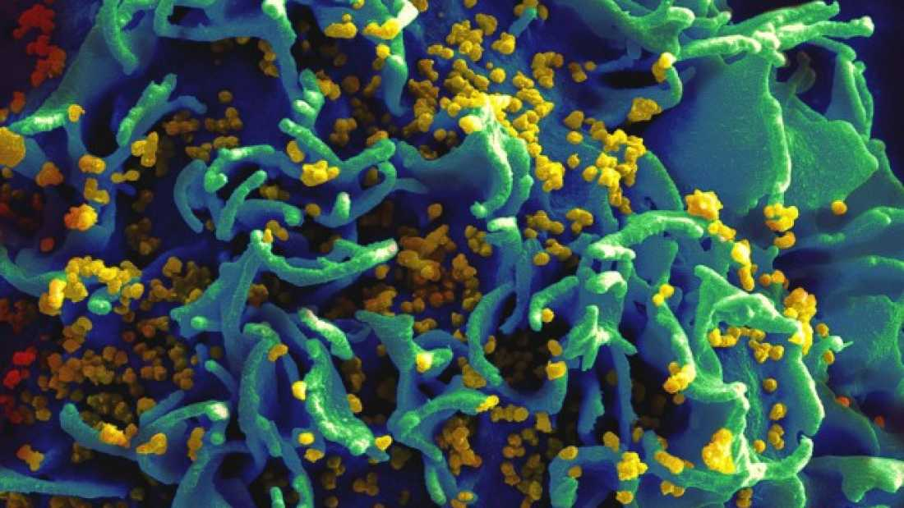



Why is this treatment not being advertised to the rest of the general population?


# A Man Was Cured Of HIV In 2008, And Hardly Anyone Knows About It

Human immunodeficiency virus (HIV), the cause of Acquired Immune Deficiency Syndrome (AIDS), has plagued the world for decades. Since the dawn of the epidemic, it is estimated that around [36 million](http://www.who.int/gho/hiv/en/) people have died of HIV. Currently, over 35 million people are infected with the virus. With the majority of infections in the developing world where access to medical care is often limited, and treatments that control rather than cure, HIV represents a global, ongoing problem. However, back in 2008, a man named Timothy Ray Brown, known more famously as “The Berlin Patient”, received a functional cure for HIV. What sets this man apart from others? Why did this treatment work, and could it be used to cure others? This article is going to briefly summarize this case study to give those who may not be aware of The Berlin Patient an insight into this intriguing situation.

[Brown](http://www.nejm.org/doi/full/10.1056/NEJMoa0802905#t=article) was diagnosed with HIV back in 1995 and he soon began taking anti-HIV drugs, or antiretroviral therapy. HIV treatments typically involve a cocktail of three drugs that target different stages of the HIV life cycle. This is because HIV can rapidly mutate and become resistant to a drug, but this becomes more difficult if several drugs are given at the same time. Brown seemed to be controlling infection with these drugs and did not present any illnesses associated with AIDS. In 2006 he was diagnosed with acute myeloid leukemia (AML). Since HIV RNA was not detectable in the patient it was likely that the two conditions were unrelated.

Brown was given [chemotherapy](http://www.nejm.org/doi/full/10.1056/NEJMoa0802905#t=article) to treat the cancer, but the drugs induced severe toxic effects and he had to stop taking his antiviral medication. This resulted in a rebound of viral replication. He was put back on the antiviral drugs, but a few months later the cancer came back. His doctors then carried out an experimental procedure to see if they could tackle both the cancer and the HIV at the same time. To do this, Brown was given two stem cell transplants from an unrelated donor. This donor happened to possess a very specific mutation.

HIV predominantly infects a type of white blood cell called a CD4+T cell. These cells express a receptor called CD4 which is what HIV primarily uses for cell entry; HIV, and viruses in general, cannot replicate outside of a host cell. However, HIV also needs to use a co-receptor to get into cells, one of which is called CCR5. Around [1%](http://www.nejm.org/doi/full/10.1056/NEJMoa0802905#t=article) of the Caucasian population has a mutation in the gene producing this receptor, called [CCR5delta32](http://bloodjournal.org/content/117/10/2791?variant=abstract) (referring to a deletion of 32 base pairs within the gene). This [mutation](http://www.nature.com/scitable/blog/viruses101/hiv_resistant_mutation) results in a smaller than normal receptor which does not localize to the outside of cells. Individuals that are [homozygous](http://blogs.nature.com/boston/2012/08/17/hiv-research-how-the-berlin-patient-led-to-the-boston-patients) (carry two copies) for this mutation are typically immune to HIV infection since HIV can’t get inside target cells. The doctors therefore wondered whether replacing the patient’s cells with cells carrying this mutation would hamper HIV replication.

Remarkably, future tests demonstrated that Brown was cleared of HIV. He therefore stopped taking antiretroviral medication and has not needed to take it since. Many are reluctant to use the word “cure” when it comes to HIV, but this was considered to be a “functional cure”. One of the (many) difficulties in tackling HIV is that it hides away in cells, replicating at very low levels that aren’t picked up by the immune system. These “viral reservoirs” can become activated and kick start viral replication when treatment stops, representing a major hurdle in treatment. Many were worried this may be the case for Brown, and indeed tests carried out years later did find [traces of HIV genetic material](http://www.npr.org/blogs/health/2012/06/13/154869103/traces-of-virus-in-man-cured-of-hiv-trigger-scientific-debate) in some tissues. However, the tests were so sensitive that it is likely these were false positives.

Although this was a very exciting case for medicine, this cure is not applicable to the vast majority of people. Stem cell transplantation is not a simple, risk-free procedure. It’s invasive, dangerous and extremely expensive. The process involves destroying the immune system of the patient, and regularly results in death. It's only used when no other treatment is available. HIV infection on the other hand, is no longer the death sentence that it was decades ago. Current anti-retroviral therapies are extremely effective at suppressing viral replication and prevent the onset of AIDS. If a person infected with HIV today receives proper treatment, they have a normal life expectancy. So as fascinating as this case is medically, don’t expect it to become common practice. 
