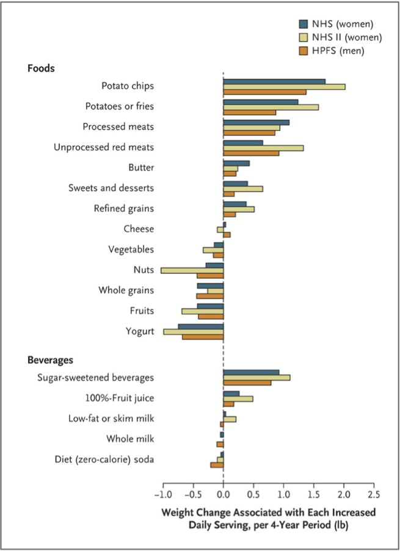

 [Thermogenex](http://hypothermics.com/)

 This should be more than enough to show how healthy a food (group) is for our weight...

 
  Changes in Diet and Lifestyle and Long-Term Weight Gain in Women and Men. Bars to the right indicate these food tend to cause this weight gain over each four year period. Bars to the left are weight loss associated with that category of food. 
 

<!-- (http://hypothermics.com/wp-content/uploads/2011/06/NEJM-Food-20-year.jpg) -->