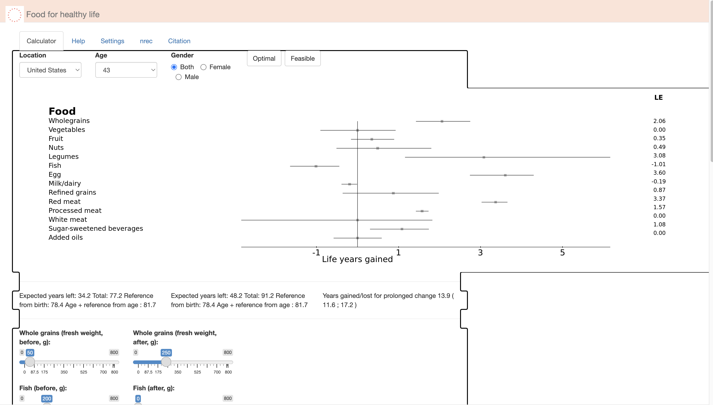

Interesting to see how eating more meat tends to lower life expectancy...

Here's a calculator to see how your dietary habits influence your healthspan.

> Basically, removing all eggs, fish, red & white meats, and lowering oil consumption significantly increases one's potential healthspan.
> In my case, "going vegan" adds about 2 **DECADES** of life! That's enough to watch my grandkids grow up!

The Food4HealthyLife calculator: [https://food4healthylife.org/](http://158.39.201.81:3838/Food/)

---

Food for healthy life is based on the following paper:

Fadnes LT, Økland J-M, Haaland ØA, Johansson KA (2022)
Estimating impact of food choices on life expectancy: A modeling study.
PLoS Med 19(1): e1003889.
https://doi.org/10.1371/journal.pmed.1003889 
