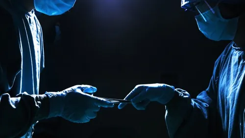


Maybe I'll upgrade my body in 20 or 30 years?


Head transplants, or body transplants depending on how you look at them, are not just a thing of quirky horror movies. The first documented procedure was carried out back in the ‘50s when surgeon and transplant pioneer Vladimir Demikhov [grafted the head and forelimbs of a puppy](http://www.newscientist.com/article/mg22530103.700-first-human-head-transplant-could-happen-in-two-years.html#.VO9Bb_msW4g) onto the body of a different dog. Disturbingly, he followed this with his more famous work, which involved the creation of two-headed dogs. Unsurprisingly, none of his animals lasted for more than a few days.  

While ethically questionable, these procedures ultimately led to the first successful head transplant on a monkey in 1970 by Dr. Robert White, who was apparently inspired by Demikhov’s work. Although White demonstrated the feasibility of the procedure, he didn’t bother to attempt to fuse the spinal cords of the donor monkey with the recipient, so it was paralyzed and couldn’t breathe without assistance. Although little has been done subsequently, medicine has progressed by leaps and bounds since then. So much so that one neurosurgeon believes that the procedure could soon be carried out on humans, and he has just [published an outline](http://surgicalneurologyint.com/article.asp?issn=2152-7806;year=2015;volume=6;issue=1;spage=18;epage=18;aulast=Canavero;type=3) of what the surgery would potentially involve.

According to the doctor, Sergio Canavero, the major obstacles to success—such as the risk of the body rejecting the head—can now be overcome thanks to modern medicine, and with a few further advances, the procedure could be ready as soon as 2017. That being said, just because it can be done, that does not mean it will—there are major ethical issues that would need to be considered before it can be approved. Those aside, this kind of dramatic surgery could offer hope to people whose organs are plagued with cancer, or those who have suffered major accidents. That’s why Canavero is now trying to [recruit a team](http://www.theguardian.com/society/2015/feb/25/first-full-body-transplant-two-years-away-surgeon-claim) to further explore the possibility of such a technique and plans to announce the project later this year, according to [New Scientist](http://www.newscientist.com/article/mg22530103.700-first-human-head-transplant-could-happen-in-two-years.html#.VO9Bb_msW4g).

So what would the surgery involve? First, the recipient’s head would have to be cooled to keep the cells alive, as would the recently deceased donor. Next, the neck is cut into and the blood vessels are hooked up by a series of small tubes. After the spinal cords are neatly severed, the head is then moved onto the donor body, which is ready for the trickiest and most crucial part: joining up the ends of the spinal cords.

To do this, [Canavero suggests](http://surgicalneurologyint.com/article.asp?issn=2152-7806;year=2015;volume=6;issue=1;spage=18;epage=18;aulast=Canavero;type=3) using a substance called polyethylene glycol, which would help [fatty cell membranes meld together](http://www.newscientist.com/article/mg22530103.700-first-human-head-transplant-could-happen-in-two-years.html#.VO9Bb_msW4g). The final part of the procedure involves stitching up the blood vessels and muscles before putting the patient into a coma for up to a month. After intense physiotherapy, the patient should be able to use their body and walk. Although there is a risk of rejection, as with any transplant, Canavero points out that immunosuppressive drugs should prevent this from happening.

However, many of the surgeons that the New Scientist contacted said the idea sounded “too outlandish,” while others simply refused to provide any remark at all. One of those who did comment was Harry Goldsmith, a clinical professor of neurological surgery at the University of California, Davis, who said: “This is such an overwhelming project, the possibility of it happening is very unlikely. I don't believe it will ever work.”

Alongside the ethical considerations of such a surgery, some have [expressed concerns](http://www.newscientist.com/article/mg22530103.700-first-human-head-transplant-could-happen-in-two-years.html#.VO9Bb_msW4g) that it could lead to people wanting to exchange their bodies for cosmetic reasons, so obviously if it does become legalized, strict regulations will have to be in place. Since the idea has been met with some strong opposition by those in the field of medicine, and many believe it simply won’t work, it will be interesting to see what unravels over the next couple of years.