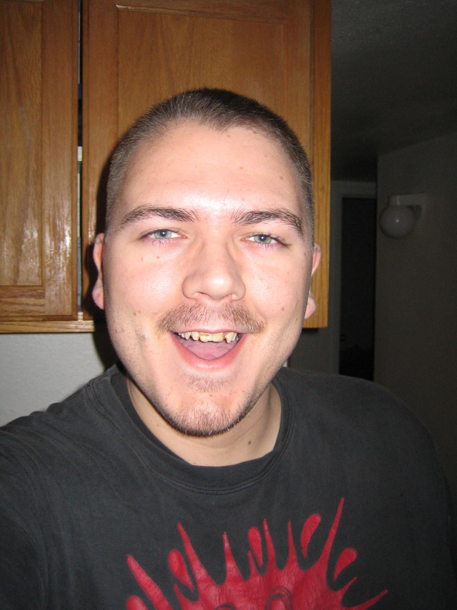

  In the summer of 2006, I had a great job and was mostly enjoying my life. I started working a 2nd job as a web developer to save up more money. The pay was great. They even bought my food. Before I started the night job, I weighed about 300 pounds. After working the night job with all the free pizza, Kentucky Fried Chicken, and other very tasty fast-foods for 3 months... I noticed that my clothes didn't fit so well anymore. Even my colleagues at my day job commented on it. I stepped on the scale and it read: "GET OFF!!!" But seriously, it told me that I ballooned to staggering **358** pounds! I was shocked! 

 
  
  
  
  
  
  
 

  At that moment, I had to decide. I choose to re-invent myself and develop a new life style. A life style that encouraged daily exercise and less buffeting on any food in reach. My day job was less than 4 miles from my home. And, most of any shopping I needed was within a 3 mile radius of my home. I decided that I would simply park the truck and leave the crotch rocket at home. Instead, I would *walk* everywhere! Every morning, I would walk to work and walk home after work. Plus, limit the physical size of my meals to no larger than the size of my right fist. Additionally, I increased the frequency of my "meals." I would eat about 5 to 6 times a day at 3 hour intervals. I made sure not to eat within two hours of bed-time.

 
  
  
  
  
  
 

  The first month, I didn't see much difference. But I wrote that off to my body still adjusting to the new routine. Then I increased the workouts to about 2 hours a day. And, I started seriously looking at the foods I was eating.  Further more, I decided that I would completely remove alcohol from my diet. One note here about the food I ate... It didn't matter what I ate... as long as I knew the calories it took my body to burn it was enough to sustain its function. The formula is quite simple: You body has to burn more energy than you intake. This does not mean that you must starve. By not only changing the quantity per meal and the frequency, I found that my metabolism had actually speed up a significant amount! Before I started this life-style change, my bowel movements where averaging about twice a week. After a month on my new diet, my average was once per day! 

  After four months of this *dedicated* routine, I dropped about 50 pounds! I was ecstatic! I even had to go shopping for new clothes that would fit. I noticed that my marches down the street were becoming "easier..." So, I bought some hand and ankle weights. Since, I lived in Phoenix, Arizona, I was drinking about 4 liters of water per day. I don't drink soda at all. Mostly, I drink water. Once in a while, I would drink some tea or juice. Since college, I don't drink much milk either. On the weekends, I would power-walk about 10 miles. It was exhausting, but I saw the rewards of my hard work. Loose fitting pants and more ladies staring at me. 😏

  I had a shirt made to remind me and everyone of my success. On it was: "LOST 70 POUNDS" in big, black lettering on a white sleeveless shirt. I wore it every weekend when I power-walked along the streets in my city. I noticed a lot of people turning their heads at me. Some even honked their horns at me in a cheer-like fashion. I would keep marching on! Their cheers provided a boost to my enthusiasm for my battle to continue loosing weight!

  After five years, my weight is now 252 pounds. The lowest I managed to weigh was 235 pounds. I've allowed myself to drink alcohol again, and I believe this is one of many reasons why my weight-loss is now negative. So, I must re-enforce what I know works. Watch my meal sizes. Stop drinking alcohol. (An occasional drink once, maybe twice a month is okay.) Beat down the side-walks like I'm marching into battle. __The battle for my life.__

  I'm also researching for more effective ways to "jump-start" my body into burning more calories. Remember, that within thermodynamics a kilocalorie is the amount of energy to raise 1 Kg of water 1 degree Celsius. So, maybe it's time I "put my diet on ice!" Literally, add ice to my workouts and baths. I'm going to attempt to train my body to sleep in colder temperatures and use no blanket. Maybe a thin sheet, but no blanket. Additionally, I need to remind myself not the eat within two hours of my "icing" and *ignore the hunger pangs*. I must return to simply drinking water anytime I feel hungry. This way, I not only keep myself hydrated, but trick my stomach into believing it's full of food. Only eat every 3 hours. 3 fist-sized meals and 2 or 3 half-fist sized snacks. This is my life here! Failure is not an option.
