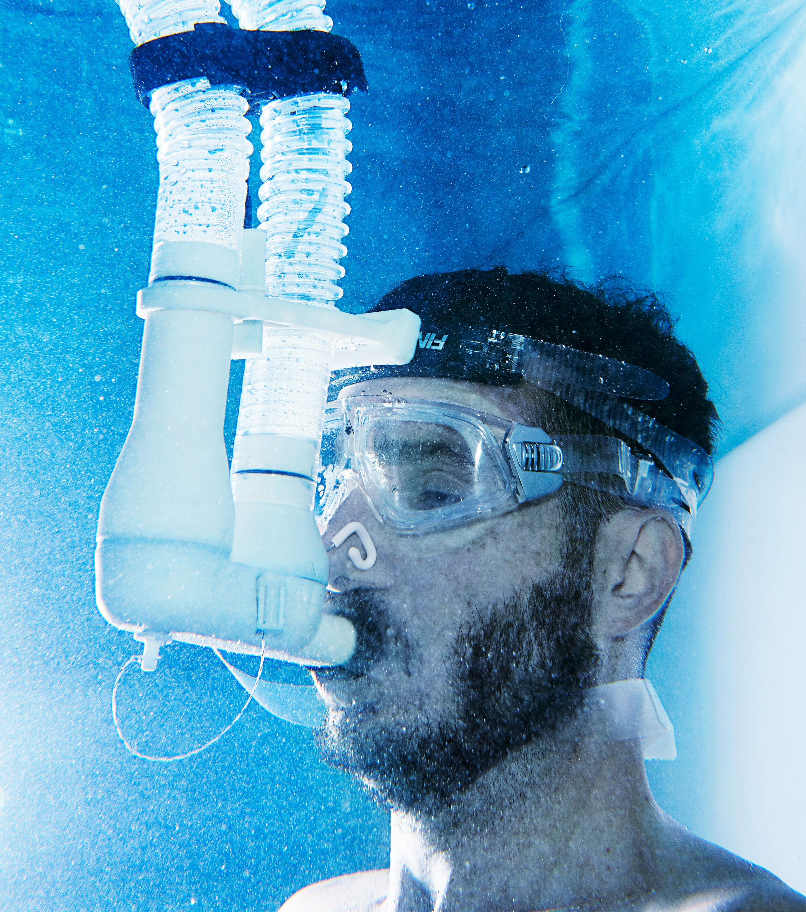
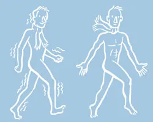
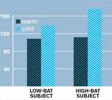

# Hot Trend: Tapping the Power of Cold to Lose Weight
 
 Exposing the body to cold can be a radically effective spur for losing weight, leading one DIY researcher to formulate an algorithm, app, or wearable device to tap the transformative power of cold.
 
 

 I'M IN THE fetal position at the bottom of a swimming pool. Water temperature: 60 degrees Fahrenheit. In my lap there's a 20-pound weight anchoring me in place. All I'm wearing is a Speedo, a nose plug, goggles, and a snorkel resembling an oversize asthma inhaler. The mouthpiece connects to two 4-foot hoses feeding out of the water and into a PC-sized box next to a laptop.

 After 20 minutes in the water, I'm shivering intensely. But that doesn't bother me so much as the headache. It feels like a set of pliers is clamping the back of my neck while someone pricks my temples with icy-hot needles.

 My suffering is natural, I tell myself. It could even be good for me.

 Now a hand from above reaches into the water and slaps the side of the pool. It's my torturer, [Ray Cronise](https://twitter.com/RayCronise), signaling that time is up. A former NASA material scientist who spent 15 years overseeing experiments aboard shuttles at Marshall Space Flight Center, Cronise is putting me through a battery of tests at his home in Huntsville, Alabama. That snorkel contraption—a $30,000 piece of lab equipment—is analyzing my breathing to chart how the cold water affects my metabolism. (It tracks inhaled and exhaled carbon dioxide and oxygen, a proxy for the amount of fuel I'm burning.) Cronise believes exposing the body to cold can be a radically effective spur for losing weight. He's doing this home-brewed research in hopes of formulating a Weight Watchers-style algorithm, app, or wearable device that can help people safely harness what he's convinced is the transformative power of cold.

 Cronise got the idea back in 2008 while watching a TV program about Michael Phelps. The coverage claimed that, while training, the Olympic swimmer ate 12,000 calories a day. At the time, Cronise was on a diet of 12,000 calories per week. (He was carrying 209 pounds on his 5'9" frame and wanted to get back down to 180.) Something didn't add up. Even if Phelps had an exceptionally high metabolism and swam three hours a day, he still should have turned into a blob. Then it hit Cronise: Phelps was spending hours every day in water, which was sucking heat from his body. He was burning extra calories just to maintain his core temperature of 98.6.

 That fall, Cronise grew obsessed. He avoided warmth altogether: He took cool showers, wore light clothing, slept without sheets, and took 3-mile "shiver walks" in 30-degree weather wearing a T-shirt, shorts, gloves, and earmuffs. In six weeks he shed 27 pounds, nearly tripling his weight-loss rate without changing his calorie-restricted diet.

 Cronise set off a full-blown weight-loss fad. In 2010, he talked about his self-experimentation in a presentation, and then the Pied Piper of body-hacking, Tim Ferriss, name-checked Cronise and prescribed 20-minute ice baths in The 4-Hour Body. When the book came out, ABC's Nightline aired a segment on Ferriss and "thermal dieting." Right on cue, bloggers began documenting their own cold-exposure experiences. On websites and forums like Fatburningman.com, diehards started sharing tips on making DIY ice packs. "My body," one guy confessed after sleeping with ice-filled Ziplocs on his abs, "felt like it had been beaten with heavy sticks." Today the trend has gone truly mass: Best-selling diet books like Six Weeks to OMG: Get Skinnier Than All Your Friends urge readers to take cold baths. On Today, Kathie Lee Gifford praised a company called FreezeAwayFat, which sells Lycra bike shorts with pockets for frozen gel packs. Her personal review: "My belt is now one notch smaller."

 Just one problem: There's not much rigorous science behind any of this. It's exceedingly difficult to quantify how environmental temperature affects an individual's metabolism. Studies have shown cold exposure can boost the metabolism anywhere from 8 to 80 percent, depending on a slew of variables including the degree and duration of the exposure, whether you're shivering, your diet, and physiological factors like age, gender, and fat mass.

 Scientists are racing to separate the real science from the pseudo. They're investigating the precise mechanisms by which the body adjusts to cold temperatures and reaching new insights into the ways our bodies burn fat. They're even trying to come up with a new kind of weight-loss pill—a longtime ambition of the pharmaceutical industry—that can mimic those processes and make us thinner faster, with less effort.

 But Cronise doesn't have plans for a pill or institutional backing or VC funding. He's not waiting around for peer review. He wants to see results—now. That's why he's got me submerged in his cold plunge pool. He's conducting his own experiments, trying to figure out how much cold affects metabolism, how best to administer the cold, and for how long.

 After 20 minutes in the pool, I emerge from the water, but I'm still breathing through the snorkel. Cronise wants to monitor me for any sustained acceleration of my metabolism for at least 30 minutes. I'm watching a firefly flicker through a lush maple tree as I sit on the deck in sticky 87-degree Southern air. I can't stop shivering.

 Seven hundred miles away, at the National Institute of Diabetes and Digestive and Kidney Diseases, Kong Chen is conducting his own (it must be said, more rigorous) experiments to understand the effect of cold on human metabolism. Chen, director of a team of researchers at the institute, studies something called thermal neutral zone. It's a range where the body requires very little energy to maintain its core temperature. It's a state of biological equilibrium with the environment.

 Researchers want to understand the physiological mechanisms at work when mammals live in a thermal neutral zone and what changes in colder conditions. Surprisingly little is known about the zone in humans. "We're only in the infancy of getting to know the body better," Chen says. To fix that problem, he's charting metabolic variability among lean and obese people exposed for up to five hours a day to air temperatures between 60.8 and 87.8 degrees. That way he can map the variables that lead to different thermal neutral zones and learn why some people burn more calories at lower temperatures.

 One of the crucial variables Chen has been studying is brown adipose tissue, known as BAT. Unlike white fat, which merely stores calories, brown adipose cells burn them to produce heat. When your body gets cold, this metabolically active tissue kicks into gear to warm you up. BAT tends to be scattered in little deposits throughout the upper back and neck. Rodents and hibernating mammals have a lot of brown fat. Human infants are born with a healthy supply to warm them once they're outside the womb. But for decades it was widely believed that the tissue vanished before adulthood.

 In the 1970s, autopsies occasionally turned up unusual tissue samples suggesting some adults might maintain reserves of BAT. But the instances were rare enough to be discounted. Then in 2004, Jan Nedergaard and his wife, Barbara Cannon, both physiologists at Stockholm University, noted an anomaly that would change BAT research forever. While conducting PET scans in search of tumors, some radiologists had noticed mysterious dark spots in cancer patients' necks. Typically, such findings—which indicate areas of elevated glucose uptake—were signs of tumor presence. But tumors are irregularly shaped, and these spots were symmetrical. They realized it must be BAT. Nedergaard and Cannon published a review of the PET scans in 2007 in the *American Journal of Physiology—Endocrinology and Metabolism*.

 In the spring of 2009, three papers published in the same issue of The New England Journal of Medicine established that BAT exists and is functionally relevant in at least some adults. One of the studies was coauthored by Aaron Cypess, an endocrinologist at Beth Israel Deaconess Medical Center in Boston. He and his colleagues had dug through his hospital's records and examined 3,640 full-body PET-CT scans. Sure enough, there were plenty of symmetrical spots. He acquired a biopsy specimen from the pathology library to corroborate the scans. Under a microscope the tissue sample was confirmed—they were brown fat cells.

 This discovery has set off a flurry of research into the prevalence of BAT and the ways it might be tapped to accelerate weight loss. In adults, BAT activates within minutes when the body loses heat; experimenters often trigger it by exposing subjects to temperatures between 61 and 66 degrees. So BAT researchers now routinely chill subjects before placing them in PET-CT scanners. The hope is that by stimulating more of the tissue to "turn on"—and light up in the scans—scientists can better determine who has more brown fat and why.

 At Beth Israel last July, Cypess stood over a trim 23-year-old male volunteer. "I have no idea if he's gonna have BAT or not," Cypess says. The volunteer is one of 19 paid lab rats that Cypess is examining for his follow-up study. "We're just on the verge of statistical significance," he says.

 The medical center has a designated cold room for BAT studies. It's a windowless vault with a gurney and 21-inch television. To administer the cold, Cypess puts the volunteer in a khaki vest lined with blue plastic tubing that circulates 58-degree water around his torso. We watch The Wedding Singer on VHS while his blood is drawn, his vitals are taken, and he receives a 12-millicurie intravenous injection of 18F-fluorodeoxyglucose, an isotope tracer that is taken up by tissue just like glucose. He shivers only slightly toward the end of our experiment, which suggests he could have a lot of BAT keeping him warm.

 Sure enough, when Cypess looks at the resulting scan he sees four symmetrical black splotches within the gray-and-white outline of the volunteer's body. According to Cypess' preliminary analysis, the subject has from 70 to 100 grams of BAT—enough to fill one, maybe two shot glasses. That's an above-average store of BAT, at least based on the data that exists. For a more precise measurement, Cypess will scrutinize the 50 axial slices of the subject's PET-CT scan. It can take many hours to quantify the BAT in one person.

 Cypess will spend months tabulating his results. Then he will comb through the blood work—the levels of glucose, pyruvate, fatty acids, lactate, and norepinephrine—to look for patterns. He hopes to uncover correlations between a subject's quantity of BAT and the chemicals that are most active when that person's metabolism is stimulated by cold.

 Cypess warns that until more studies are completed, dieters should be wary of freezing themselves to get skinny.

## A Cold Case Study
 Ray Cronise didn't set out to investigate the effects of cold on weight loss—he just wanted to find a way to drop pounds, fast. Caloric restriction and cardio had worked for him in the past, but Cronise was getting impatient with his usual methods. Here's how he added cold to his diet regimen and lost 27 pounds in six weeks, tripling his previous rate of weight loss. —Katie M. Palmer

 If cold speeds up weight loss, and if the effects of cold are the result of an underlying physiological process, then it follows that theoretically you could synthesize a drug to induce that physiological process without ever having to bother with cold exposure. In other words: a magic diet pill. That possibility is exceedingly enticing to drugmakers.

 More than 30 percent of adults in the US are obese. It's easy to fathom the broad appeal and potential payoff of a weight-loss pill that can activate BAT—or spur its formation in the body. "Every major pharmaceutical company is interested in brown fat right now," says Lou Tartaglia, CEO of Ember Therapeutics, a Massachusetts startup that in 2011 raised $34 million to develop BAT pharmaceuticals. In January 2012, Ember cofounder Bruce Spiegelman, a Harvard professor and Dana-Farber Cancer Institute researcher, published the identification of a hormone he named irisin, which transforms white fat into brown fat—a process called browning. Spiegelman dropped another bomb in July: His team isolated a third type of fat cell, one that's neither white nor brown. Dubbed beige fat, this third distinct tissue can be found within white fat cells and functions much like BAT.

 Ember just has to distill all these developments into a pharmaceutical cocktail: a bit of irisin and maybe a dash of the growth factor BMP7 to brown your white fat, then a few other proteins to jump-start the metabolic process that causes energy-burning.

 Tartaglia isn't wasting time. In September Ember opened a 15,000-square-foot office with a wet lab in Watertown, Massachusetts, and went on a hiring spree. One of the biggest challenges: finding a way to keep BAT turned on—and burning energy—perpetually. For now, the only method for stimulating BAT in humans for a meaningful amount of time is cold exposure. "We don't have any simple methods to increase the activity," says Nedergaard, a member of Ember's scientific advisory board. "You can build 10 furnaces, but if you don't actually ignite them—and keep them lit—it won't do much."

 Tartaglia says he expects Ember to begin testing its first BAT drugs on primates by the end of 2013. But even if all goes according to plan, BAT drugs for humans won't hit the market until at least 2020.

 Critics say the whole effort misses the point. "Obesity is not a disease of insufficient BAT, but rather one of overconsumption and reduced calorie expenditure: couch potato-itis," says Shaun Morrison, a neurobiologist studying BAT at Oregon Health & Science University. "Obese individuals will simply eat their way through the therapy and remain obese."

 Nevertheless, the race to understand BAT is accelerating. Since 2010, the NIH has awarded $4.5 million in grants to improve technology that measures BAT. (PET scanning exposes patients to radiation. It's also expensive and prone to false negatives.) More than a dozen researchers in the US and abroad are exploring techniques using MRI and infrared cameras.

 Cronise, the man who kicked off the freeze-yourself-thin fad, doesn't have any NIH funding. He also doesn't care much whether BAT is responsible for his weight loss. His obsession is figuring out how people can most effectively lose weight, not why. And he's concerned that some of his more overzealous acolytes have adopted "stupid crazy" tactics—cold showers, frigid ice baths—that can be uncomfortable, dangerous, and unnecessary.

 Cronise thinks there's a way to lose weight without subjecting your body to such extreme temperatures. Studies have shown that the same thermogenic mechanism used by BAT also occurs in skeletal muscles during cold exposure. Before you shiver, your muscles produce heat—just as BAT does. The findings suggest that exposing yourself to less extreme cold could still be metabolically beneficial—even if you have very little BAT.

 Since 2008, Cronise has tried to invent a more user-friendly way for people to tap into the power of cold exposure. By 2010 he settled on his ultimate goal: a wearable device that would make it simple for anybody to shed pounds. It would have a temperature sensor and could connect wirelessly to an app on your laptop. You'd type in what clothes you were wearing and the software would then factor in the ambient temperature and ultimately estimate the net effect on your metabolism.

 
 Cronise started by modeling some basic assumptions about the body and creating a unit of measurement he called thermal load. The idea was to boil all the variables down to one simple number that helps people understand the amount of cold exposure they're getting and then approximate its impact on metabolism. Cronise has filled 10 binders with notes, peer-reviewed journal articles, and data about his own energy-use patterns.

 But to build his dream device he needed more data, so in 2011 he spent $1,500 building his own calorimeter out of sensors from LabQuest, a CPAP mask normally used for treating sleep apnea, and a lunchbox-sized plastic tub. He designed a custom air valve in CAD and had it 3-D-printed at the local community college. But it didn't work well enough, so early in 2012 he got a $3,000 BodyGem, a version of the handheld device used to assess metabolic changes in contestants on *The Biggest Loser*.

 In March 2012, Cronise turned off his home thermostat, opened his windows, and spent one month letting in the cool outdoor air. He measured his resting metabolic rate every morning. His body burned 22.5 percent more calories in the cooler air, without any change in diet or exercise. He was, in theory, losing weight while he was sleeping. But Cronise wanted better, less anecdotal data.

## The BAT Effect
 Scientists are beginning to understand how cold affects metabolism, but they're still not sure which mechanisms really kick your calorie-burning engine into overdrive. One variable is brown adipose tissue, which converts energy from food directly into heat. After a chilly dip in a pool, two people with different levels of active BAT will both get a metabolic boost—but the person with higher levels typically burns even more calories, as shown here. —K.M.P.

 
 When exposed to cold for two hours, a man with relatively little active BAT burned 35 more calories per hour than usual. (If you keep up that rate all day, staying cool could net you an extra burger or a skipped workout.) In people with little or no BAT, this extra burn likely comes from skeletal muscle, which produces heat both before and after you start to shiver.

 But a man with a lot of active BAT increased his energy expenditure even more after cold exposure, burning an extra 68 calories per hour (two burgers!). The more BAT you have, generally the more calories you'll burn when exposed to cold, as the tissue's mitochondria convert caloric energy into heat instead of energy that can be stored as fat.

 Which brings us to that $30,000 snorkel-inhaler we're using in the pool. Cronise bought the Cosmed Quark CPET last August, because it's the gold standard for measuring metabolism. The setup can be calibrated to the environment and quantify the percentage of fat versus carbohydrate that a subject metabolizes. Cronise wants to pinpoint how various types of cold exposure burn fat. And he has expanded his selection of test subjects: I'm the fifth person he has analyzed but the first he has subjected to water torture.

 It's the final day of our experiments in Huntsville. I'm luxuriating in the sun in my Speedo. I finished an 80-degree soak—it was certainly more pleasant than my first 60-degree submersion. I shivered, just nowhere near as long or as violently.

 Cronise is eager to deconstruct my data. We're looking at my total energy expenditure and respiratory quotient, or RQ, which reflects what kind of fuel I was burning. Ideally my RQ should stay as close to 0.7 for as long as possible, because that indicates 100 percent of the energy being generated by my body is coming from fat (RQ = CO₂ eliminated/O₂ consumed). When RQ shoots up to 1.0, the body is fueling itself on carbohydrates only. But sustained fat burning is the goal of cold exposure.

 Cronise walks me through the graphs. During and after running, cycling, or swinging kettle bells and while I swam, my RQ hovered around 0.9, often spiking closer to 1.0. Not good. I was burning carbs instead of just fat.

 But Cronise assures me that "slobbering in a tube underwater, looking like a bondage slave" was worth it. He points out that my RQ dropped noticeably; I was burning fat steadily every time I exited the pool. After the 20-minute swim in 70-degree water, my RQ averaged 0.73 for 15 minutes. Following a 20-minute swim in 60 degrees, I hit 0.695 for 12 minutes. After that first miserable soak in 60-degree water? 0.73 for 15 minutes.

 The cold had a prolonged effect on my metabolism. The data confirms what Cronise has been saying: Water is an efficient way to force the body to produce a lot more heat for a sustained period of time. If my goal is to burn fat, I'm better off swimming—or even sitting—in San Francisco Bay than jogging or cycling, provided I let my body warm itself naturally afterward (no hot showers or sauna allowed).

 "Do we know it was BAT?" Cronise asks. "We don't know. Not for sure. You were definitely burning more calories after cold exposure." Conceivably, I'm walking around with a generous supply of brown fat that makes the cold worth my while. But it could also be my muscles burning the calories. For now there's no way to know. None of the researchers I interviewed would give me a PET-CT scan. Unless it can be included in a study, one scan is pointless to them, not to mention costly: It can cost up to $4,000.

 One thing is certain: Cronise's data has only whetted my appetite. Could less-extreme measures help me maintain my weight without changing my diet? How long in a cold shower would equal my results from the pool? Do I need to measure the water temperature?

 Before I leave Cronise's house, I head for the shower. Our last test was a 20-minute treadmill jog. So I'm sweaty and tired and about to catch a plane, where I'll wrap myself in a fleece blanket and sit still in a climate-controlled cabin for hours. I reach for the faucet, turn on the water, and feel the first cold drops splash my hand.

