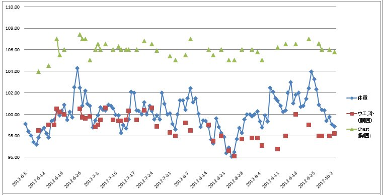

 Here's a more detailed view of my weight-loss tracking. I've observed how my waist-line seems to follow my weight (with an error of about 5%). So, my waist is actually at 98cm and my weight is 98Kg.

 