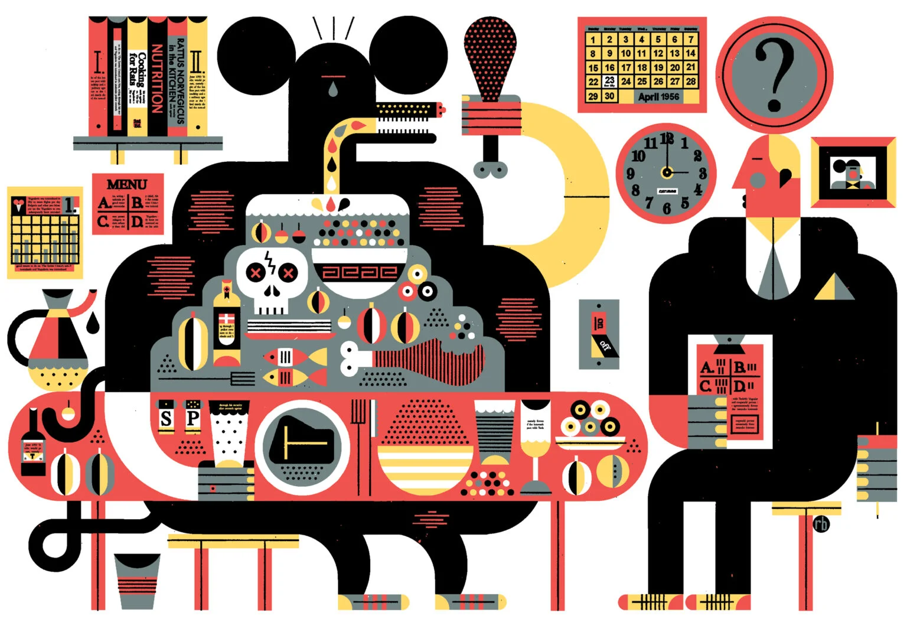


Feed your brain this while you stuff yourself with holiday cheer.


*This post has been updated. It was originally published on December 16, 2014.*

# The extreme consequences of stuffing yourselves during the holidays
*The biology of having just one more slice of pie.*

On a Sunday that’s usually a week or two after “Western” Easter, my parents set up an electric spit to roast a whole lamb in their suburban Massachusetts backyard. We welcome guests to our Greek Orthodox Easter celebration with a kiss on both cheeks; we nibble on *tiropitakia*, little cheese pies made with phyllo dough, and *kokoretsi*, organ meats wrapped in intestines and cooked on the spit next to the lamb. When the lamb is ready, we begin the meal by cracking open dyed hard-boiled eggs. Over the next few hours, we eat way too much lamb, *moussaka*, *dolmades*, and *tzatziki*, finishing off with cookies, cakes, and chocolate bunnies bought at deep discount (cheap Easter sweets are one of the perks of celebrating according to the Julian calendar). Happy, sleepy, and extremely full, we adjourn well before sunset to rest and digest.

This ritual will be recognizable to millions of holiday overindulgers. Most will be too sleepy to wonder what’s happening inside their cells and nerves, or which enzymes and hormones control the biochemistry of postprandial sleepiness. But as a biologist, I can’t help myself.

## How much can your stomach hold?
That you can eat until you feel like you might burst without *actually* bursting tells us a lot about the physics and physiology of the stomach and the neuroscience of appetite. At maximum capacity, the stomach can hold a gallon of food, about sixty-five times its empty volume. As the stomach stretches to accommodate additional food, it inflates like a balloon, pushing against the other organs in the abdomen and making it increasingly uncomfortable to keep eating. Eventually the stomach will start pushing on the diaphragm, making it difficult to take a deep breath.

Well before you reach that maximum volume, the body begins to take action. The stomach is lined with bundles of nerves that can sense the level of stretching and work with gastrointestinal and peripheral hormones to signal fullness to the brain. Should you press onward past the first feelings of fullness, the nerve signals get more insistent.

Between “full” and reflexive vomiting—the body’s final defensive strategy for overfullness—there is a lot of room for holiday overeating. It’s easy to ignore those early signals, convincing ourselves that we’ve still got room to try a few things we couldn’t fit on our plates the first time, and still more room for dessert. And, in fact, the abundance of choice presented by holiday feasts actually enhances our penchant for overeating.

The variety-induced overeating typical of holidays is known as the “smörgåsbord effect,” and was first identified in 1956 by the French physiologist Jacques Le Magnen. To study the effects of food flavors on appetite, Le Magnen made tiny feasts for rats. When he fed the rats unlimited amounts of a single type of food, they would eat until they felt full, and then stop. But when he gave the rats a smörgåsbord with four different flavors of rat chow, the rats would eat about three times as much as normal, filling up again on each new flavor.

Humans are like rats in that way: when we’re eating one food, we get a little more bored and a little more full with each bite—the “hedonic rating” (basically the empirical enjoyability) of the meal goes down with every mouthful. If you’ve ever waddled out of a fancy restaurant, overstuffed after eating a tasting menu where many dishes were parceled out in tiny portions over a couple hours, you’ve experienced the reverse: without that sensory boredom kicking in, you can eat more and more enthusiastically throughout the meal.

This phenomenon was rediscovered in experiments on humans in the 1980s. Researchers served varied four-course dinners in their labs and asked the diners to rate their satisfaction at different points throughout the meal. They found that people would eat up to 44 percent more than when offered only a single dish, and that satisfaction and appetite were renewed by each new flavor.

At a fundamental level, our hunger instincts are controlled by the levels of fats and sugar in our bloodstream, and we eat in order to maintain these nutrients at a stable level. When our blood sugar begins to go down, we start to feel hungry, and hormones tell our brain that it’s time to eat again. But while we’re eating, both sensory pleasure and stomach stretching happen quickly. How we eat—and especially how we eat during the holidays—is influenced by forces beyond just our metabolism and our stomach capacity, namely our willpower and our senses.

## The symptoms of feasting and stuffing
Inevitably, we end up ignoring our bodies’ early warnings and overeat during the holidays. But how does this all translate to the inevitable postmeal yawns and shuttering of eyelids?

One oft-cited explanation is the sugar high and subsequent insulin crash phenomena. Consider the Halloween feast: Kids gorge themselves on pillowcases full of refined sugar. The sugar rapidly enters the bloodstream through the lining of the stomach. Cells in the pancreas absorb the sugar from the blood and start converting it into energy. The subsequent change in the level of energy activates a cascade of biochemical switches. At the last step in the cascade, specialized vesicles inside the pancreatic cells open to release insulin. The hormone insulin controls how the body’s cells and tissues process sugar.

All this happens in a matter of minutes. As the fresh dose of insulin flows through the bloodstream, it tells the muscles and fat cells to absorb the sugar and to start converting it into energy. Hence, sugared-up kids bouncing off the walls. But the sugar high has never been proven in double-blind studies: kids get hyper when they get treats whether they have real sugar or not. The psychology and rituals of food—like the excitement of trick-or-treating—have a bigger effect than sugar itself.

The sugar crash is likewise disputed. Insulin makes our tissues absorb sugar quickly, but that shouldn’t cause blood sugar to dip below normal levels. Let’s consider another theory. For the post-Thanksgiving food coma, blame often falls on everybody’s favorite celebratory poultry: turkey. High levels of the amino acid **tryptophan** in turkey are converted into melatonin, the hormone that regulates sleep-wake cycles in the brain. Turkey does have a lot of tryptophan, but so does chicken, fish, cheese, and eggs—tryptophan levels aren’t enough to explain how sleepy you feel after overeating at Thanksgiving.

What makes holiday feasts sleep-inducing—Thanksgiving, in particular—is the combination of all of the above. First, you just eat a lot during the holidays. The same nerve bundles in your stomach lining that signal your brain to slow down your gorging also tell the brain to divert more of your body’s energy to digestion. Second, you eat a lot of carbs in the form of mashed potatoes, stuffing, and dinner rolls. The simple sugars trigger the release of insulin into the bloodstream. Insulin’s main job is to tell cells to absorb that sugar, but it also activates the absorption of some—but not all—amino acids, and raises the relative concentration of tryptophan. Tryptophan gets left behind to enter the brain. Cells in the brain convert tryptophan first into serotonin, a neurotransmitter that makes you feel happy, and then into melatonin, which makes you sleepy.

After all the turkey and stuffing, you may manage to find room for a few bites of pumpkin pie, your appetite reinvigorated by the sight and smell of a new stimulus. The extra dose of simple sugars releases another spike of insulin, and perhaps your brain makes a little bit more melatonin. Sleep is thus irresistible. You pass out on the couch.

In the morning, your stomach is empty or somewhere close to it, your insulin levels are low, and you’re ready to do it all over again.