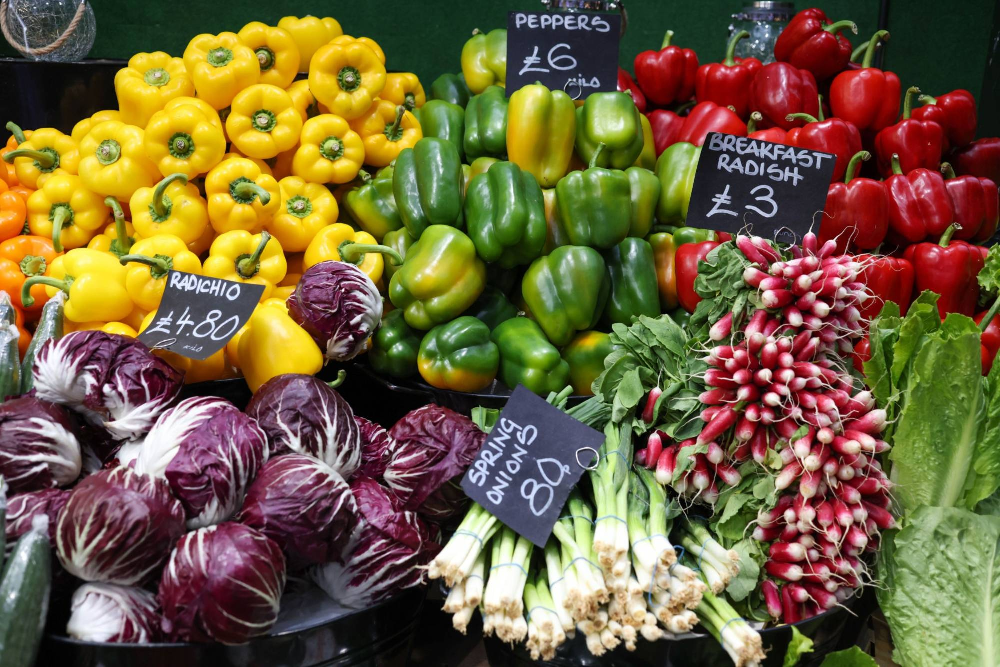
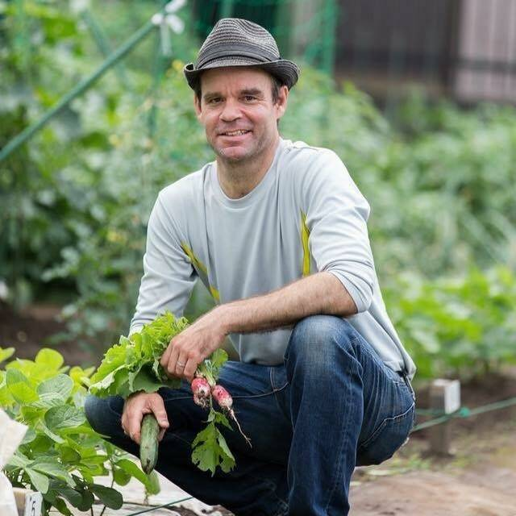
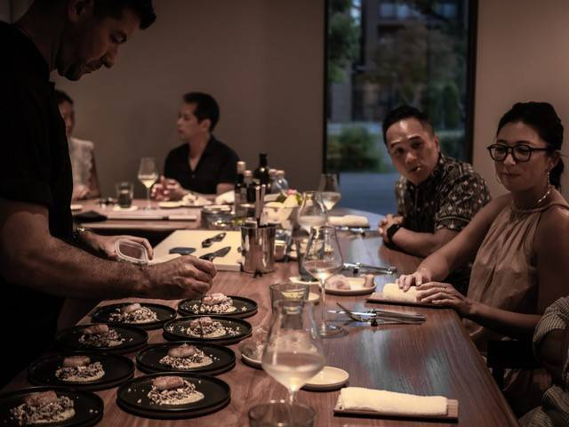


The article below would have been great to see 20 years ago. However, we have only a few short years to make dramatic and significant changes before our window of opportunity closes on having a sustainable and livable future on Earth.

"*[Climatarianism](https://en.wikipedia.org/wiki/Climatarian_diet)*" strikes me as a fake word with little meaning behind the effort to mitigate our impending doom with the ongoing Climate Crisis. The author of this piece is obviously ignorant of what [Veganism](https://www.vegansociety.com/go-vegan/definition-veganism) means and its values attribute to the environment on the whole. While Veganism is *not* a diet, its moral stance has a significant potential for positive impact on the planet. Hypothetically, if everyone chose to stop eating meat, the amount of CO2, CH4 (methane), and N2O (Nitrous Oxide) that agribusinesses produce in the process of raising (and slaughtering) livestock would stop rapidly accumulating in our atmosphere. Methane is about 20x more potent while Nitrous Oxide is about 300x more potent than carbon dioxide at trapping heat. While CO2 takes decades to filter from the atmosphere, the others can fortunately be broken down within a couple decades. If we remove animals from the menu, we can add 20 years to mitigate the Climate Crisis. And, that alone just might be enough for technology to catch up and resolve the rest of the crisis.

While I applaud efforts to encourage everyone to reduce meat (including fish) consumption, we need to further increase the *awareness of why* we need to do so. I fear the importance gets lost in translation. What needs to be heard is how our dinner plate has a far greater impact that we realize. Even bigger than greenhouse gas emissions from planes, trains, cars and ships combined! If we are to effectively mitigate Global Warming, we need to all take a collective effort and realize that convenience doesn't ensure our future.

From a budget and health perspective, meat costs about 3x more than vegetables yet yields 16x _less_ nutrition... vegetables net you 48x more nutrition per $1.00 than meat. - from "How not to die" by [Dr. Michael Greger, M.D., FACLM](https://nutritionfacts.org)... Not only are vegetables cheaper, but there's enough farm production to feed everyone on the planet in need. Just not enough for everyone’s greed. 

Furthermore, encouraging everyone to take part in the culture of recycle and reuse is great, but we should not shift the blame of how our environmental woes are singularly the responsibility of the end-consumer. Corporations must do their part to reduce, reuse, and recycle. Make it easy for the end user to continue using your products without sacrificing the future of our environment.

Overall, this article does present some good ideas. Namely the carbon footprint app and urban farming. I would have appreciated more urgency to the Climate Crisis rather than encouraging everyone to keep their heads in the sand for convenience's sake.


## Vegan and vegetarian eats might not go far enough

“It is worse, much worse, than you think.”

The opening of David Wallace Wells’ 2019 book, “The Uninhabitable Earth,” is indicative of the doomsday rhetoric that has defined environmental discourse in recent years.

Climate concerns have made an impression on the public consciousness in Japan, too. From the founding of the Japan Climate Initiative in 2018 — featuring more than 100 Japanese companies, local governments, research institutions and NGOs — to the growing presence of climate advocacy groups such as Kiko Network and Fridays for Future.

At the individual level, many Tokyo residents — particularly those in the international community who often have better access to overseas media outlets with more climate-centric coverage — have adapted their lifestyles and eating habits to minimize their contributions to global warming. Concomitantly, it’s becoming easier to find restaurants and cafes promoting environmental sustainability in their menus.

Wine bar-cum-delicatessen [Tutti/Non Capiscono Niente](https://www.facebook.com/noncapiscononiente/) in Shibuya Ward’s Uehara neighborhood, is focused on zero waste and runs on carbon-cutting renewable energy. It also uses food waste as compost, eschews plastic straws, incorporates sustainable products and ingredients into its dishes and uses upcycled chairs in the shop. But the shop’s “concept producer,” Tomoaki Kurino, admits this is only the beginning.

“We have not yet achieved even 10% of what is on the concept sheet,” he says. “We are working on it on an ongoing basis. We would like to increase the number of things we are working on in the future to become a fully environmentally friendly shop.”

Among the major contributors to greenhouse gas emissions, industry, energy and aviation often take the brunt of the public heat. But according to a recent study from the [University of Illinois](https://www.newscientist.com/article/2290068-food-production-emissions-make-up-more-than-a-third-of-global-total/#:~:text=Food%20production%20contributes%20around%2037,emissions%20of%20plant%2Dbased%20ones.), food may account for as much as 37% of global greenhouse gas emissions — 19 times that of commercial air travel.

If you want to start assessing your carbon output — and compare it to the per capita average in Japan (8.26 metric tons in 2020) — your food intake is a good place to start. This is where the “climatarian” diet comes in; an eating regime that’s gaining traction among climate-conscious groups for its one guiding principle: minimizing your carbon footprint.

## Eating for the Earth
While vegan and vegetarian diets have environmentally positive principles built into them, “climatarianism” advocates for a balancing act between dietary preferences and food sourcing.

A diet consisting of energy-intensive vegetables imported from across the world defeats the purpose of eating green – utilizing seasonal produce from local greengrocers and farmer’s markets can mitigate this issue. Likewise, palm oil, coffee and sugar production contribute to deforestation, soil erosion, water pollution and habitat degradation; climatarianism suggests substituting these from your diet for environmentally friendlier alternatives. Industrial farming techniques and the use of herbicides and fertilizers therein also have deleterious effects on biodiversity. Opting for fruits and vegetables grown in such conditions, as opposed to those cultivated in organic farms, contravenes the perceived positives of a plant-based diet.

Furthermore, some [vital nutrients](https://www.healthline.com/nutrition/7-nutrients-you-cant-get-from-plants#1.-Vitamin-B12), such as vitamin B12, are very difficult to attain on vegan and vegetarian diets without artificial supplements, explaining in part why said eating regimes have yet to go mainstream. The climatarian diet is positioned as a nuanced and nutritional alternative that’s less bound by dietary absolutism and dogma.

“The intention of the climatarian diet is to reduce our carbon footprint by suggesting eco-friendly food choices and behavior modifications”, says Dr. Alona Pulde, an advisory board member at [Lifesum](https://lifesum.com), the world’s leading healthy eating app with more than 50 million active users. “When making (dietary) changes, choosing the pace that’s right for you is essential for long-term success.”

Pulde praises the diet’s flexibility and inclusivity.

“For meat eaters, it is possible to start by swapping out beef, lamb and goat — bigger contributors to greenhouse gas emissions — for poultry, pork and eggs,” she says. “Just swapping chicken for beef can lower your carbon footprint by about 50%.”

Shifting toward plant-based foods, including fruits, vegetables, starchy vegetables, nuts, seeds, whole grains or legumes, can also help lower your consumption of energy-intensive meat.

“Add plant foods to every meal or just change breakfast for now,” says Pulde. “Other options are meatless Mondays, plant-based weekdays, or meatless breakfasts and lunches. Meat alternatives, which have been shown to emit 10 times less greenhouse gasses than beef-based products, are an additional possibility.”

This dovetails with an increasing demand for vegetarian and vegan options in Japan. According to research by [TPC Bibliotheque](https://www.tpc-osaka.com/?fbclid=IwAR00pGsocA_s2vwdajvBLXwk_fBzmCocPh5QPsRD4DjP-8fv7pxDeBwYBT8), sales of vegan products increased 17% between 2010 and 2020, while the production of plant-based proteins [rose 7.2%](https://www.japantimes.co.jp/life/2022/08/08/food/japan-plant-based-meat/) between 2019 and 2021.

That said, animal-based proteins remain central to the Japanese diet, just as most people value convenience over sustainability. Adopting a more holistic approach to climatarianism can help offset the environmental burden.

“Reuse and recycle to decrease waste,” advises Pulde.

This includes simple fixes, like reusable shopping bags, water bottles and cloth napkins, as well as using recycling bins and compost heaps at home to lessen the burden on landfills.

“Avoid highly processed foods, which require more ingredients, more processing, more packaging — all resulting in a higher carbon footprint,” Pulde adds.

## Keeping climatarian
If you’re serious about eating climatarian in Tokyo, self-sufficiency might be the key to success.

Jon Walsh, operator of Tokyo-based urban farming consultancy Business Grow, has found circumventing the supply chain is one of the best ways to minimize your carbon footprint.

A leading technician of growing fresh produce in the nooks and crannies of the Tokyo cityscape, Walsh started urban farming in 2012 off the back of highly destructive earthquakes in Japan and his native New Zealand. He wanted “to become more self-sufficient and less reliant on fragile supply chains.” Walsh has since taught urban farming techniques to over 1,400 people and opened more than 60 gardens on apartment balconies, school rooftops, and in office buildings across the Japanese capital.

“(Urban farming) produces fresh, local, immediately available food with no supply chain by default,” he says. “The fact the food is local makes a big difference, especially in terms of taste (fantastic), cost (low), health benefits (huge) and near-zero food miles and associated climate footprint.”

Walsh maintains that there are few limits to what you can grow in the city, provided you have sunlight and a small amount of space. Based on his experience, eight tomato plants grown in 2 square meters can produce as many as 1,800 tomatoes, while eight cucumber plants grown in the same size space could yield hundreds of cucumbers.

“I have grown tomatoes in community gardens in the concrete metropolis of Tokyo that have been virtually free,” Walsh says. “And if you collect and save your own seeds, growing food will become even cheaper. … The taste difference between urban-farmed food and commercially grown produce is like the difference between a B-grade movie and a blockbuster.”

Anne Kyle, CEO of Arigato Travel, admits she had never encountered the term “climatarianism,” but has essentially been practicing the diet for several years.

“If I buy a leek, I’ll make sure I use it from top to bottom,” she says. “Or if I peel carrots, I’ll use the peel for smoothies. When I drink green tea, the leftover leaves will go into my homemade yogurt.”

Kyle, whose company curates food tours for travelers in Japan, recommends climatarians sample the fare at restaurants Locale and Mark’s Tokyo, both of which are located in Meguro Ward and create their menus around locally sourced produce and waste mitigation. She also suggests supporting initiatives that seek to expand the boundaries of sustainable cuisine, such as the [Yokohama Vegan Ramen](https://circular.yokohama/en/2021/10/06/sustainable-vegan-ramen-made-with-yokohama-local-produce/) project that appeared on the menu at [Haishop Cafe](https://www.haishopjapan.com/p/00004) last year.

The eponymous Mark Sekita of Mark’s Tokyo, a chef’s table restaurant inspired by his Japanese-Italian roots, says supporting local farmers is “key to bringing the best product to the table.”

“We also have a specific farmer at the Aoyama Farmers Market that delivers to us on Sundays,” Sekita says. “We take a look at what they weren’t able to sell that day, and try to purchase as much of that produce as possible. That way, the vegetables don’t go to waste, and we are able to help support the local farmers.”

In some respects, climatarianism is a common-sense approach to dieting: eating locally sourced, nutritionally valuable and ethically derived foods. But it’s about the collective effects that such an approach can realize.

Or, as Pulde says, “Small changes can create ripples that have a big impact.”

## Related



