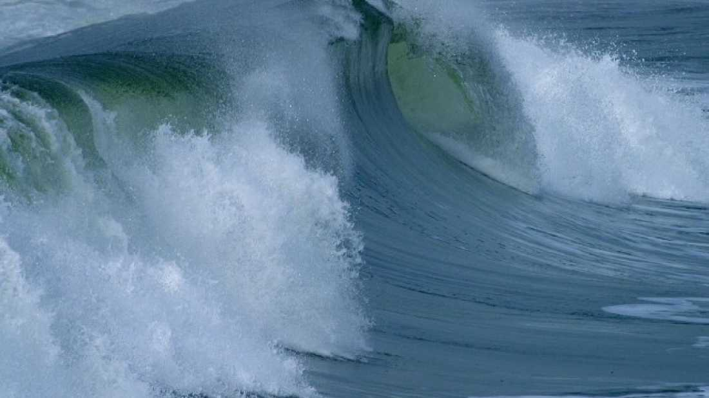
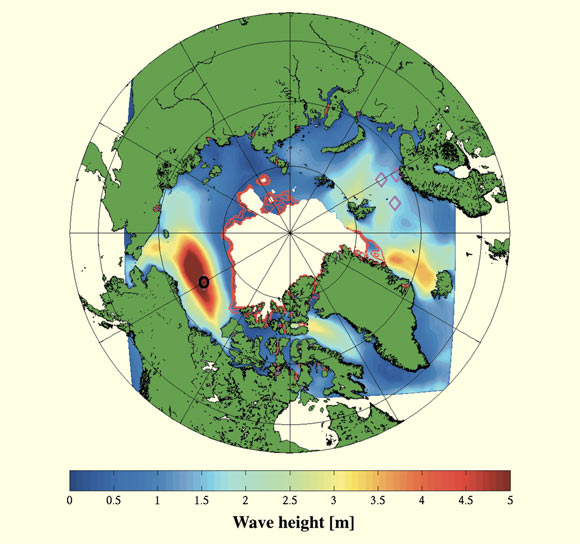


Surfer's paradise found in the Arctic...

Still believe global warming is not affecting you?


The Arctic Ice-cap has a new enemy: huge waves. For the first time, 5 meter swells have been detected in the Arctic. The absence of ice provides opportunities for waves to grow, but is also suspected to hasten the break–up of the ice that remains, creating a feedback loop that has not been factored into previous predictions.

Although [white squalls](https://www.youtube.com/watch?v=pMDk-3gCIRw) plague the Great Lakes, waves that are both high and broad are the result of wind blowing over oceanic expanses of water. The distance over which the wind builds the wave is known as [the fetch](https://en.wikipedia.org/wiki/Fetch_%28geography%29). With the Arctic Ocean is almost entirely surrounded by land, and much of the ocean covered by ice, the length has been restricted.

However, the decrease in sea ice (and yes, Daily Mail, [it really is decreasing](http://http//www.skepticalscience.com/2013-arctic-sea-ice-prediction.html)) is [making fetch happen](http://www.youtube.com/watch?v=Pubd-spHN-0), producing waves that can break-up sea ice once they encounter it. Broken ice melts more quickly, as there is a larger exposed surface area.

In September 2012, the Arctic sea-ice reached the lowest level ever recorded, and probably the lowest for at least 100,000 years. Dr Jim Thomson of the University of Washington reports in *[Geophysical Research Letters](http://onlinelibrary.wiley.com/doi/10.1002/2014GL059983/full)* that a storm in that month saw 5m waves in the Beaufort Sea, the first time this has been detected in the Arctic.

While it is clearly impossible for substantial waves to get started in areas of solid sea ice, Thomson also [points to evidence](http://onlinelibrary.wiley.com/doi/10.1029/2009GL040676/abstract) that “The interaction of waves and ice is particularly complex, because ice can suppress waves by scattering and dissipating wave energy.” Consequently, modeling has predicted that the more sea ice breaks up, the larger waves will become, which will in turn break up more ice. However, a shortage of studies of wave heights in the Arctic has kept this largely theoretical until now.

The decline in Arctic sea-ice is already known to be driven by a larger feedback mechanism – open water absorbs more heat than [highly reflective ice](http://www.the-cryosphere-discuss.net/8/2685/2014/tcd-8-2685-2014.pdf). However, with the accelerating effect of waves such as those Thomson recorded &mdash; this could become worse. It is likely to be only a few years before the Arctic is ice-free towards the end of summer, but this new factor could see ice eliminated earlier and earlier in the season, allowing even more heat to be absorbed by the ocean when the sun is at its highest.