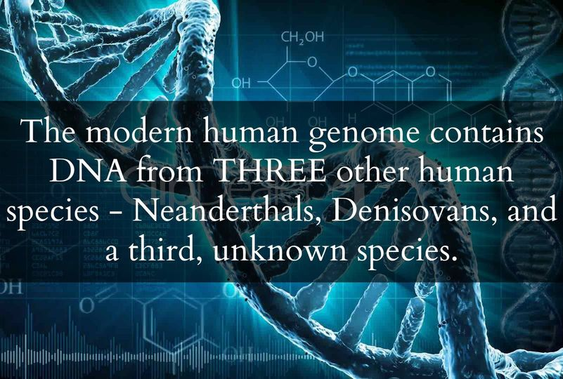
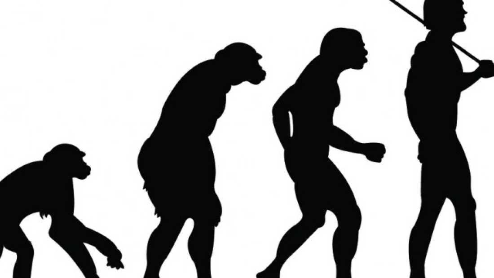


As it would turn out... I am at least two percent Neanderthal!
😃

Love cold weather like a polar bear...

 



---
 

 The evolutionary tree for modern humans a bit of a mess - humans haven’t had a close relative on this planet for over 10,000 years, but there used to be several other closely related species living at the same time. Genetic analyses on bone fragments from Neanderthals and Denisovans has given us new insight into our not-so-distant evolutionary past. The results indicate that not only did Denisovans and Neanderthals interbreed with modern Homo sapiens, but they also mated with an unidentified fourth [hominin](http://bit.ly/1fshHSk) group. This information was presented to evolutionary geneticists last week for a meeting of the [Royal Society](http://bit.ly/1i2t2KW).

 Neanderthals emerged about 200,000 years ago and remains have been found throughout Europe, stretching into central Asia. While Neanderthals weren’t as cognitively advanced as Homo sapiens who emerged around the same time, they were probably the first hominins known to wear clothing, bury dead, and form languages. It has been traditionally thought that the last common ancestor of Homo sapiens and Neanderthals existed around 400,000 years ago, though [new research suggests](http://bit.ly/Ikl13c) it could have been earlier.

 Denisovans are an extinct group of hominins that are part of our evolutionary lineage. Our knowledge of them comes from bone fragments found in a cave that date back about 30,000-50,000 years. Though genetic analysis had been done a couple years ago, the results weren’t really clear. New techniques have yielded much more complete genetic sequences and two new studies have released different yet related results. 

 There is evidence of certain populations of humans alive today getting as much as 4% of their DNA from Denisovans, though there is some debate surrounding it. Additionally, there are people with ancestries outside of Africa that could have gotten about 2% of their genomes from Neanderthals, though there is some speculation with this as well.

 Right now, the identity of this fourth early human group [remains a mystery](http://bit.ly/17ATu7x). They could have come from Asia, but that has not yet been made certain. Future research will hopefully identify this unknown population and help us better understand all of the different evolutionary inputs that make us who we are.

