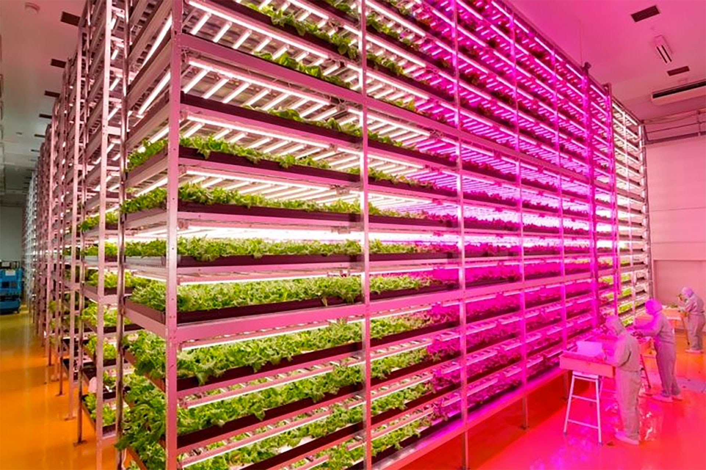

*A Japanese company's futuristic approach to farming could revolutionize how we grow our food.*

An abandoned Sony factory in Miyagi Prefecture, Japan, has been transformed into what could very well be the farm of the future.

Shigeharu Shimamura, a plant physiologist and CEO of [Mirai](http://miraigroup.jp/en/), has constructed the world's largest indoor farm—25,000 square feet of futuristic garden beds nurtured by 17,500 LED lights in a bacteria-free, pesticide-free environment. The result? About 10,000 heads of fresh lettuce harvested each day.

The unique "plant factory" is so efficient that it cuts food waste from the 30 to 40 percent typically seen for lettuce grown outdoors to less than 3 percent for their coreless lettuce. 

National Geographic spoke with Shimamura recently about the innovative food factory and indoor farms as a potential solution to the global food crisis.

What was the inspiration for this business venture?

Japan has had an interest in research and development in the field of farming in a factory setting for about 40 to 50 years now.

Our company built a plant factory at a location devastated by the [Tohoku earthquake and tsunami in 2011](http://news.nationalgeographic.com/news/2012/03/pictures/120309-japan-tsunami-earthquake-anniversary-fukushima/#/japan-earthquake-tsunami-before-after-wave-road-before_49811_600x450.jpg) because of the general concern in Japan about the declining rate of domestic vegetable supply, and how we might remedy the problem of the heavy dependence on imports.

The reason we chose this particular location is because we wanted to prove that vegetables can be produced anywhere now. Second, we wanted to help restart the economic development in this disaster area. And last, looking into the future, if we could succeed there, we could also see a possibility of exporting the technology we developed all over the world. (Related: "[Inside the Looming Food Crisis.](http://news.nationalgeographic.com/news/2014/05/140522-food-crisis-vulnerable-weather-climate-future/)")

What impact could your plant factory have on the future of food production and as a remedy for food shortages?

Currently we have a world population of 7 to 7.2 billion. Among them, about [800 to 900 million people are suffering from starvation](http://www.wfp.org/hunger/stats), or close to it. People around the world are all wondering how we can produce more food to mitigate this grave situation.

We know that water plays a big role in this, and the technology Mirai developed uses less than one percent of the water commonly used to grow vegetables—so we can conserve water by growing vegetables in a factory environment and use the water to produce more grains elsewhere.

Using this method, if we can build plant factories all over the world, we can support the food production to feed the entire world's population. This is what we are really aiming for.

How do you manage to use so little water?

With the conventional method of farming, a lot of water is wasted seeping through the soil as well as evaporating into the air. In an enclosed environment of a factory, we don't lose water down the soil. That is one way.

We can also collect the moisture the plant itself emits into the air. The water collected is recycled; this is similar to how our Earth works. The moisture released from living things on Earth collects, forms clouds, and drops back down to Earth as rain. This is the recycling system of our planet. Our factory works just like that. Water is collected, filtered, and recycled in an enclosed space.

Your lighting system was specially designed by GE Japan. What's unique about these lights?

The lighting we are talking about is LED [light-emitting diode], and it is very suitable for plant growth. The light from the particular product GE Japan developed for us promotes photosynthesis as well as cell division. What's unique about this lighting system we have now is that it can provide multiple types of light that not only encourage photosynthesis and cell growth, but also provide all other aspects necessary for plant growth.

Here is an example: If we only use the type of light that encourages photosynthesis, plants will grow too big, too fast—this causes crowding and then not enough light will reach the whole plant. The particular kind of lighting product we use now will also emit a type of light capable of penetrating the plant so every part of the plant can absorb the light.

With 10,000 heads of lettuce, how labor intensive is it to harvest the produce? Do you use robots?

I'd say it is only half automated. Machines do some work, but the picking part is done manually. In the future, though, I expect an emergence of harvesting robots. For example, a robot that can transplant seedlings, or for cutting and harvesting, or transporting harvested produce to be packaged.

You already have a few small-scale versions of the plant factory elsewhere in the world, and you're planning two more large factories in Hong Kong and Russia. Can you tell me a little bit more about these facilities?

We are building a factory in Hong Kong as we speak. We will be producing 5,000 heads of lettuce a day there. The reason we are there is because most of the vegetables consumed there come from outside Hong Kong. People are very concerned about food safety, and they want domestically produced, safe food.

The interest in Russia may have something to do with our company's success in Mongolia, where we have two smaller factories: one in the south Gobi desert and one in Ulaanbaatar. There the climate is so severe that they can't grow any vegetables outdoors during the cold season, so they import them mostly from Europe—a long distance away, especially for people who live in the far eastern part of the country. They wanted to be able to grow vegetables domestically. Our plant factory in Russia will produce 10,000 heads of lettuce next spring once it starts the operation. (Related: "[Is Your Country Food Independent?](http://onward.nationalgeographic.com/2014/04/13/is-your-country-food-independent/)")

What are some of the challenges in creating these indoor farms elsewhere in the world?

There are two big challenges. In order to build a plant factory, we need certain infrastructure in place, such as electricity and water supply. A dependable supply of electricity and water is essential right from the start. We consulted with GE Japan on this; we talked about the possibility of building a factory where electric generators are already in place.

Another big factor is the availability of telecommunication infrastructure. In Japan, we do a lot of training as well as overseeing of the operation remotely online, so having a dependable Internet connection and other telecommunication infrastructure is also critical.

Right now you're focusing on growing lettuce and leafy greens. Can this system be adapted to other produce like tomatoes, potatoes, or fruit?

I believe that, at least technically, we can produce almost any kind of plant in a factory. But what makes most economic sense is to produce fast-growing vegetables that can be sent to the market quickly. That means leaf vegetables for us now. In the future, though, we would like to expand to a wider variety of produce. It's not just vegetables we are thinking about, though. The factory can also produce medicinal plants. I believe that there is a very good possibility we will be involved in a variety of products soon.

When it comes to solving food-supply issues in the future, what can we learn from this project?

What is important here is that the success of this project depended not only on the technology, but also on the accumulated knowledge of farming practices. Mirai, our company, had the knowledge of how to grow vegetables in a factory setting, but we needed the technology to make it work.

As we face world shortages of both water and food, plant factory operations will not only stay but expand worldwide. The merging of our expertise is essential in expanding our operation to other places in the world.