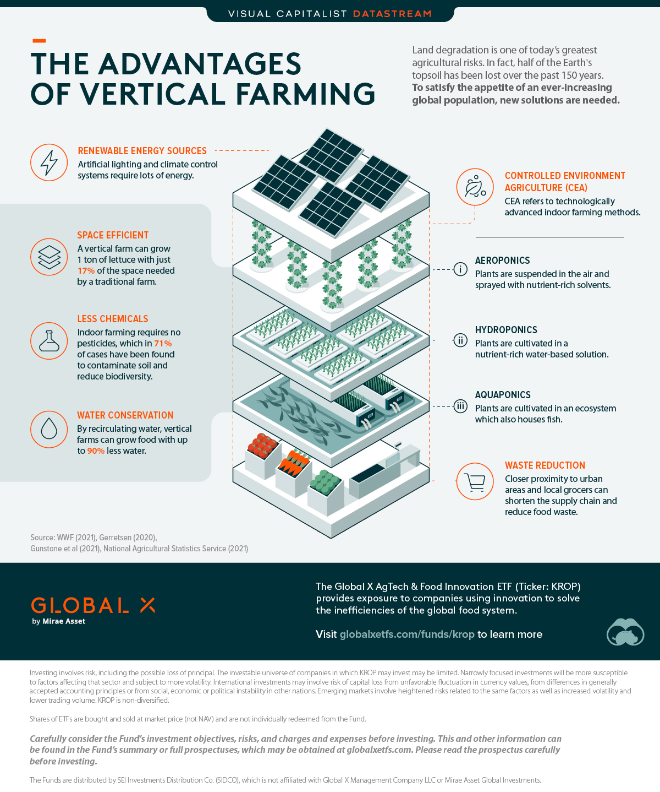

## Is Vertical Farming the Future?
According to the World Wildlife Fund (WWF), half of the Earth’s topsoil has been lost over the past 150 years. This issue is known as **[land degradation](https://www.ipcc.ch/srccl/chapter/chapter-4/)**, and it’s caused by natural and human forces such as droughts, overfarming, pollution, deforestation, and poor farming practices.

## Advantages of Vertical Farming
Vertical farming is best defined as growing food indoors and on vertically stacked layers. It utilizes technologies known as **controlled environment agriculture** (CEA):

* Aeroponics: Plants are suspended in the air and sprayed with nutrient-rich solvents
* Hydroponics: Plants are cultivated in a nutrient-rich water-based solution
* Aquaponics: Plants are cultivated in an ecosystem which also houses fish

Vertical farms can grow 1 ton of lettuce with just **17%** of the space needed for a traditional farm, meaning they are much more space efficient. This is a direct solution for land degradation, but the benefits don’t end there.

Farming in a controlled environment cuts down on chemical usage because there is no longer a need for pesticides. A recent U.S. study found that in **71%** of usage cases, pesticides have [contaminated soil and reduced biodiversity](https://biologicaldiversity.org/w/news/press-releases/new-study-agricultural-pesticides-cause-widespread-harm-to-soil-health-threaten-biodiversity-2021-05-04/).

Furthermore, vertical farms can reduce water use by up to **90%** thanks to recirculation. This is a massive improvement when considering that traditional farms account for **70%** of global water consumption.

## What’s the Trade-off?
Like most things in life, vertical farms also have their drawbacks.

The first challenge is high energy consumption due to the lack of natural sunlight and water. Both of these inputs must be provided by using electricity, which may not be ideal depending on location. The second challenge is costs, not just because of energy consumption, but also due to the equipment needed for CEA systems.

The table below compares a traditional outdoor farm with a theoretical vertical farm. These estimates illustrate a clear trade-off between **i)** greater output and less water usage; and **ii)** a larger carbon footprint.

|	Metric	|	Traditional Outdoor Farm	|	Vertical Farm	|	Percentage Difference	|
|	:--	|	:--	|	:--	|	:--	|
|	Lettuce output per 1 acre	|	16 tons	|	126 tons	|	787%	|
|	Kg CO₂ emitted per ton of lettuce	|	160 kg	|	540 kg	|	337%	|
|	KL of water used per ton of lettuce	|	118 kL	|	6 kL	|	-95%	|

*Traditional farm yields are based on the U.S. 2020 average. Source: Global X ETFs*

Worth noting that scaling up traditional farms to the same output as a vertical farm would amplify their carbon footprint well past that of the vertical farm. Additionally, a single acre of land on a traditional farm is two-dimensional whereas a vertical farm is three-dimensional &mdash; enabling it to grow far more in the same footprint.

With global population expected to reach 10 billion people by 2060, more efficient methods of farming are needed. With higher population densities in existing megalopolis expected to rise, we will need to build these vertical farms in urbanized areas to minimize the distance of transporting produce. 

Vertical farms, alongside other [innovations in agriculture and food](https://www.visualcapitalist.com/an-investors-guide-to-agtech-food-innovation/), could be the answer. And to limit the carbon footprint further, we could use [renewable energy sources](/2022/0609/Politics_政治的/Energy-to-change.html).

## References
- [Global X ETFs](https://go.globalxetfs.com/l/750543/2022-02-17/zlhhh)
- [WWF](https://twitter.com/wwf/status/1423613663961927681)