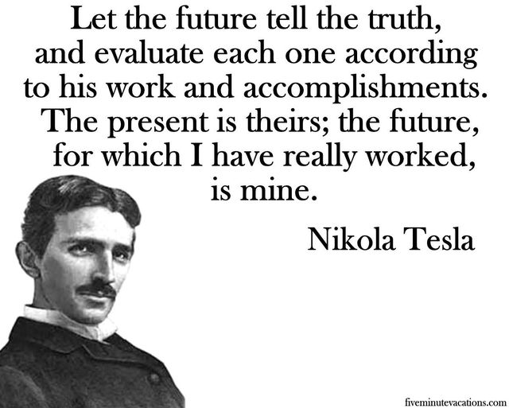


Today would have been the 158th birthday of noted inventor at futurist, Nikola Tesla.




Let the future tell the truth, an evaluate each one according to his work and accomplishments.
The present is theirs; the future, for which I have really worked, is mine.

