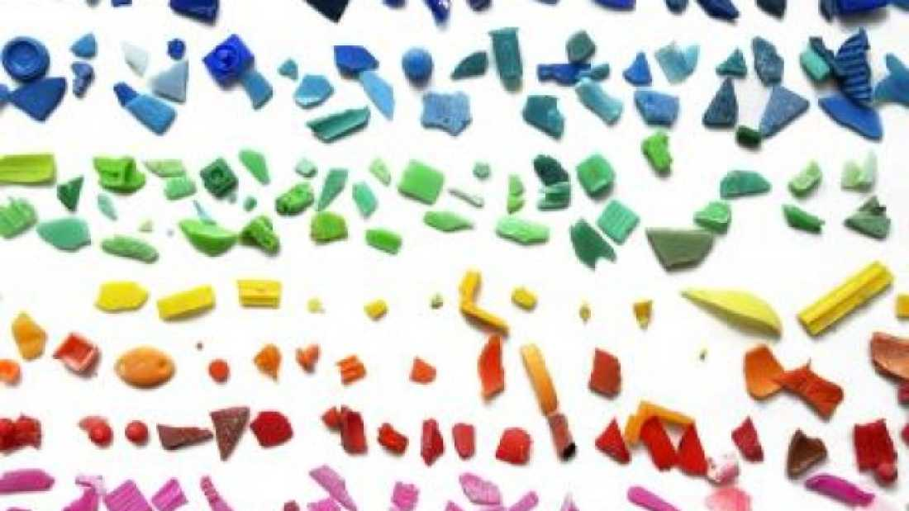


Would you like some extra plastic with your fish?


 

 Each year, humans produce about 300 million tons of plastic. A considerable amount of that ends up in the ocean, posing a risk to marine life. It isn’t just large plastic that entangles or chokes animals that is a cause for concern - microscopic plastic can do considerable damage as well. Recent sampling showed that microplastics are present on the 88% of the surface water in the oceans. The study was led by Carlos Duarte and the results were published in the Proceedings of the [National Academy of Sciences](http://www.pnas.org/content/early/2014/06/25/1314705111.abstract).

 "Ocean currents carry plastic objects which split into smaller and smaller fragments due to solar radiation. Those little pieces of plastic, known as microplastics, can last hundreds of years and were detected in 88% of the ocean surface sampled during the Malaspina Expedition 2010,” stated lead author Andrés Cózar in a [press release](http://www.eurekalert.org/pub_releases/2014-06/snrc-atw063014.php).

 As the pieces of plastic get increasingly smaller, a wider variety of marine animals can mistake the plastic for food. The plastic cannot be digested, it can stay in the stomach and cause the animal to starve to death. The smaller animals with stomachs full of plastic are consumed by progressively larger fish, pushing plastic up through the food chain. Aside from the threat of starvation, plastic can absorb pollutants that are then leeched out into the animals.

 "These microplastics have an influence on the behavior and the food chain of marine organisms. On one hand, the tiny plastic fragments often accumulate contaminants that, if swallowed, can be passed to organisms during digestion; without forgetting the gastrointestinal obstructions, which are another of the most common problems with this type of waste,” Cózar continued. 

 “On the other hand, the abundance of floating plastic fragments allows many small organisms to sail on them and colonize places they could not access to previously. But probably, most of the impacts taking place due to plastic pollution in the oceans are not yet known.”

 The results of this study are based on samples collected by the Malaspina Circumnavigation Expedition in 2010. A total of 313 locations in the Indian, Pacific, and Atlantic oceans were sampled at variable depths up to 6,000 meters. The 200,000 samples were tested for temperature, salinity, gases such as oxygen and carbon dioxide, and the data was put into context based on amount of sunlight, ocean current strength, and other factors.

 While they found a considerable amount of plastic debris, there was not as much as previous estimates would have indicated. This discrepancy could have have come from animals ingesting large amounts of plastics, the plastic washing ashore (potentially becoming [plastiglomerate](http://www.iflscience.com/environment/rocks-formed-plastic-found-beach)), the debris sticking to other animals or their droppings causing it to sink, or the plastic has broken down past the point of detection. Each possibility has its flaws, and further study is needed to find out what is happening to the plastic in the our oceans and the full effect it has on those ecosystems.