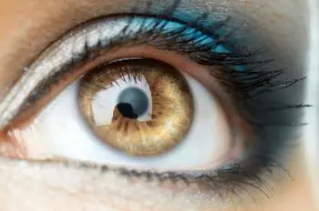


Where & when can I get some? I have decent night vision already, but could use some more. 


*An independent research group called Science for the Masses have developed eyedrops that allow the user to identify symbols and people in darkened areas up to 50 meters away.*

The eyedrops utilize a mixture of insulin and chlorin e6 (Ce6) – a chlorophyll analog that has be used for many years in laser-assisted cancer treatment. Ce6 has light-amplifying properties, allowing surgeons to use energy from low-power light sources to destroy tumor cells.

However, recent research has found that Ce6 could also be used to treat night blindness and improve the vision of people with certain visual disturbances, through direct application to the eye.

In addition to Ce6 and saline, insulin was used in the mixture in order to achieve greater absorption of Ce6 into the chamber of the eyes. Another substance, dimethylsulfoxide (DMSO) was also used in order to increase the permeability of the eye’s cellular membranes.

The eyedrops were applied to researcher Gabriel Licina with a micropipette while his eyes were held open with a speculum to guarantee absorption. Prior to the eyedrops being administered, the subject’s eyes were cleaned with saline to remove any small particles that may have been present.

Once the eyedrops had been applied, Licina wore protective contact lens and sunglasses to protect himself from exposure to bright light as the solution began to work, increasing the intensity of light.

After allowing the subject’s eyes to adjust for two hours, their vision was then tested in a darkened area alongside four control subjects. The participants were asked to identify different symbols at a distance of 10 meters, symbols on varying background colors and moving symbols with varying background colors at varying distances.

The participants were also asked to identify a number of individuals who were located in a small grove of trees with a laser pointer. Each individual was located between 25-50 meters away from the participants’ observation point.

With the help of the Ce6 eyedrops, the subject was able to consistently recognize symbols that the controls were unable to see. When identifying the individuals in the dark wooded area, the subject had a 100% success rate, compared with a 33% success rate for the control participants.

## Further tests planned to quantify improvements to vision
The researchers plan to conduct further tests in order to measure the improvements to vision more objectively.

“A Ganzfeld stimulator and electro-retinigraph will be used to measure the actual amount of electrical stimulation increase from the eye, giving a hard quantifiable number to the degree of amplification,” write the researchers. “It is also possible to test which ranges of vision are being amplified as well.”

The subject did not report any adverse effects over the 20 days following the use of the eyedrops. His vision had returned to normal by the following day.

Science for the Masses subscribe to the notion of “citizen science,” whereby access to tools and resources is available to anyone who wishes to perform scientific research.


Citizen scientists and ‘DIY biologists’ are under no pressure to reach or hold a position of tenure and often do not have the need to produce for monetary reasons,” write the researchers. “It is possible that this will allow for less bias in publishing and a more open release of work due to the lack of external motivators.


Due to their independent status, however, the researchers note that they do not have access to certain tools and resources that would enable them to verify their findings swiftly and efficiently. Consequently, there is still much to be done by the team, but in these early stages their research has already made illuminating reading.

