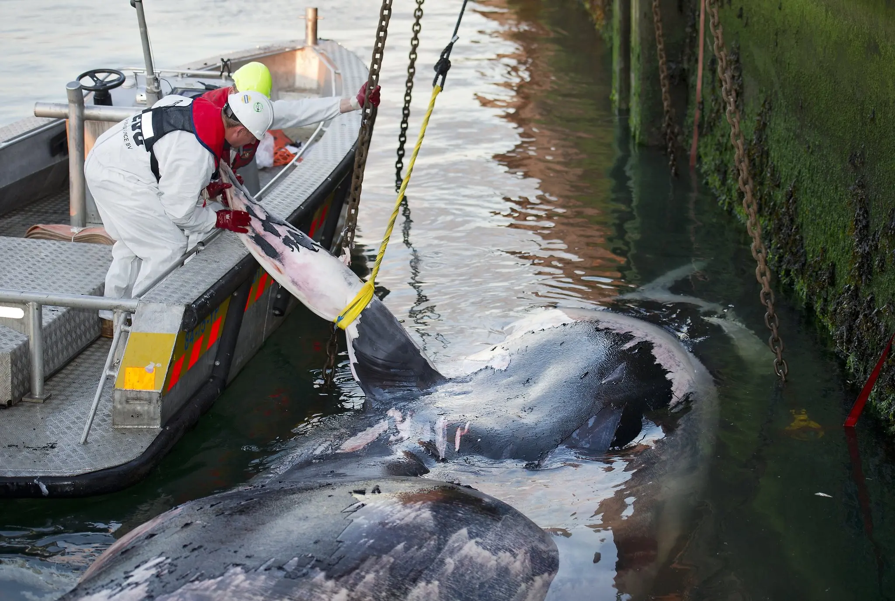
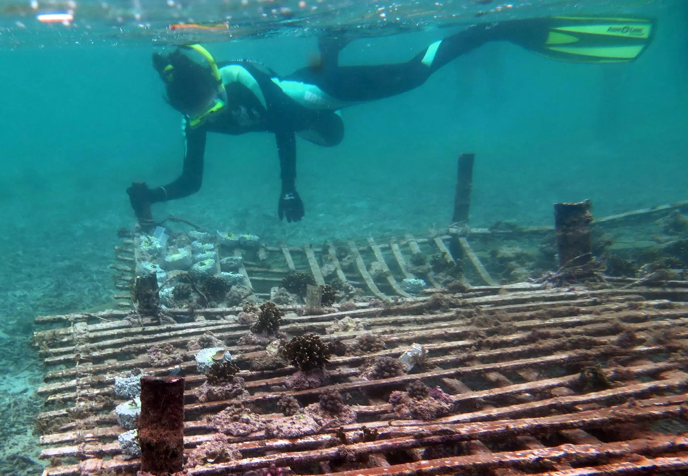


We are not only overfishing the oceans, but polluting them too. We really need to stop killing our planet!


# Ocean Life Faces Mass Extinction, Broad Study Says

A team of scientists, in a groundbreaking analysis of data from hundreds of sources, has concluded that humans are on the verge of causing unprecedented damage to the oceans and the animals living in them.

“We may be sitting on a precipice of a major extinction event,” said Douglas J. McCauley, an ecologist at the University of California, Santa Barbara, and an author of the new research, which was [published on Thursday in the journal Science](https://www.sciencemag.org/lookup/doi/10.1126/science.1255641).

But there is still time to avert catastrophe, Dr. McCauley and his colleagues also found. Compared with the continents, the oceans are mostly intact, still wild enough to bounce back to ecological health.

“We’re lucky in many ways,” said Malin L. Pinsky, a marine biologist at Rutgers University and another author of the new report. “The impacts are accelerating, but they’re not so bad we can’t reverse them.”

Scientific assessments of the oceans’ health are dogged by uncertainty: It’s much harder for researchers to judge the well-being of a species living underwater, over thousands of miles, than to track the health of a species on land. And changes that scientists observe in particular ocean ecosystems may not reflect trends across the planet.

Dr. Pinsky, Dr. McCauley and their colleagues sought a clearer picture of the oceans’ health by pulling together data from an enormous range of sources, from discoveries in the fossil record to statistics on modern container shipping, fish catches and seabed mining. While many of the findings already existed, they had never been juxtaposed in such a way.

A number of experts said the result was a remarkable synthesis, along with a nuanced and encouraging prognosis.

“I see this as a call for action to close the gap between conservation on land and in the sea,” said Loren McClenachan of Colby College, who was not involved in the study.

There are clear signs already that humans are harming the oceans to a remarkable degree, the scientists found. Some ocean species are certainly overharvested, but even greater damage results from large-scale habitat loss, which is likely to accelerate as technology advances the human footprint, the scientists reported.

Coral reefs, for example, have declined by 40 percent worldwide, partly as a result of climate-change-driven warming.

Some fish are migrating to cooler waters already. Black sea bass, once most common off the coast of Virginia, have moved up to New Jersey. Less fortunate species may not be able to find new ranges. At the same time, carbon emissions are altering the chemistry of seawater, making it more acidic.

“If you cranked up the aquarium heater and dumped some acid in the water, your fish would not be very happy,” Dr. Pinsky said. “In effect, that’s what we’re doing to the oceans.”

Fragile ecosystems like mangroves are being replaced by fish farms, which are projected to provide most of the fish we consume within 20 years. Bottom trawlers scraping large nets across the sea floor have already affected 20 million square miles of ocean, turning parts of the continental shelf to rubble. Whales may no longer be widely hunted, the analysis noted, but they are now colliding more often as the number of container ships rises.

Mining operations, too, are poised to transform the ocean. Contracts for seabed mining now cover 460,000 square miles underwater, the researchers found, up from zero in 2000. Seabed mining has the potential to tear up unique ecosystems and introduce pollution into the deep sea.

The oceans are so vast that their ecosystems may seem impervious to change. But Dr. McClenachan warned that the fossil record shows that global disasters have wrecked the seas before. “Marine species are not immune to extinction on a large scale,” she said.

Until now, the seas largely have been spared the carnage visited on terrestrial species, the new analysis also found.

The fossil record indicates that a number of large animal species became extinct as humans arrived on continents and islands. For example, the moa, a giant bird that once lived on New Zealand, [was wiped out by arriving Polynesians in the 1300s](http://www.nature.com/ncomms/2014/141107/ncomms6436/full/ncomms6436.html), probably within a century.

But it was only after 1800, with the Industrial Revolution, that extinctions on land really accelerated.

Humans began to alter the habitat that wildlife depended on, wiping out forests for timber, plowing under prairie for farmland, and laying down roads and railroads across continents.

Species began going extinct at a much faster pace. Over the past five centuries, researchers have recorded 514 animal extinctions on land. But the authors of the new study found that documented extinctions are far rarer in the ocean.

Before 1500, a few species of seabirds are known to have vanished. Since then, scientists have documented only 15 ocean extinctions, including animals such as the Caribbean monk seal and the [Steller’s sea cow](http://www.britannica.com/EBchecked/topic/530513/sea-cow).

While these figures are likely underestimates, Dr. McCauley said that the difference was nonetheless revealing.

“Fundamentally, we’re a terrestrial predator,” he said. “It’s hard for an ape to drive something in the ocean extinct.”

Many marine species that have become extinct or are endangered depend on land — seabirds that nest on cliffs, for example, or sea turtles that lay eggs on beaches.

Still, there is time for humans to halt the damage, Dr. McCauley said, with effective programs limiting the exploitation of the oceans. The tiger may not be salvageable in the wild — but the tiger shark may well be, he said.

“There are a lot of tools we can use,” he said. “We better pick them up and use them seriously.”

Dr. McCauley and his colleagues argue that limiting the industrialization of the oceans to some regions could allow threatened species to recover in other ones. “I fervently believe that our best partner in saving the ocean is the ocean itself,” said Stephen R. Palumbi of Stanford University, an author of the new study.

The scientists also argued that these reserves had to be designed with climate change in mind, so that species escaping high temperatures or low pH would be able to find refuge.

“It’s creating a hopscotch pattern up and down the coasts to help these species adapt,” Dr. Pinsky said.
Ultimately, Dr. Palumbi warned, slowing extinctions in the oceans will mean cutting back on carbon emissions, not just adapting to them.

“If by the end of the century we’re not off the business-as-usual curve we are now, I honestly feel there’s not much hope for normal ecosystems in the ocean,” he said. “But in the meantime, we do have a chance to do what we can. We have a couple decades more than we thought we had, so let’s please not waste it.”
