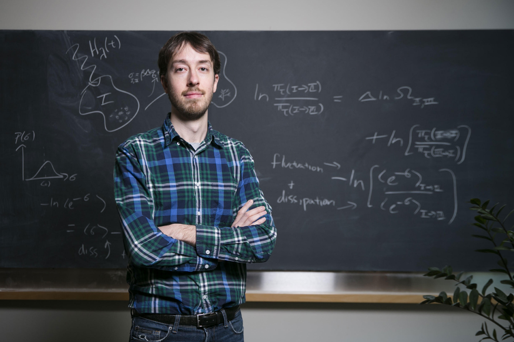
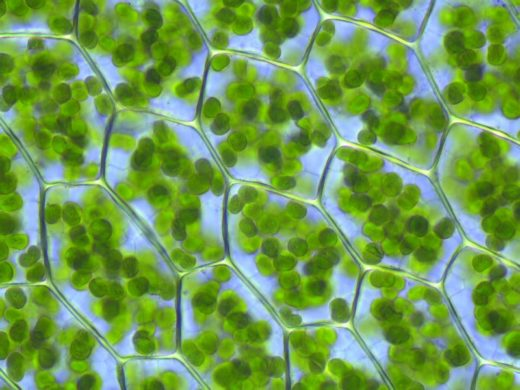



**Very curious!**


# A new thermodynamics theory of the origin of life
 An MIT physicist has proposed the provocative idea that life exists because the law of increasing entropy drives matter to acquire lifelike physical properties.

 

 Why does life exist?

 Popular hypotheses credit a primordial soup, a bolt of lightning and a colossal stroke of luck. But if a provocative new theory is correct, luck may have little to do with it. Instead, according to the physicist proposing the idea, the origin and subsequent evolution of life follow from the fundamental laws of nature and “should be as unsurprising as rocks rolling downhill.”

 From the standpoint of physics, there is one essential difference between living things and inanimate clumps of carbon atoms: The former tend to be much better at capturing energy from their environment and dissipating that energy as heat. [Jeremy England](http://www.englandlab.com/), a 31-year-old assistant professor at the Massachusetts Institute of Technology, has derived a mathematical formula that he believes explains this capacity. The formula, based on established physics, indicates that when a group of atoms is driven by an external source of energy (like the sun or chemical fuel) and surrounded by a heat bath (like the ocean or atmosphere), it will often gradually restructure itself in order to dissipate increasingly more energy. This could mean that under certain conditions, matter inexorably acquires the key physical attribute associated with life.



  You start with a random clump of atoms, and if you shine light on it for long enough, it should not be so surprising that you get a plant



 England’s theory is meant to underlie, rather than replace, Darwin’s theory of evolution by natural selection, which provides a powerful description of life at the level of genes and populations. “I am certainly not saying that Darwinian ideas are wrong,” he explained. “On the contrary, I am just saying that from the perspective of the physics, you might call Darwinian evolution a special case of a more general phenomenon.”

 

 His idea, detailed in a [recent paper](http://www.englandlab.com/uploads/7/8/0/3/7803054/2013jcpsrep.pdf) and further elaborated in [a talk](http://www.englandlab.com/talks.html) he is delivering at universities around the world, has sparked controversy among his colleagues, who see it as either tenuous or a potential breakthrough, or both.

 England has taken “a very brave and very important step,” said Alexander Grosberg, a professor of physics at New York University who has followed England’s work since its early stages. The “big hope” is that he has identified the underlying physical principle driving the origin and evolution of life, Grosberg said.

 “Jeremy is just about the brightest young scientist I ever came across,” said Attila Szabo, a biophysicist in the Laboratory of Chemical Physics at the National Institutes of Health who corresponded with England about his theory after meeting him at a conference. “I was struck by the originality of the ideas.”

 Others, such as Eugene Shakhnovich, a professor of chemistry, chemical biology and biophysics at Harvard University, are not convinced. “Jeremy’s ideas are interesting and potentially promising, but at this point are extremely speculative, especially as applied to life phenomena,” Shakhnovich said.

 England’s theoretical results are generally considered valid. It is his interpretation — that his formula represents the driving force behind a class of phenomena in nature that includes life — that remains unproven. But already, there are ideas about how to test that interpretation in the lab.

 “He’s trying something radically different,” said Mara Prentiss, a professor of physics at Harvard who is contemplating such an experiment after learning about England’s work. “As an organizing lens, I think he has a fabulous idea. Right or wrong, it’s going to be very much worth the investigation.”

 At the heart of England’s idea is the second law of thermodynamics, also known as the law of increasing entropy or the “arrow of time.” Hot things cool down, gas diffuses through air, eggs scramble but never spontaneously unscramble; in short, energy tends to disperse or spread out as time progresses. Entropy is a measure of this tendency, quantifying how dispersed the energy is among the particles in a system, and how diffuse those particles are throughout space. It increases as a simple matter of probability: There are more ways for energy to be spread out than for it to be concentrated. Thus, as particles in a system move around and interact, they will, through sheer chance, tend to adopt configurations in which the energy is spread out. Eventually, the system arrives at a state of maximum entropy called “thermodynamic equilibrium,” in which energy is uniformly distributed. A cup of coffee and the room it sits in become the same temperature, for example. As long as the cup and the room are left alone, this process is irreversible. The coffee never spontaneously heats up again because the odds are overwhelmingly stacked against so much of the room’s energy randomly concentrating in its atoms.

 

 Although entropy must increase over time in an isolated or “closed” system, an “open” system can keep its entropy low — that is, divide energy unevenly among its atoms — by greatly increasing the entropy of its surroundings. In his influential 1944 monograph “[What Is Life?](http://whatislife.stanford.edu/LoCo_files/What-is-Life.pdf)” the eminent quantum physicist Erwin Schrödinger argued that this is what living things must do. A plant, for example, absorbs extremely energetic sunlight, uses it to build sugars, and ejects infrared light, a much less concentrated form of energy. The overall entropy of the universe increases during photosynthesis as the sunlight dissipates, even as the plant prevents itself from decaying by maintaining an orderly internal structure.

 Life does not violate the second law of thermodynamics, but until recently, physicists were unable to use thermodynamics to explain why it should arise in the first place. In Schrödinger’s day, they could solve the equations of thermodynamics only for closed systems in equilibrium. In the 1960s, the Belgian physicist Ilya Prigogine made progress on predicting the behavior of open systems weakly driven by external energy sources (for which he won the 1977 Nobel Prize in chemistry). But the behavior of systems that are far from equilibrium, which are connected to the outside environment and strongly driven by external sources of energy, could not be predicted.

 This situation changed in the late 1990s, due primarily to the work of Chris Jarzynski, now at the University of Maryland, and Gavin Crooks, now at Lawrence Berkeley National Laboratory. Jarzynski and Crooks [showed](http://arxiv.org/pdf/cond-mat/9901352v4.pdf) that the entropy produced by a thermodynamic process, such as the cooling of a cup of coffee, corresponds to a simple ratio: the probability that the atoms will undergo that process divided by their probability of undergoing the reverse process (that is, spontaneously interacting in such a way that the coffee warms up). As entropy production increases, so does this ratio: A system’s behavior becomes more and more “irreversible.” The simple yet rigorous formula could in principle be applied to any thermodynamic process, no matter how fast or far from equilibrium. “Our understanding of far-from-equilibrium statistical mechanics greatly improved,” Grosberg said. England, who is trained in both biochemistry and physics, started his own lab at MIT two years ago and decided to apply the new knowledge of statistical physics to biology.

 
## Video (2:29 minutes)
  How Does Life Come From Randomness?

  David Kaplan explains how the law of increasing entropy could drive random bits of matter into the stable, orderly structures of life.



    start: 0,
    allowfullscreen: 1,
    autoplay: 0,
    hl: en,
    cc_lang_pref: en,
    cc_load_policy: 1,
    color: white,
    controls: 1,
    disablekb: 0,
    enablejsapi: 1,
    fs: 0,
    iv_load_policy: 3,
    loop: 0,
    modestbranding: 1,
    playsinline: 0,
    privacy_mode: yes,
    rel: 0,
    showinfo: 0,
    origin: blog.richiebartlett.com,
    widget_referrer: blog.richiebartlett.com


 Using Jarzynski and Crooks’ formulation, he derived a generalization of the second law of thermodynamics that holds for systems of particles with certain characteristics: The systems are strongly driven by an external energy source such as an electromagnetic wave, and they can dump heat into a surrounding bath. This class of systems includes all living things. England then determined how such systems tend to evolve over time as they increase their irreversibility. “We can show very simply from the formula that the more likely evolutionary outcomes are going to be the ones that absorbed and dissipated more energy from the environment’s external drives on the way to getting there,” he said. The finding makes intuitive sense: Particles tend to dissipate more energy when they resonate with a driving force, or move in the direction it is pushing them, and they are more likely to move in that direction than any other at any given moment.

 “This means clumps of atoms surrounded by a bath at some temperature, like the atmosphere or the ocean, should tend over time to arrange themselves to resonate better and better with the sources of mechanical, electromagnetic or chemical work in their environments,” England explained.

 Self-replication (or reproduction, in biological terms), the process that drives the evolution of life on Earth, is one such mechanism by which a system might dissipate an increasing amount of energy over time. As England put it, “A great way of dissipating more is to make more copies of yourself.” In [a September paper](http://www.englandlab.com/uploads/7/8/0/3/7803054/2013jcpsrep.pdf) in the Journal of Chemical Physics, he reported the theoretical minimum amount of dissipation that can occur during the self-replication of RNA molecules and bacterial cells, and showed that it is very close to the actual amounts these systems dissipate when replicating. He also showed that RNA, the nucleic acid that many scientists believe served as the precursor to DNA-based life, is a particularly cheap building material. Once RNA arose, he argues, its “Darwinian takeover” was perhaps not surprising.

 

 The chemistry of the primordial soup, random mutations, geography, catastrophic events and countless other factors have contributed to the fine details of Earth’s diverse flora and fauna. But according to England’s theory, the underlying principle driving the whole process is dissipation-driven adaptation of matter.

 This principle would apply to inanimate matter as well. “It is very tempting to speculate about what phenomena in nature we can now fit under this big tent of dissipation-driven adaptive organization,” England said. “Many examples could just be right under our nose, but because we haven’t been looking for them we haven’t noticed them.”

 Scientists have already observed self-replication in nonliving systems. According to new research led by Philip Marcus of the University of California, Berkeley, and [reported in Physical Review Letters](http://prl.aps.org/abstract/PRL/v111/i8/e084501) in August, vortices in turbulent fluids spontaneously replicate themselves by drawing energy from shear in the surrounding fluid. And in [a paper appearing online this week](http://www.pnas.org/content/early/2014/01/17/1313601111.abstract) in Proceedings of the National Academy of Sciences, Michael Brenner, a professor of applied mathematics and physics at Harvard, and his collaborators present theoretical models and simulations of microstructures that self-replicate. These clusters of specially coated microspheres dissipate energy by roping nearby spheres into forming identical clusters. “This connects very much to what Jeremy is saying,” Brenner said.

 Besides self-replication, greater structural organization is another means by which strongly driven systems ramp up their ability to dissipate energy. A plant, for example, is much better at capturing and routing solar energy through itself than an unstructured heap of carbon atoms. Thus, England argues that under certain conditions, matter will spontaneously self-organize. This tendency could account for the internal order of living things and of many inanimate structures as well. “Snowflakes, sand dunes and turbulent vortices all have in common that they are strikingly patterned structures that emerge in many-particle systems driven by some dissipative process,” he said. Condensation, wind and viscous drag are the relevant processes in these particular cases.

 “He is making me think that the distinction between living and nonliving matter is not sharp,” said [Carl Franck](http://www.physics.cornell.edu/professorspeople/professors/?page=website/faculty&action=show/id=14), a biological physicist at Cornell University, in an email. “I’m particularly impressed by this notion when one considers systems as small as chemical circuits involving a few biomolecules.”

 England’s bold idea will likely face close scrutiny in the coming years. He is currently running computer simulations to test his theory that systems of particles adapt their structures to become better at dissipating energy. The next step will be to run experiments on living systems.

 

 Prentiss, who runs an experimental biophysics lab at Harvard, says England’s theory could be tested by comparing cells with different mutations and looking for a correlation between the amount of energy the cells dissipate and their replication rates. “One has to be careful because any mutation might do many things,” she said. “But if one kept doing many of these experiments on different systems and if [dissipation and replication success] are indeed correlated, that would suggest this is the correct organizing principle.”

 Brenner said he hopes to connect England’s theory to his own microsphere constructions and determine whether the theory correctly predicts which self-replication and self-assembly processes can occur — “a fundamental question in science,” he said.

 Having an overarching principle of life and evolution would give researchers a broader perspective on the emergence of structure and function in living things, many of the researchers said. “Natural selection doesn’t explain certain characteristics,” said Ard Louis, a biophysicist at Oxford University, in an email. These characteristics include a heritable change to gene expression called methylation, [increases in complexity in the absence of natural selection](https://www.quantamagazine.org/20130716-the-surprising-origins-of-lifes-complexity/), and certain molecular changes Louis has recently studied.

 If England’s approach stands up to more testing, it could further liberate biologists from seeking a Darwinian explanation for every adaptation and allow them to think more generally in terms of dissipation-driven organization. They might find, for example, that “the reason that an organism shows characteristic X rather than Y may not be because X is more fit than Y, but because physical constraints make it easier for X to evolve than for Y to evolve,” Louis said.

 “People often get stuck in thinking about individual problems,” Prentiss said. Whether or not England’s ideas turn out to be exactly right, she said, “thinking more broadly is where many scientific breakthroughs are made.”

 _Correction: This article was revised on January 22, 2014, to reflect that Ilya Prigogine won the Nobel Prize in chemistry, not physics._