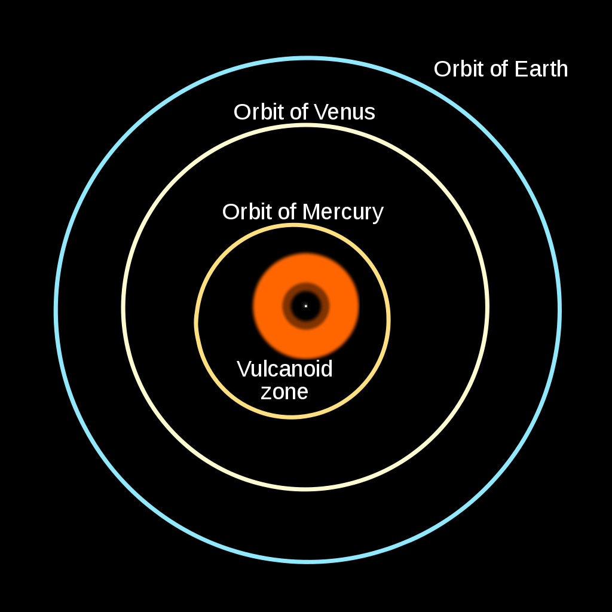

 *Even the most brilliant mind in history couldn’t have achieved all he did without significant help from the minds of others.*

 

 Perhaps the biggest myth in all of science is that of the lone genius. Someone, somewhere, with a towering intellect but no formal training wades into a field and can immediately see things that no one else has ever seen before. With just a little bit of hard work, they wind up finding solutions to puzzles that have stymied the greatest minds prior to them. And perhaps, if you had the good fortune of coming into a field just like that, yourself, you could make those great breakthrough that the world’s greatest professionals had all missed.

 That’s the myth we frequently tell ourselves about Einstein. That he, an outcast and a dropout, taught himself everything he needed to know on his own, and revolutionized the field of physics in a number of ways. In the early days, his work thinking about light gave us the photoelectric effect, special relativity, and *E = mc²*, among other advances. Later on, his work alone gave us General Relativity, arguably his greatest achievement. All by his lonesome, Einstein single-handedly dragged the field out of Newtonian stagnation and into the 20th, and now the 21st, centuries. Here’s why that couldn’t be farther from the truth.

 

 Yes, it’s true: back in 1905, Einstein published a series of papers that would go on to revolutionize a number of areas of physics, and that we call this his “miracle year” because of those publications. But even those substantial advances could hardly have been said to have occurred in a vacuum, or that Einstein in some way was an outsider to the field of physics.

 Quite to the contrary, Einstein himself, although German-born, moved to Switzerland specifically to study physics and mathematics. At the age of 17, he enrolled in the mathematics and physics teaching diploma program in Zürich, where he graduated in 1900. That might not sound impressive, but today [that University is known as ETH Zürich](https://en.wikipedia.org/wiki/ETH_Zurich), and has had a total of 22 Nobel Laureates come through it.

 Yes, it’s true that he went to work at the Swiss patent office, but was concurrently continuing his studies in Zürich at the same time. Moreover, it was his friend and classmate, Marcel Grossman, whose connections (through his father) got Einstein the job. (Grossman didn’t need it, having secured teaching positions to finance his graduate education.)

 Additionally, there were a series of pieces of evidence that had been known — for decades, at that point — to go beyond what the ideas of Newton could hope to explain.

 

 Newton’s Universe was deterministic. If you could take any system of particles and write down their positions, momenta, and masses, you could calculate how each and every one of them would evolve with time. With infinite calculational power, you could compute this to arbitrary precision at each and every moment in time. Maxwell’s equations brought electromagnetism into the same realm as Newtonian gravity and Newtonian mechanics. Those were the foundational pillars of physics at the time of Einstein’s birth.

 But puzzles arose, and were well-known for those final few decades of the 1800s. Radioactivity had been discovered, and the time at which any atom would decay was known to be random. Additionally, the law of mass conservation was violated for certain radioactive decays; mass was actually lost during beta decay. It was known that objects did not obey Newton’s laws of motion when they moved close to the speed of light: time dilation and length contraction had already been discovered and described. The null results of the Michelson-Morley experiment had been robustly determined.

 And, perhaps most importantly, when the precession of Mercury’s orbit was calculated in detail — accounting for the gravitation of the planets and moons as well as the periodic change in Earth’s equinoxes — it came up short of observations by a tiny but significant amount: 43 arc-seconds per century.

 

 Yes, in 1905, Einstein made quite a splash with his series of published papers. But it’s not like he hadn’t been working and studying continuously since his graduation. His patent office work largely consisted of examining electrical and electro-mechanical devices, including the transmission of electric signals and synchronization devices. He studied [physics independently with a group of physics and mathematics friends](https://en.wikipedia.org/wiki/Olympia_Academy), including the works of Ernst Mach and Henri Poincaré. And, owing to his studies, he was awarded a Ph.D. from the University of Zürich for his dissertation, *A new determination of molecular dimensions*, with Professor Alfred Kleiner.

 Einstein’s 1905 achievements, which included:
 - the discovery of Brownian motion,
 - the derivation of *E = mc²* and mass-energy equivalence,
 - the discovery of the photoelectric effect,
 - and the derivation of special relativity,

 were no doubt momentous, but they didn’t occur in a vacuum. Quite to the contrary, Einstein benefitted from friends, colleagues, teachers and mentors, the collaborative efforts [of his first wife](https://en.wikipedia.org/wiki/Mileva_Mari%C4%87) (whose contributions [will likely never be fully known](https://journals.sagepub.com/doi/pdf/10.1080/03064229008534960)), and the input of many others during this time. His papers didn’t come out of nowhere, but rather built upon earlier ideas of Planck, Lorentz, FitzGerald, Thomson, Heaviside, Hasenöhrl, and Poincaré. In fact, [Poincaré had independently derived E = mc² back in 1900](http://physicsinsights.org/poincare-1900.pdf); it’s possible that Einstein read that very paper as part of his study group.

 

 But what about General Relativity? Einstein, according to the legendary stories you might have heard about him, simply had what he referred to as “his happiest thought” around 1907 or so, and the rest was history.

 What was “his happiest thought,” then? It was to consider what difference there would be between an observer who was locked in a windowless room on the surface of the Earth, and experienced the force of gravity pulling everything down towards the center of the Earth, and an observer who was locked in a uniformly accelerating room in the vacuum of space.

 For the observer inside, Einstein reasoned, there was no way to tell the difference between the two scenarios. Everything inside would accelerate “downward” at 9.8 m/s²; the floor would push “upwards” with a restoring, normal force to balance the downward pull; even light, if shone from one end of the room to the other, would travel in a curved path as dictated by either acceleration or gravitation. Known today as [Einstein’s equivalence principle](https://en.wikipedia.org/wiki/Equivalence_principle), it provided the conceptual link between motion, which was described by his (earlier, developed in 1905) theory of special relativity, and gravitation, which up until that point was a purely Newtonian phenomenon.

 ![The identical behavior of a ball falling to the floor in an accelerated rocket (left) and on Earth (right) is a demonstration of Einstein’s equivalence principle. Measuring the acceleration at a single point shows no difference between gravitational acceleration and other forms of acceleration; unless you can somehow observe or access information about the outside world, these two scenarios would yield identical experimental results. (Credit: Markus Poessel/Wikimedia commons; retouched by Pbroks13)](./Einstein-wasnt-a-lone-genius-after-all/equivalence_gravity.jpeg)

 But even with this, Einstein was not operating in a vacuum at all. Einstein’s former professor during his undergraduate days, Hermann Minkowski, became enamored with special relativity, and was shocked that it was the same Einstein he had taught that developed it. “For me it came as a tremendous surprise, for in his student days Einstein had been a real lazybones. He never bothered about mathematics at all,” Minkowski wrote, but then it was Minkowski who developed the idea of spacetime based upon Einstein’s work. By placing space and time on the same mathematical footing, he set the stage for the mathematical development of General Relativity.

 Conceptually, Einstein’s “happiest thought” may have been preceded by some fascinating work by Henri Poincaré. Poincaré realized that Mercury’s orbit didn’t only require corrections for Earth’s precessing equinoxes and the gravitational influence of the other bodies in the Solar System, but also for the fact that, as the fastest planet, Mercury’s velocity with respect to the speed of light could not be neglected. With the advent of special relativity, he realized that Mercury would experience dilated time, and that there would be length contraction in the direction of its motion around the Sun. When he applied special relativity to the orbit of Mercury, he found that he could account for about ~20% of the observed extra precession just by adding in that one effect.

 

 How, then, would it be possible to construct a physical theory that married gravitation to this new concept of spacetime, explain the precession of Mercury’s orbit, incorporate special relativity, and still be able to reproduce all of the earlier centuries of success that Newtonian gravity had?

 It wasn’t Einstein’s idea at all, but rather that of his friend and former classmate, Marcel Grossman. While Einstein had the idea of the equivalence principle, it was Grossman who had the idea to describe the Universe with non-Euclidean geometry as its spacetime fabric.

 After all, this was Grossman’s specialty: Riemannian geometry, where two parallel lines did not necessarily always remain parallel, but could converge and meet or diverge and get farther and farther apart, as dictated by the underlying geometry. Differential geometry and tensor calculus were precisely the language required to describe the Universe that Einstein was trying to picture, and Grossman was the one who put it all together. The paper, [Outline of a Generalized Theory of Relativity and of a Theory of Gravitation](http://www.icra.it/MG/doc/Einstein_Entwurf_1913.pdf), was the first of two fundamental papers that would establish General Relativity as the theory of gravity.

 

 But even this specialty was not unique to Grossman and, through him, Einstein. Absolute differential calculus, as a field, had been begun by [Erwin Christoffel in 1869](https://gdz.sub.uni-goettingen.de/id/PPN243919689_0070) and was only recently, at the time, completed by [Gregorio Ricci and Tullio Levi-Civita in 1900](https://link.springer.com/article/10.1007/BF01454201). (These last names will be familiar to anyone who’s studied General Relativity.) There were numerous mathematicians who were studying precisely this field at the time, and one of them, the legendary David Hilbert, almost arrived at the equations that would describe gravitation in the Universe before Einstein did.

 In every physical theory where you have mechanical motion, there’s a thing you can define — the action — that must be minimized in order to figure out what the path of that object will be. In Newtonian mechanics, it was [Hamilton’s principle of least action](https://en.wikipedia.org/wiki/Stationary-action_principle) that led to the equations of motion; in the context of a general theory of relativity, a new action principle would have to be discovered. That action principle was formulated independently by both Einstein and by Hilbert at around the same time, and is today known as [the Einstein-Hilbert action](https://en.wikipedia.org/wiki/Einstein%E2%80%93Hilbert_action). It’s this action principle, when correctly applied to the physics of the system, that leads to the modern [Einstein field equations](https://bigthink.com/starts-with-a-bang/einstein-general-theory-relativity-equation/).

 

 None of this is to diminish the genius of Einstein, nor to take credit away from him for the breakthroughs that he himself made. Rather, these stories are to better provide context as to how these great advances were made. Einstein was not, as the common narrative often goes, a lone genius who was working outside of the strict confines of academia, who was able to revolutionize the field precisely because he was an outsider, unconfined by the dogmatic and restrictive teachings of his day.

 Rather, it was precisely because Einstein had the education and background that he did — his own unique toolkit, as it were — that he was able to approach this variety of problems in a self-consistent, non-contradictory way. It was because of his friends and collaborators that he was exposed to ideas that helped him to progress, rather than stagnate. And it was because of his willingness and even eagerness to rely on the input and expertise of others, and to take inspiration from them and incorporate it into his own work, that his excellent ideas, many of which were profound but were mere seeds, were able to sprout into the towering achievements we reflect upon today.

 ![An animated look at how spacetime responds as a mass moves through it helps showcase exactly how, qualitatively, it isn’t merely a sheet of fabric but all of space itself gets curved by the presence and properties of the matter and energy within the Universe. Note that spacetime can only be described if we include not only the position of the massive object, but where that mass is located throughout time. Both instantaneous location and the past history of where that object was located determine the forces experienced by objects moving through the Universe, making General Relativity’s set of differential equations even more complicated than Newton’s. (Credit: LucasVB)](./Einstein-wasnt-a-lone-genius-after-all/animated_spacetime.gif)

 Last year, I wrote an essay entitled, [What if Einstein never existed?](https://bigthink.com/starts-with-a-bang/science-einstein-never-existed/) At the end, I contrasted the narrative of the lone genius with the attempts made to solve many of the outstanding problems of their time by other, less heralded scientists, and found that most advances would have occurred even without the person who made the key breakthrough. Georges Lemaître and Howard Robertson each put together the expanding Universe independently of Edwin Hubble. Sin-Itiro Tomonaga worked out quantum electrodynamics independently of both Julian Schwinger and Richard Feynman. Robert Brout and Alexei Starobinskii each published papers with key realizations concerning what we now know as cosmic inflation well before Alan Guth’s revolutionary paper.

 What would the world have been like without Einstein? Would we ever have had General Relativity? I think the answer, without a doubt, is yes. Many others, even at the time, were close behind him. And without listening to the inputs of the world-class minds around him, Einstein wouldn’t have had anywhere near the successes or the impact that he did. Although our culture loves soundbites, with perhaps the most famous from Einstein being, “imagination is more important than knowledge,” these sorts of advances absolutely require both. Regardless of the ratio of “inspiration” to “perspiration” required, there’s simply no way around the need, if you want to make a meaningful advance, for expertise and hard work.
