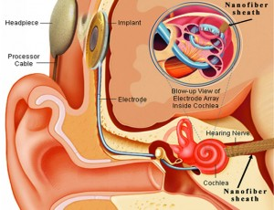

 In response to: https://www.extremetech.com/electronics/139875-mit-devises-biobattery-that-could-allow-the-human-ear-to-power-its-own-hearing-aid

 ---

 The potential behind this science has awesome applications. As someone that suffers hearing challenges, this is of keen interest.

 