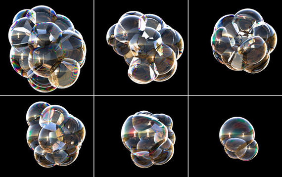

 

 When you're a kid, and even when you're not, one of the best toys you can ever have is a simple one: a bottle of detergent whose cap doubles as a plastic wand. With that wand, aided by a puff of wind or breath, you can create a particular kind of magic: bubbles. Bubbles that are big and/or tiny. Bubbles that are singular and/or fused together. Bubbles that double as shiny, light-catching, wind-floating little creatures.

 The forms the bubbles take have always been a little bit mysterious -- not only to amateur scientists, but to professional ones, as well. While single soap bubbles are fairly straightforward things -- gas, trapped in liquids -- much more complex are the single bubbles that fuse together into composite structures of trapped air: [foams](http://en.wikipedia.org/wiki/Foam). And when bubbles become foams -- when they glom onto each other to create the weird and wobbly little wonders pictured above -- they behave differently than single bubbles do. When one member of the unit inevitably pops, the bubbles rearrange themselves to balance out the cluster. They compensate for the loss by creating new -- and newly stable -- configurations. 

 The forces behind all that wobbling and wonder-making, however, are [different from the forces that determine when each bubble pops](http://news.sciencemag.org/sciencenow/2013/05/scienceshot-the-life-cycle-of-a-.html?rss=1) -- making it notoriously difficult to predict bubble behavior. And making it hard, as well, to create computer models that might account for all the different phases in the lifespan of a bubble.

 Hard ... but not, it turns out, impossible. Two UC Berkeley researchers, James A. Sethian and Robert I. Saye, have now [found a way to describe, in mathematical terms, the successive stages](http://news.sciencemag.org/sciencenow/2013/05/scienceshot-the-life-cycle-of-a-.html?rss=1) in the complex evolution of foam. Their equations account for a number of factors in that life cycle, from the chemical to the physical: the draining of liquid from the bubbles' thin walls, causing them to rupture; the rearrangement of the remaining bubbles; the resulting destabilization of the surrounding bubbles; the subsequent popping of those bubbles.

 Applying those equations, the pair created this computer-generated video of a cluster of bubbles forming into, and then popping out of, existence:

## Video (2 minutes) Bursting Bubbles at UC Berkeley
 Two University of California, Berkeley, researchers have now described mathematically the successive stages in the complex evolution and disappearance of foamy bubbles, a feat that could help in modeling industrial processes in which liquids mix or in the formation of solid foams such as those used to cushion bicycle helmets.

 Applying these equations, the mathematicians,  James A. Sethian and Robert I. Saye, created this computer-generated video of a cluster of bubbles popping out of existence, illustrating the various physical and chemical processes involved: liquid drains from the bubbles' thin walls until they rupture, after which the remaining bubbles rearrange, often destabilizing other bubbles, which subsequently pop.

 
  start: 0,
  allowfullscreen: 1,
  autoplay: 0,
  hl: en,
  cc_lang_pref: en,
  cc_load_policy: 1,
  color: white,
  controls: 1,
  disablekb: 0,
  enablejsapi: 1,
  fs: 0,
  iv_load_policy: 3,
  loop: 0,
  modestbranding: 1,
  playsinline: 0,
  privacy_mode: yes,
  rel: 0,
  showinfo: 0,
  origin: blog.richiebartlett.com,
  widget_referrer: blog.richiebartlett.com


 This is science that is also, in its way, a beautiful and fairly haunting work of art. But it's much more than that, too: a better understanding of foam formation and dissolution could help manufacturers to better model industrial processes that rely, in their way, on foams. The cushions within bike helmets, for example. Or packing materials. Or ergonomic chairs. The researchers' models, in other words, could help us to make more effective use of bubbles. Though they could, yes, also take some of the magic and mystery out of them. Not to burst your ... well, you know.