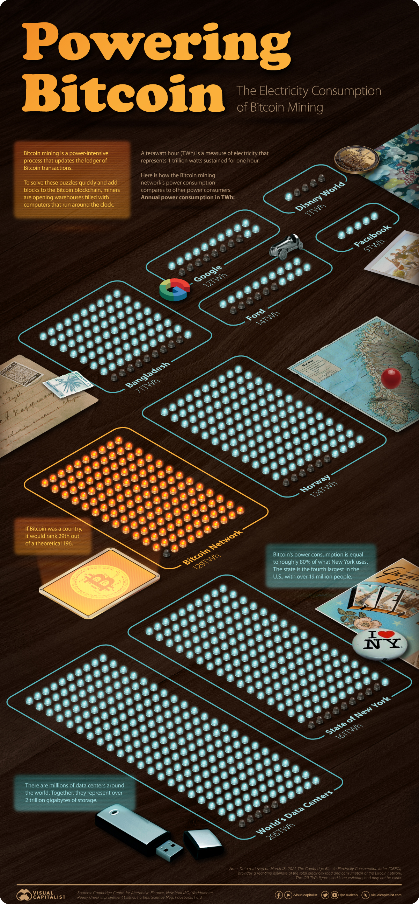

This article is related to my post on banning cryptocurrencies based on energy usage.



## Infographic

## Visualizing the Power Consumption of Bitcoin Mining
Cryptocurrencies have been some of the most talked-about assets in recent months, with bitcoin and ether prices reaching record highs. These gains were driven by a flurry of announcements, including increased adoption by businesses and institutions.

Lesser known, however, is just how much electricity is required to power the Bitcoin network. To put this into perspective, we’ve used data from the University of Cambridge’s Bitcoin Electricity Consumption Index ([CBECI](https://cbeci.org/cbeci/comparisons)) to compare Bitcoin’s power consumption with a variety of countries and companies.

## Why Does Bitcoin Mining Require So Much Power?
When people mine bitcoins, what they’re really doing is updating the ledger of Bitcoin transactions, also known as the blockchain. This requires them to solve numerical puzzles which have a 64-digit hexadecimal solution known as a **hash**.

Miners may be rewarded with bitcoins, but only if they arrive at the solution before others. It is for this reason that Bitcoin mining facilities—warehouses filled with computers—have been popping up around the world.

These facilities enable miners to scale up their **hashrate**, also known as the number of hashes produced each second. A higher hashrate requires greater amounts of electricity, and in some cases can even [overload](https://www.businessinsider.com/iran-government-blames-bitcoin-for-blackouts-in-tehran-other-cities-2021-1) local infrastructure.

## Putting Bitcoin’s Power Consumption Into Perspective
On March 18, 2021, the annual power consumption of the Bitcoin network was estimated to be **129 terawatt-hours** (TWh). Here’s how this number compares to a selection of countries, companies, and more.

|	Name	|	Population 	|	Annual Electricity Consumption (TWh)	|
|	:--	|	:--	|	:--	|
|	China	|	1,443M	|	6,543	|
|	United States	|	330.2M	|	3,989	|
|	All of the world’s data centers	|	-	|	205	|
|	State of New York	|	19.3M	|	161	|
|	**Bitcoin network** 	|	**-**	|	**129** 	|
|	Norway	|	5.4M	|	124	|
|	Bangladesh	|	165.7M	|	70	|
|	Google	|	-	|	12	|
|	Facebook	|	-	|	5	|
|	Walt Disney World Resort (Florida)	|	-	|	1	|


A terawatt hour (TWh) is a measure of electricity that represents 1 trillion watts sustained for one hour.

SOURCE: *Cambridge Centre for Alternative Finance, Science Mag, New York ISO, Forbes, Facebook, Reedy Creek Improvement District, Worldometer*

If Bitcoin were a country, it would rank **29th** out of a theoretical 196, narrowly exceeding Norway’s consumption of 124 TWh. When compared to larger countries like the U.S. (3,989 TWh) and China (6,543 TWh), the cryptocurrency’s energy consumption is relatively light.

For further comparison, the Bitcoin network consumes **1,708%** more electricity than Google, but 39% less than all of the world’s data centers—together, these represent over 2 trillion gigabytes of storage.

## Where Does This Energy Come From?
In a [2020 report](https://www.jbs.cam.ac.uk/wp-content/uploads/2021/01/2021-ccaf-3rd-global-cryptoasset-benchmarking-study.pdf) by the University of Cambridge, researchers found that **76%** of cryptominers rely on some degree of renewable energy to power their operations. There’s still room for improvement, though, as renewables account for just **39%** of cryptomining’s total energy consumption.

Here’s how the share of cryptominers that use each energy type vary across four global regions.

|	Energy Source	|	Asia-Pacific	|	Europe	|	Latin America and the Caribbean	|	North America	|
|	:--	|	:--	|	:--	|	:--	|	:--	|
|	Hydroelectric	|	65%	|	60%	|	67%	|	61%	|
|	Natural gas	|	38%	|	33%	|	17%	|	44%	|
|	Coal	|	65%	|	2%	|	0%	|	28%	|
|	Wind	|	23%	|	7%	|	0%	|	22%	|
|	Oil	|	12%	|	7%	|	33%	|	22%	|
|	Nuclear	|	12%	|	7%	|	0%	|	22%	|
|	Solar	|	12%	|	13%	|	17%	|	17%	|
|	Geothermal	|	8%	|	0%	|	0%	|	6%	|

SOURCE: University of Cambridge

*Editor’s note: Numbers in each column are not meant to add to 100%*


Hydroelectric energy is the most common source globally, and it gets used by at least **60%** of cryptominers across all four regions. Other types of clean energy such as wind and solar appear to be less popular.

Coal energy plays a significant role in the Asia-Pacific region, and was the only source to match hydroelectricity in terms of usage. This can be largely attributed to China, which is currently the [world’s largest consumer of coal](https://www.statista.com/statistics/265510/countries-with-the-largest-coal-consumption/).

Researchers from the University of Cambridge noted that they weren’t surprised by these findings, as the Chinese government’s strategy to ensure energy self-sufficiency has led to an oversupply of both hydroelectric and coal power plants.

## Towards a Greener Crypto Future
As cryptocurrencies move further into the mainstream, it’s likely that governments and other regulators will turn their attention to the industry’s carbon footprint. This isn’t necessarily a bad thing, however.

Mike Colyer, CEO of Foundry, a blockchain financing provider, believes that cryptomining can support the global transition to renewable energy. More specifically, he believes that clustering cryptomining facilities near renewable energy projects can mitigate a common issue: an oversupply of electricity.


It allows for a faster payback on solar projects or wind projects… because they would *[otherwise]* produce too much energy for the grid in that area.


This type of thinking appears to be taking hold in China as well. In April 2020, Ya’an, a city located in China’s Sichuan province, issued a [public guidance](https://www.coindesk.com/chinese-city-known-for-bitcoin-mining-seeks-blockchain-firms-to-burn-excess-hydropower) encouraging blockchain firms to take advantage of its excess hydroelectricity.