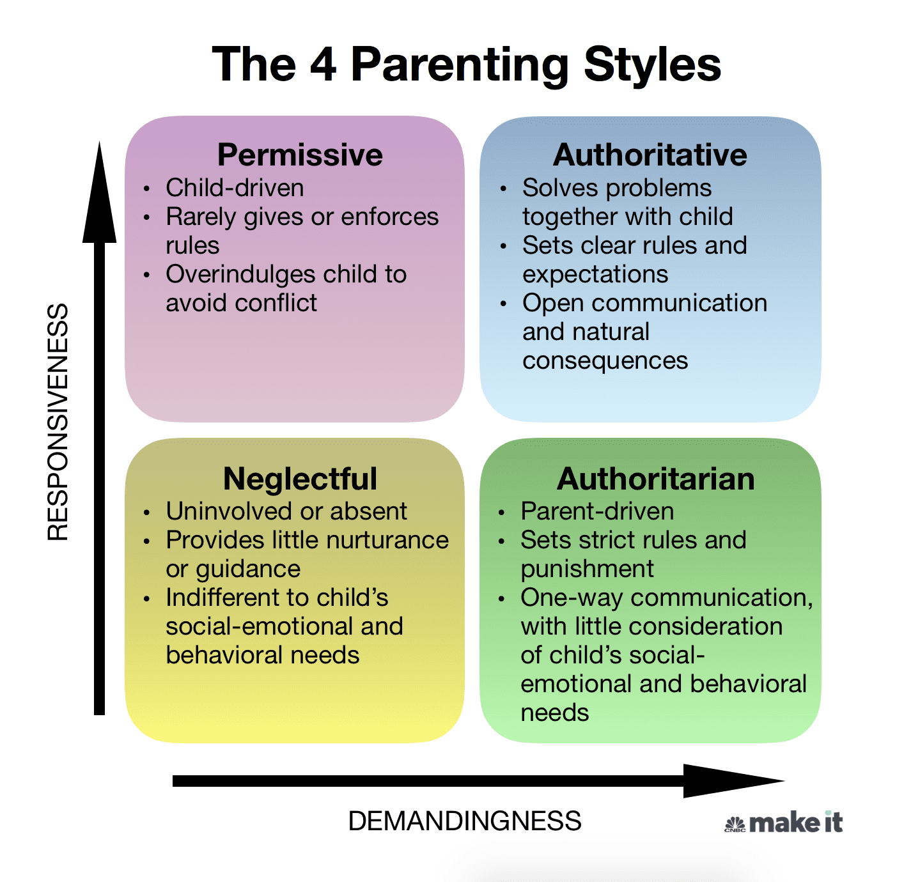

# A psychologist shares 4 styles of parenting — and the type that researchers say is the most successful

Since children do not come with manuals, parents often struggle to determine how to raise [mentally strong, well-rounded and successful kids](https://www.cnbc.com/2020/05/25/biggest-parenting-mistake-destroys-kids-mental-strength-says-therapist.html). Some parents are strict, while others are lenient. Some are vigilant, while others are distant.

If the question "What type of parent do I want to be?" has ever crossed your mind, it helps to understand the basics of [different parenting styles](https://www.psychologytoday.com/us/basics/parenting/parenting-styles).

## The 4 types of parenting
The four main parenting styles — permissive, authoritative, neglectful and authoritarian — used in child psychology today are based on the work of [Diana Baumrind](https://senate.universityofcalifornia.edu/in-memoriam/files/diana-baumrind.html), a developmental psychologist, and Stanford researchers [Eleanor Maccoby and John Martin](https://fabbs.org/our_scientists/eleanor-maccoby-phd/).

Each parenting style has different effects on children's behavior and can be identified by certain characteristics, as well as degrees of responsiveness (the extent to which parents are warm and sensitive to their children's needs) and demandingness (the extent of control parents put on their children in an attempt to influence their behavior).

### The Permissive Parent
Common traits:
* High responsiveness, low demandingness
* Communicates openly and usually lets their kids decide for themselves, rather than giving direction
* Rules and expectations are either not set or rarely enforced
* Typically goes through great lengths to keep their kids happy, sometimes at their own expense

Permissive parents are more likely to take on a friendship role, rather than a parenting role, with their kids. They prefer to avoid conflict and will often acquiesce to their children’s pleas at the first sign of distress. These parents mostly allow their kids to do what they want and offer limited guidance or direction.

### The Authoritative Parent
Common traits:
* High responsiveness, high demandingness
* Sets clear rules and expectations for their kids while practicing flexibility and understanding
* Communicates frequently; they listen to and take into consideration their children’s thoughts, feelings and opinions
* Allows natural consequences to occur (e.g., kid fails quiz when they didn’t study), but uses those opportunities to help their kids reflect and learn

Authoritative parents are nurturing, supportive and often in tune with their children’s needs. They guide their children through open and honest discussions to teach values and reasoning. Kids who have authoritative parents tend to be self-disciplined and can think for themselves.

### The Neglectful Parent
Common traits:
* Low responsiveness, low demandingness
* Lets their kids mostly fend for themselves, perhaps because they are indifferent to their needs or are uninvolved/overwhelmed with other things
* Offers little nurturance, guidance and attention
* Often struggles with their own self-esteem issues and has a hard time forming close relationships

Sometimes referred to as uninvolved parenting, this style is exemplified by an overall sense of indifference. Neglectful parents have limited engagement with their children and rarely implement rules. They can also be seen as cold and uncaring — but not always intentionally, as they are often struggling with their own issues.

### The Authoritarian Parent
Common traits:
* High demandingness, low responsiveness
* Enforces strict rules with little consideration of their kid’s feelings or social-emotional and behavioral needs
* Often says “because I said so” when their kid questions the reasons behind a rule or consequence
* Communication is mostly one-way — from parent to child

This [rigid parenting style](https://www.psychologytoday.com/us/blog/thinking-about-kids/201409/authoritative-versus-authoritarian-parenting-style) uses stern discipline, often justified as “tough love.” In attempt to be in full control, authoritarian parents often talk to their children without wanting input or feedback.

## What is the best parenting style for you?
[Research suggests that authoritative parents](https://www.parentingscience.com/authoritative-parenting-style.html) are more likely to raise independent, self-reliant and [socially competent](https://www.researchgate.net/publication/309026935_A_Meta-Analysis_of_Parental_Style_and_Consumer_Socialization_of_Children) kids.

While children of authoritative parents are not immune to mental health issues, relationship difficulties, substance abuse, poor self-regulation or low self-esteem, these traits are more commonly seen in children of parents who strictly employ authoritarian, permissive or uninvolved parenting styles.

Of course, when it comes to parenting, there is no “one size fits all.” You don’t need to subscribe to just one type, as there may be times when you have to use a varied parenting approach — but in moderation.

The most successful parents know when to change their style, depending on the situation. An authoritative parent, for example, may want to become more permissive when a child is ill, by continuing to provide warmth and letting go of some control (e.g. “Sure, you can have some ice cream for lunch and dinner.”).

And a permissive parent may be more strict if a child’s safety is at stake, like when crossing a busy street (e.g. “You’re going to hold my hand whether you like it or not.”).

At the end of the day, use your best judgement and remember that the parenting style that works best for your family at that time is the one you should use.



## Related
