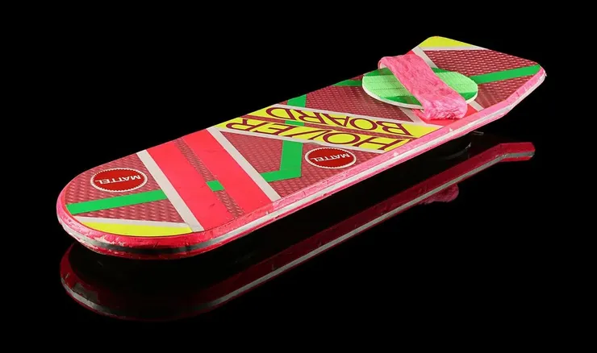
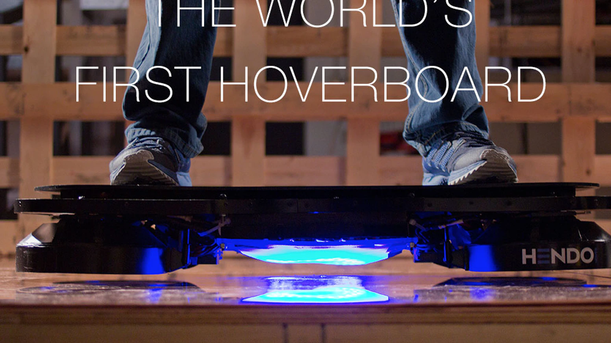


Real Hoverboard?? 

Awesome, if true.


# The Back to the Future Hoverboard is Finally Here
Everybody knows that by far the coolest part of *Back to the Future: Part II* is the scene where Marty McFly escapes his arch-nemesis by zooming through the air on his rad Mattel hoverboard. And every year since then, we've said to ourselves, "Well, where are our hoverboards? We were promised hoverboards!"

Well, now Science has finally said "OK. "

Jill and Greg Henderson, the founders of Hendo, released a video today featuring their prototype hoverboard. The clip starts out sappy, with a kid superglueing Superman to a skateboard and then seemingly asking his genius scientist dad to make him a real one. And then his dad does, because apparently it was that easy.

Cut to the kid skating around on a now life-size hoverboard like a superhero.



Now, cut to the founders asking you for money.

According to the Kickstarter campaign, the Hendo hoverboard hovers "about 1 inch off the ground… the prototype is real and it works! But to see it hover in person, and better yet, to defy gravity by riding it, is something you need to experience as well."

We've been waiting so long for a proper hoverboard that it's easy to be skeptical. The good news about Hendo is that this is their 18th prototype and it really does seem to work, although it won't hover over just any surface—it requires something magnetized. (In a way, that's even better. It means that, just like in the *Back to the Future*, the board won't hover over water!)

Their dreams don't end there. The Hendo teams also wants to build hoverboard parks that look a lot like futuristic 1980s skating rinks (thereby making all of our childhood fantasies come true). And they want to release a development kit called Whitebox that will enable you to make all kinds of other things hover.

It'll take only $250,000 pledged by Dec. 15 to get this thing in the air. They're in good shape: It's the first day and the campaign has already accumulated $100,000. So the chances of us actually having functioning hoverboards by 2015 looks pretty good—which is kind of incredible, because that's the year in which *Back to the Future* actually took place.

## A working hoverboard, it's finally here | Video (3:12 minutes)
Hendo is introducing the world's first REAL hoverboard. 

Something something great Scott!



    start: 0,
    allowfullscreen: 1,
    autoplay: 0,
    hl: en,
    cc_lang_pref: en,
    cc_load_policy: 1,
    color: white,
    controls: 1,
    disablekb: 0,
    enablejsapi: 1,
    fs: 0,
    iv_load_policy: 3,
    loop: 0,
    modestbranding: 1,
    playsinline: 0,
    privacy_mode: yes,
    rel: 0,
    showinfo: 0,
    origin: blog.richiebartlett.com,
    widget_referrer: blog.richiebartlett.com



**UPDATE:** This project turned out to *mostly* be a scam. Most of the supporters didn't get what they paid for...
