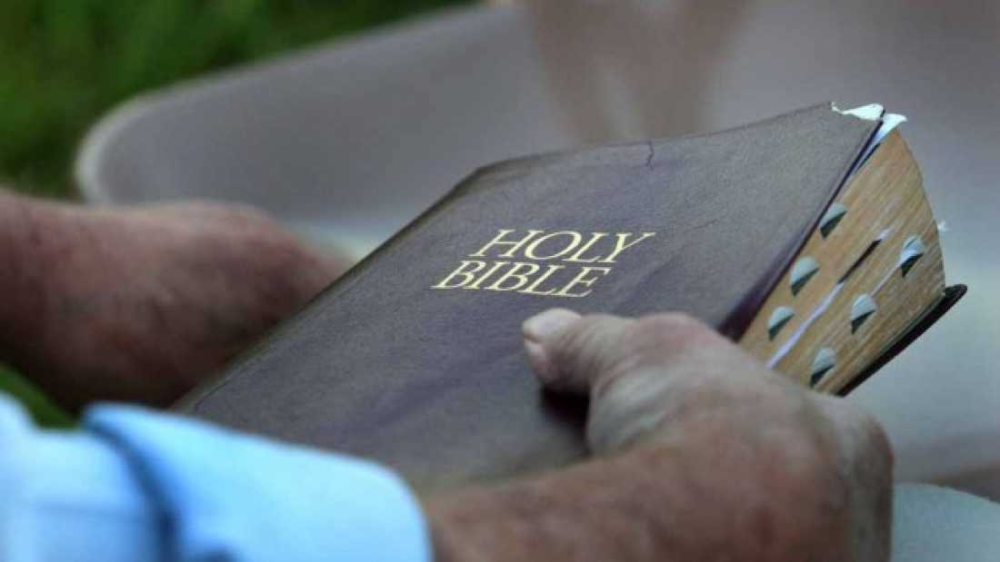

The ability of young children to distinguish fact from fiction varies considerably with exposure to religion, two new studies have found. Children who did not attend parochial (religious) schools or church were significantly better at identifying characters in religious or fantasy stories as pretend than those who did. The studies have been published in [Cognitive Science](http://onlinelibrary.wiley.com/doi/10.1111/cogs.12138/abstract).

For the investigations, researchers enrolled 5- and 6- year old children and separated them into [four groups](https://friendlyatheist.patheos.com/2014/07/18/new-study-shows-that-children-exposed-to-religion-have-a-hard-time-distinguishing-fact-from-fiction/): children who attend public school and church, children who attend public school but not church, children who attend parochial school and church and children who attend parochial school but not church.  

They then exposed the children to three different types of stories- biblical (religious), fantastical (where the divine element was replaced with magic) or realistic (all supernatural elements removed). They then asked the children to judge whether the protagonist (lead character) was fictional or real.

Unsurprisingly, they found that all children judged the protagonist to be a real person in the realistic stories that described ordinary events, irrespective of religious background or schooling. However, when the children were read religious stories, such as Noah’s ark, there were significant differences in judgment. Children exposed to religion, either through school or church, decided that the characters were real, whereas secular children judged them to be fictional.

Furthermore, when the children were read fantastical stories where impossible events were either magical or non-magical (unexplained), the secular children were significantly better than religious children at identifying characters as fictional. They found that children from religious backgrounds would [rely](http://www.huffingtonpost.com/2014/07/21/children-religion-fact-fiction_n_5607009.html?ncid=fcbklnkushpmg00000043&ir=Science) on religion in order to justify these incorrect classifications.

In sum, this [study suggests](http://onlinelibrary.wiley.com/doi/10.1111/cogs.12138/abstract) that exposure to religion has a profound impact on the ability of children to discern reality from fiction, whether presented with religious ideas or fantasy stories.

The researchers [acknowledge](http://www.patheos.com/blogs/friendlyatheist/2014/07/18/new-study-shows-that-children-exposed-to-religion-have-a-hard-time-distinguishing-fact-from-fiction/) that the study design was not perfect. In particular, they recognize that it may not be exposure to religion that is causing these differences, but another variable that was not taken into account in the study. Still, the researchers believe that religion is the most likely contributing factor. 

[Via [Huffington Post](http://www.huffingtonpost.com/2014/07/21/children-religion-fact-fiction_n_5607009.html?ncid=fcbklnkushpmg00000043&ir=Science), [Cognitive Science](http://onlinelibrary.wiley.com/doi/10.1111/cogs.12138/abstract), and [Patheos](http://www.patheos.com/blogs/friendlyatheist/2014/07/18/new-study-shows-that-children-exposed-to-religion-have-a-hard-time-distinguishing-fact-from-fiction/)]