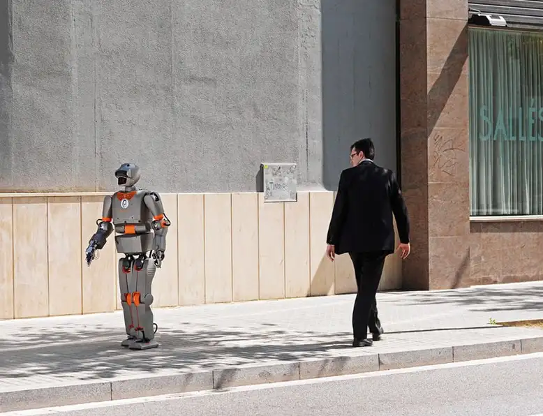


There are rules in war?

Furthermore, they must be *taught* to military robots?


# Ethical trap: robot paralyzed by choice of who to save

*Can a robot learn right from wrong? Attempts to imbue robots, self-driving cars and military machines with a sense of ethics reveal just how hard this is...*


 A new experiment tests Asimov's fictional First Law of Robotics in which ethical robots prevent humans from coming to harm.


    start: 0,
    allowfullscreen: 1,
    autoplay: 0,
    hl: en,
    cc_lang_pref: en,
    cc_load_policy: 1,
    color: white,
    controls: 1,
    disablekb: 0,
    enablejsapi: 1,
    fs: 0,
    iv_load_policy: 3,
    loop: 0,
    modestbranding: 1,
    playsinline: 0,
    privacy_mode: yes,
    rel: 0,
    showinfo: 0,
    origin: blog.richiebartlett.com,
    widget_referrer: blog.richiebartlett.com



CAN we teach a robot to be good? Fascinated by the idea, roboticist Alan Winfield of Bristol Robotics Laboratory in the UK built an ethical trap for a robot – and was stunned by the machine’s response.

In an experiment, Winfield and his colleagues programmed a robot to prevent other automatons – acting as proxies for humans – from falling into a hole. This is a simplified version of Isaac Asimov’s fictional First Law of Robotics – a robot must not allow a human being to come to harm.

At first, the robot was successful in its task. As a human proxy moved towards the hole, the robot rushed in to push it out of the path of danger. But when the team added a second human proxy rolling toward the hole at the same time, the robot was forced to choose. Sometimes, it managed to save one human while letting the other perish; a few times it even managed to save both. But in 14 out of 33 trials, the robot wasted so much time fretting over its decision that both humans fell into the hole. The work was presented on 2 September at the Towards Autonomous Robotic Systems meeting in Birmingham, UK.

Winfield describes his robot as an “ethical zombie” that has no choice but to behave as it does. Though it may save others according to a programmed code of conduct, it doesn’t understand the reasoning behind its actions. Winfield admits he once thought it was not possible for a robot to make ethical choices for itself. Today, he says, “my answer is: I have no idea”.

As robots integrate further into our everyday lives, this question will need to be answered. A self-driving car, for example, may one day have to weigh the safety of its passengers against the risk of harming other motorists or pedestrians. It may be very difficult to program robots with rules for such encounters.


A self-driving car may have to weigh the safety of its passengers against that of a pedestrian or motorist.


But robots designed for military combat may offer the beginning of a solution. Ronald Arkin, a computer scientist at Georgia Institute of Technology in Atlanta, has built a set of algorithms for military robots – dubbed an “ethical governor” – which is meant to help them make smart decisions on the battlefield. He has already tested it in simulated combat, showing that drones with such programming can choose not to shoot, or try to minimise casualties during a battle near an area protected from combat according to the rules of war, like a school or hospital.

Arkin says that designing military robots to act more ethically may be low-hanging fruit, as these rules are well known. “The laws of war have been thought about for thousands of years and are encoded in treaties.” Unlike human fighters, who can be swayed by emotion and break these rules, automatons would not.

“When we’re talking about ethics, all of this is largely about robots that are developed to function in pretty prescribed spaces,” says Wendell Wallach, author of *Moral Machines: Teaching robots right from wrong*. Still, he says, experiments like Winfield’s hold promise in laying the foundations on which more complex ethical behaviour can be built. “If we can get them to function well in environments when we don’t know exactly all the circumstances they’ll encounter, that’s going to open up vast new applications for their use.”