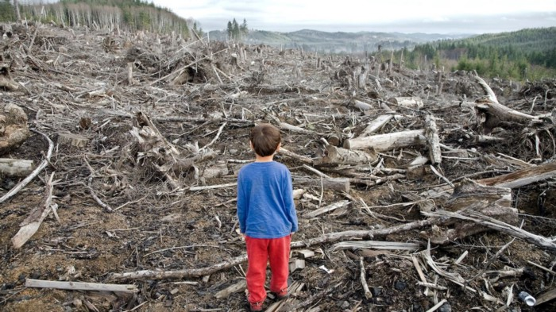

 *Data indicates a massive decline in population and life quality during the 2040s.*

 

 It would be a challenge to find something more credible than an old study that has proven to be correct over many decades — or even centuries.

 Such an accomplishment could be compared to the rock-solid hypotheses that have come out of science, such as Newton’s Law of Gravitation.

 Such a thing is even more impressive if it stands up to the challenges of today’s tools of science.

 
## Limits of growth report (1972)
 A report from the 1970s predicted a global collapse would occur sometime around the 2040s. A new reassessment of this report has indicated that the world is right on track for such an event. The original report stemmed from a bestselling book entitled *The Limits to Growth* published in 1972.

 At that time, a group of MIT scientists emphasized how industrial civilization was sure to burst at the seams and eventually collapse due to the zeal at which corporations and governments continue to seek constant economic growth — at any cost.

 To back up their premise, these researchers predicted twelve potential future scenarios. Most of those included a forecast where the world’s natural resources would get so scarce that all economic growth would cease, and the personal welfare of everyone living on Earth would plummet.

## Business as Usual scenario
 The most infamous scenario from the report was the Business as Usual scenario. This outlook predicted a peak of the world’s economic growth would take place around the 2040s. A sharp downturn would follow the peak in the world’s economy.

 As one might imagine, we would see a drop in global population, natural resources, and food availability. While this imminent collapse would not signal an end to the human race, it would serve as a turning point in society. A turning point that would witness a severe drop in the world’s overall living standards — one that would last for decades.

## Today’s status compared to the collapse forecast
 After almost half a century has passed since these MIT researchers shared their forecasts, and now many wonder how world conditions today compare with them.

 A sustainability and dynamic system analysis researcher from KPMG (a consulting firm) named Gaya Herrington decided to find out. It began with research that she conducted as a graduate student at Harvard University. The research included the analysis of the original 1972 MIT predictions compared to the most up-to-date real-world data.

 Herrington discovered that the world’s current state, as indicated through ten different variables such as pollution levels, fertility rates, population, industrial output, and food production, aligned remarkably close with two of the 1972 collapse scenarios. One of which was the Business as Usual scenario.

## Comprehensive Technology scenario
 The second scenario to which the variables of the world today aligned closely was the Comprehensive Technology scenario. In this case, we would run out of natural resources because of technological advancements designed to increase our food supply and reduce pollution.

 While this scenario would certainly be less of a jolt to the world population and personal welfare, the scarcity of natural resources will still result in a sharp decline of economic growth — or, more precisely, a plummet of industrial society.

## Shocking conclusion
 In either scenario, Herrington concluded in her study that the data shows a halt in growth within the next decade or so. This is simply because the pursuit of continuous economic growth is not sustainable.

 Regardless of which of these two scenarios play out, the world will experience a depletion of its natural resources.

 While capitalists contend that the free markets have always overcome such threats, a solution for this one is long overdue.

## Stabilized World scenario
 However, a small ray of sunshine can be found in one of the original twelve collapse scenarios. The Stabilized World scenario implies that it’s still not too late to avoid either of these scenarios while putting society on track to an alternate outcome.

 The Stabilized World scenario starts just like the other two — where resources decline with growth. But in this case, humans make a personal choice to limit their own economic growth before they are forced to do so from a lack of natural resources.

 This would require a widespread shift in global societal priorities. Issues like smaller family size, birth control availability, industrial output limitations, and higher quality health and education services would need to reach the forefront of society.

## Final thoughts
 Learning that critical variables of today are still in correlation with those doomsday collapse scenarios from the original 1972 findings is *very disturbing*.

 It would be one thing if the recent findings were on an island unto itself, but this is not the case. With a bit of research, we can easily find other studies and results that pretty much substantiate the 1972 findings as well.

 While it’s refreshing to learn that one scenario provides hope and perhaps a path to safety, we still have to overcome human nature. Greed is the reason we’ve reached this untenable position. It’s hard to see those in power backing down anytime soon.

 Secondly, there’s the thought process that all of us have at times. Sometimes we are content to sit back and believe others will take action in our stead. This is especially true during the turbulent conditions of today.

 Hopefully, everyone understands what is at stake.

## References
 - Peter Passell, Marc Roberts, Leonard Ross. (April 2, 1972). The Limits to Growth. https://www.nytimes.com/1972/04/02/archives/the-limits-to-growth-a-report-for-the-club-of-romes-project-on-the.html.
 - Gaya Herrington. (2021). Limits to Growth. https://advisory.kpmg.us/articles/2021/limits-to-growth.html.