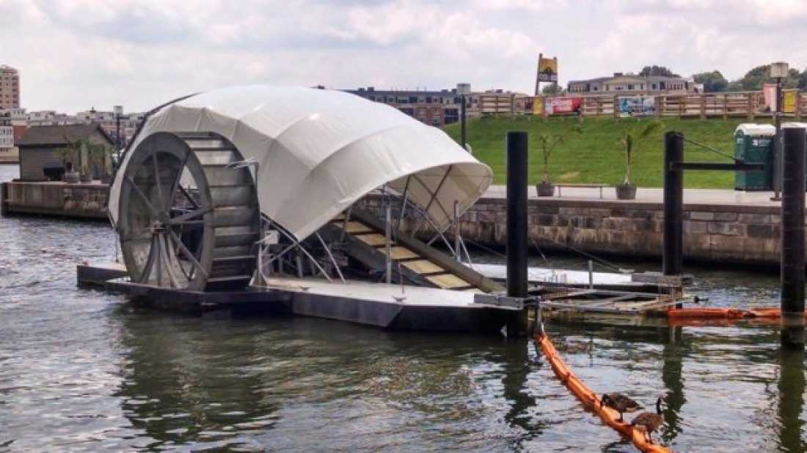


We should have MORE of these in all the major cities around the world!

This way, we can prevent a significant amount of plastic from ruining our economies and environment.


Humans produce around [300 million tons](http://news.sciencemag.org/environment/2014/06/ninety-nine-percent-oceans-plastic-missing) of plastic each year and while the majority ends up in landfills, it is estimated that 0.1% ends up in our oceans. Consequently, there are about [one billion tons](http://qz.com/237830/the-most-promising-technology-for-cleaning-up-ocean-plastic-is-a-giant-wheel/?utm_source=digg&utm_medium=twitter) of plastic in the ocean, concentrating in [5 rotating currents](http://www.theoceancleanup.com/) called gyres. This plastic is a big problem to both the environment and our economy, spurring scientists into looking at ways to tackle the issue.

Recently, we heard of [The Ocean Cleanup](http://www.iflscience.com/environment/19-year-old-develops-machine-clean-oceans-plastic) which designed floating barriers to catch and concentrate the debris. Unfortunately, it will be some years before large-scale pilot tests can be initiated. But there may be another viable solution: the [Water Wheel](http://www.southernfriedscience.com/?p=17362&_ga=1.238528640.1804081251.1406485204).  

The machine was installed at the mouth of a major river that flows into Baltimore’s Inner Harbor back in May. The wheel pulls floating garbage out of the river onto a conveyor belt where it is then deposited into a dumpster barge. If placed correctly, the wheel is capable of capturing trash from an entire watershed, preventing it from ending up in the ocean. What’s more, it’s powered by both current and solar panels, making it an environmentally friendly solution.

The [operating capacity](http://qz.com/237830/the-most-promising-technology-for-cleaning-up-ocean-plastic-is-a-giant-wheel/?utm_source=digg&utm_medium=twitter) of the wheel is 25 tons (23 tonnes) per day; however, it hasn’t been collecting quite that much. Between May 16 and June 16 it collected around 50 tons of garbage from the harbor, ranging from cigarette butts to tires, which would have ultimately ended up in the Atlantic Ocean. Catching plastic at the source, rather than when it has already reached the ocean like other clean-up projects, is also advantageous, especially since we can’t account for 99% of the plastic in the world’s oceans.

Check out this clip of the Water Wheel in operation:
[Via [Quartz](http://qz.com/237830/the-most-promising-technology-for-cleaning-up-ocean-plastic-is-a-giant-wheel/?utm_source=digg&utm_medium=twitter)]

## Mr. Trash Wheel operating in a rain storm (Baltimore, MD) | Video (02:38 minutes)
 Follow Mr. Trash Wheel on social media:
https://twitter.com/mrtrashwheel
https://www.facebook.com/mrtrashwheel
https://www.instagram.com/mrtrashwheel/

Keep up with the Trash Wheel family at MrTrashWheel.com

 
  start: 0,
  allowfullscreen: 1,
  autoplay: 0,
  hl: en,
  cc_lang_pref: en,
  cc_load_policy: 1,
  color: white,
  controls: 1,
  disablekb: 0,
  enablejsapi: 1,
  fs: 0,
  iv_load_policy: 3,
  loop: 0,
  modestbranding: 1,
  playsinline: 0,
  privacy_mode: yes,
  rel: 0,
  showinfo: 0,
  origin: blog.richiebartlett.com,
  widget_referrer: blog.richiebartlett.com

