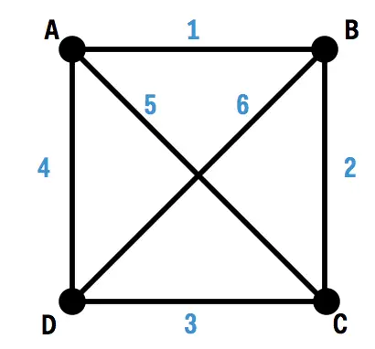
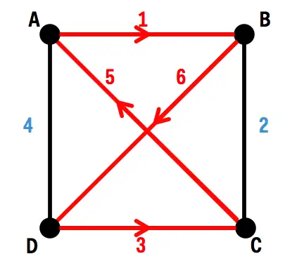
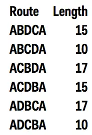


Who ever thought Math doesn't pay?

Solve this "simple" problem and earn an easy $1,000,000 dollars!


# If you can solve this math problem you'll get a $1 million prize — and change internet security as we know it

One of the deepest questions in computer science is called [P vs. NP](http://www.claymath.org/millenium-problems/p-vs-np-problem), and answering the question would earn you a million-dollar prize. P vs. NP is one of the [Clay Mathematics Institute Millennium Prize Problems](http://www.claymath.org/millennium-problems/millennium-prize-problems), seven problems judged to be among the most important open questions in mathematics.

P vs. NP is about finding algorithms, or computer programs, to solve particular math problems, and whether or not "good" algorithms exist to solve these problems. Good algorithms allow a computer to come up with a solution to a problem relatively quickly, even if the size of the input to the problem is very large. Problems for which computer scientists have found good algorithms are said to be in the "complexity class" P.

However, there are a large number of problems for which the best-known algorithms are not efficient, and can take an extremely long time to run on even the fastest computers. Some of these problems have very important applications to computer and industrial design, internet security, and resource allocation. Problems that have a good algorithm for checking a given possible solution but that don't necessarily have a good algorithm for finding solutions are in the complexity class NP.

The million-dollar question is whether the two complexity classes P and NP equal each other. P is contained in NP: Any problem that can be solved quickly by a computer can also have a particular possible answer quickly checked by a computer. The reverse — whether NP is contained in P — is unknown: We don't know whether problems that have a good algorithm for checking answers also have good algorithms for finding answers.

Most computer scientists and mathematicians think that the two classes are not equal: that there are some problems in NP that are not in P. Yet this has never been mathematically proven. Finding efficient algorithms for the hard problems in NP, and showing that P = NP, would dramatically change the world. On the other hand, finding a proof that no such algorithms exist, and that P ≠ NP, would likely involve a huge leap in our understanding of the nature and limitations of computers.

## Easy Problems
There are many useful problems that are in P: We know how to solve them relatively quickly, even for large inputs. For example, every year the [National Resident Matching Program](https://www.nrmp.org/) assigns recent medical-school graduates to hospital-residency programs [using an algorithm Business Insider has described in the past](https://www.businessinsider.com/national-residency-matching-program-algorithm-2014-3). Graduates and programs each make rankings of their preferences. The algorithm takes each unmatched graduate, and tentatively tries to match them with their highest-ranked program.

If the program has space available, it tentatively accepts the graduate. If the program is full but prefers the current applicant to someone on its tentative acceptance list, the program kicks out the lowest-ranked tentative candidate and replaces him or her with the higher-ranked current applicant. The low-ranked candidate who got kicked out is added back to the unmatched graduate pool, where he or she will try to match with the next program on his or her ranking.

In the absolute worst-case scenario, we would have to try matching every graduate with every program that they have on their ranking list. In this scenario, a computer running this algorithm would have to perform a tentative match for each possible pair of applicant and program. This means that the largest number of tentative matches the computer would have to perform would be the number of applicants times the number of residency programs.

This gives us a more formal definition of P. P stands for "polynomial time": An algorithm like residency matching can be run in a number of steps based on a power of the size of the input. Algorithms like this can be run relatively quickly on a computer — while it will take longer for a computer to run the algorithm for a larger input, the number of operations the computer needs to execute grows in a reasonable way. These are our "good" algorithms.

## Hard Problems
Not all problems have known good polynomial time algorithms. An example is the [Traveling Salesman Problem](http://www.csd.uoc.gr/~hy583/papers/ch11.pdf). Here, we consider a set of cities that have some fixed distances between each other, and a salesman who starts in one city and needs to visit the other cities and then come home. The salesman's goal is to find the shortest such tour of the cities. Here's a simple example with four cities and their distances marked in blue (distances are clearly not to scale):

Here's one possible tour our salesman could take through the four cities:

Start at A, walk to B (which has a distance of 1), then across to D (distance 6), then to C (distance 3), then back to A (distance 5). Adding up the distances, the total length of this tour is 1 + 6 + 3 + 5 = 15 units.

We're looking for the shortest path, however. At this point, we can frame this as a related yes-or-no question (formally, P and NP are defined in terms of yes-or-no questions, which are closely related to the kinds of problems we're looking at here): Is there a path shorter than the one above, a path with a total distance of less than 15?

Notice that it's very easy to check any particular route to see if it satisfies our criteria. First, make sure we actually visit all our cities. Second, add up the city-to-city distances to get the total length of the tour, and see if it's less than 15. The fact that it's easy to check a given possible answer means that the Traveling Salesman Problem is in NP.

Since checking a particular path is easy, one possible way to solve this problem is through brute force: Find the length of every possible route that starts and ends at A while visiting the three other cities. Here are all the possible routes in our simple example, with the loops indicated by the order in which we visit the cities (so that, for example, the route above is represented by ABDCA):

The path around the outside of the square, either going ABCDA or ADCBA, is the shortest path with a total length of 10 units.

For four cities, this approach is pretty easy: We had only six routes to consider. That number of routes is not an accident: We are starting at A, and from that point we have three cities to choose from for our first leg: B, C, or D. Once we've chosen the second city to visit, we have two cities left to choose from. After we've chosen a third city from those two, there's just one remaining city to visit. So our number of possible paths is 3 × 2 × 1 = 6.

The same idea for counting paths works as we add more cities. If we have a Traveling Salesman Problem with five cities, we have 4 × 3 × 2 × 1 = 24 paths to look at. If we have six cities, we have 5 × 4 × 3 × 2 × 1 = 120 paths.

As we can already see with these small numbers of cities, the number of paths grows extremely quickly as we add more cities. While it's still easy to take a given path and find its length, the sheer number of possible paths makes our brute-force approach untenable. By the time we have 30 cities, the number of possible paths is about a 9 followed by 30 zeros. A computer that could check a trillion paths per second would take about 280 billion years to check every path, about 20 times the current age of the universe.

There are algorithms for the Traveling Salesman Problem that are much more efficient than this brute-force approach, but they all either provide some kind of approximate "good enough" solution that might not be the actual shortest path, or still have the number of needed calculations grow exponentially with the number of cities, taking an unacceptably long time for large numbers of cities. There is no efficient, polynomial time algorithm known for the problem.

It turns out that there are a large number of problems that are like this: It's easy to check whether a particular candidate solution works for us, but actually finding a solution is much more difficult. As mentioned above, problems for which it's easy to check whether a particular possible answer works are said to be in [the class NP](https://complexityzoo.uwaterloo.ca/Complexity_Zoo:N#np), for "nondeterministic polynomial time."

That "nondeterministic" refers to a computer that, roughly speaking, could make as many copies of itself as needed to solve a given problem. If we had such a computer, we could just make as many copies of the computer as there are possible solutions, and check each one of them in parallel.

## P Versus NP And NP Completeness
The big question is whether or not P = NP: do good, efficient, polynomial time algorithms exist to find solutions to problems that have good checking algorithms?

Answering a question like this at first glance seems excessively broad. There are many NP problems, like the Traveling Salesman, for which no polynomial time algorithm is known. Fortunately, there is a special subset of NP problems with a very interesting property: Finding a polynomial time algorithm for one of these problems would lead to a similarly quick algorithm for any NP problem. These problems are called [NP-complete](https://complexityzoo.uwaterloo.ca/Complexity_Zoo:N#npc).

The basic idea is fairly straightforward. A problem is NP complete if it would be possible to make a good algorithm for any NP problem using a "black box" that could solve the NP complete problem quickly. That is, having an efficient algorithm for an NP complete problem automatically leads to an efficient algorithm for any NP problem.

Many interesting problems, including the Traveling Salesman Problem, are NP complete. This makes answering the million-dollar question somewhat easier: You either need to find an efficient algorithm for one NP complete problem, or prove that no such algorithm exists for one particular such problem.

Most computer scientists think that the latter is true: It's likely that there are no polynomial time algorithms for NP complete problems. But there is no formal proof of this yet, and any such proof would almost certainly involve radical new insights into the nature of computation and algorithms.

The practical implications of this problem, however, could be even more extreme than these theoretical aspects. Many hard problems in NP for which we don't have a good polynomial time algorithm are very useful. The Traveling Salesman Problem from above, for example, has applications in logistics and manufacturing: finding efficient road paths for deliveries, or the most efficient way for a robotic arm to place components on a circuit board. Being able to quickly solve the Traveling Salesman Problem would be very useful in these areas.

## Prime Factors And Internet Security
One of the biggest NP problems for which we don't yet know an efficient algorithm is [factoring integers](http://modular.math.washington.edu/edu/124/misc/arjen_lenstra_factoring.pdf). One of the most basic facts in number theory is that any number can be broken down into a unique product of prime numbers: numbers that are not divisible by any number other than themselves and one. For small numbers, finding factorizations is easy: 15 is 5 × 3; 12 is 2 × 2 × 3; 70 is 2 × 5 × 7.

For larger numbers, however, finding those prime factors can be much more difficult. To see why, consider the most naive possible way to go about factoring a number: Take every number between 2 and one less than the number, and divide the number we're interested in by the smaller number. If this division has no fractional part, or leaves no remainder, then the smaller number is a factor of our number.

This naive brute-force approach works fine for small numbers, but quickly breaks down as we add more digits. For a two-digit number, we have fewer than a hundred possible candidate factors. But for a 10-digit number, we have billions of numbers we need to try out to see if they are factors.

So, the number of possible factors increases exponentially with the number of digits. If we have a number that is the product of two prime numbers with around 100 digits each, the resulting number will have around 200 digits. Taking such a huge product and trying to find the two prime numbers going into that number using the naive brute-force approach would take a nearly unimaginable amount of computing power and time.

As with the Traveling Salesman Problem, [there are better algorithms](https://www.math.vt.edu/people/ezbrown/doc/briggs_gnfs_thesis.pdf) than brute force for factoring extremely large integers. However, none of the currently known algorithms satisfy the gold standard of running in polynomial time.

<!-- Travis Goodspeed via Flickr -->

The integer-factoring problem is particularly important since almost all security on the internet depends on this problem not being easily solvable. The [RSA encryption algorithm](http://people.csail.mit.edu/rivest/Rsapaper.pdf) allows computers to securely communicate with each other over the open internet.

A user randomly chooses two extremely large prime numbers and then multiplies them together. By publishing that product of the two primes along with another number of the user's choosing, other computers can encrypt messages for the user that can ([probably](http://people.csail.mit.edu/rivest/RivestKaliski-RSAProblem.pdf)) only be decrypted if someone knows the two prime numbers. As long as the user keeps those prime numbers secret, they will be the only person who can read messages encrypted with the publicly available product of the primes.

The security of RSA, which is used in many secure online communications, would be completely broken with an efficient integer-factoring algorithm. A hacker with the ability to take the public composite number and quickly find the secret prime factors of that number would be able to decrypt any supposedly secure message sent to the user, such as encrypted emails, or credit-card numbers sent to an online vendor.

Factoring is an NP problem, since a possible solution can be quickly checked: If I have some prime numbers that I think are the factors of a given number, I can just multiply those primes together and see if I actually get my number. This means that if there is an efficient polynomial time algorithm for NP complete problems, large numbers can be factored quickly, and internet security based on RSA or similar protocols would fall apart.

Whether or not P = NP, the insights to be gained by answering this deep question would have tremendous theoretical and practical effects on our understanding of the abilities and limitations of computers, and an answer is certainly worth at least a million dollars.