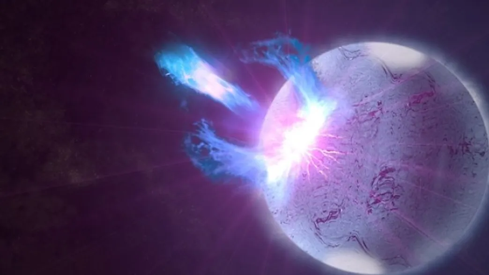


Makes sense...
If we have Earthquakes, moonquakes, and Marsquakes, then it goes with reason that solar masses would also have similar mechanics.
Not sure I would want to be around the Sun when it has a large SunQuake...


Patterns in the high-energy blasts from one of the most extreme star types known are triggered by seismic waves, the stellar equivalent of earthquakes, according to new data.

[Magnetars](http://www.nasa.gov/missions/deepspace/f_magnetars.html) share the small size (20 kilometers in diameter) and [enormous density](http://imagine.gsfc.nasa.gov/docs/science/know_l1/pulsars.html) of other neutron stars, but have magnetic fields that are thousands of times stronger. Since even ordinary neutron stars have magnetic fields trillions of times as powerful as the one that envelops our planet, the power of these fields really do test our imagination.

Magnetars' magnetic fields produce huge bursts in which X-rays and gamma-rays are emitted. Only 23 are known, which is thought to reflect the [short lifespan](http://solomon.as.utexas.edu/~duncan/magnetar.html#Epilog) of the magnetic fields after the magnetar is [formed in a supernova explosion](http://www.nature.com/nature/journal/v502/n7471/full/nature12569.html).

The tight locking of the magentar's field with the incredibly dense crust means that any changes in one triggers a response in the other, leading to powerful bursts of energy that we can view in X-ray or gamma-ray emissions.

Astronomers have been frustrated that in over 35 years of watching magnetars, we have witnessed just three giant flares. However, the Fermi Gamma-ray Space Telescope has offered a different path to study these objects. 

"Fermi's Gamma-ray Burst Monitor (GBM) has captured the same evidence from smaller and much more frequent eruptions called bursts, opening up the potential for a wealth of new data to help us understand how neutron stars are put together," says the University of Amsterdam's astrophysicist Dr. Anna Watts.

The giant flares previously witnessed on magnetars imply starquakes release as much energy as magnitude 23 earthquakes, Watts notes, pointing out that the largest seismic event on Earth was 9.5 on the Richter scale. However, in 2009, the magnetar SGR J1550-5418 produced a string of smaller eruptions, sometimes hundreds in a few minutes, some of which are shown in this video.

## Soft Gamma-Ray Repeater Light Echoes Captured by Swift Satellite | Video (0:21 minutes)
NASA's Fermi Gamma-ray Space Telescope detected a rapid-fire "storm" of high-energy blasts from a highly magnetized neutron star, also called a magnetar, on Jan. 22, 2009. Now astronomers analyzing this data have discovered underlying signals related to seismic waves rippling throughout the magnetar.

In the midst of SGR J1550-5418's 2009 burst storm, Swift's X-Ray Telescope captured an expanding halo produced by the magnetar's brightest bursts. The rings formed as X-rays from the brightest bursts scattered off of intervening dust clouds. Clouds closer to Earth produced larger rings.

Credit: NASA/Swift/Jules Halpern, Columbia Univ.



    start: 0,
    allowfullscreen: 1,
    autoplay: 0,
    hl: en,
    cc_lang_pref: en,
    cc_load_policy: 1,
    color: white,
    controls: 1,
    disablekb: 0,
    enablejsapi: 1,
    fs: 0,
    iv_load_policy: 3,
    loop: 0,
    modestbranding: 1,
    playsinline: 0,
    privacy_mode: yes,
    rel: 0,
    showinfo: 0,
    origin: blog.richiebartlett.com,
    widget_referrer: blog.richiebartlett.com


A study of 63 of these bursts was published in [The Astrophysical Journal](http://iopscience.iop.org/0004-637X/785/1/52). Many of the vibrations Fermi's GBM captured look like fainter versions of the previously observed giant flares, Watts says. "We think these are likely twisting oscillations of the star where the crust and the core, bound by the super-strong magnetic field, are vibrating together." 

However, Watts reports, "We also found, in a single burst, an oscillation at a frequency never seen before and which we still do not understand." 

Just finding the frequencies of the vibrations occurring on SGR J1550-5418 was an achievement, given the noisy environment being studied. Daniela Huppenkothen, who developed the technique for [her Ph.D.](http://www.uva.nl/en/news-events/events/events-calendar/content/phd-defence-ceremonies/2014/10/variability-in-short-magnetar-bursts.html), compares it to being “in the middle of the North Atlantic during a storm, searching for ripples amidst huge waves in a churning sea."  Unsurprisingly, she says, "Our old methods really weren't appropriate for this, but I have in effect developed a way of accounting for the rough sea so we can find ripples even in stormy conditions." 

