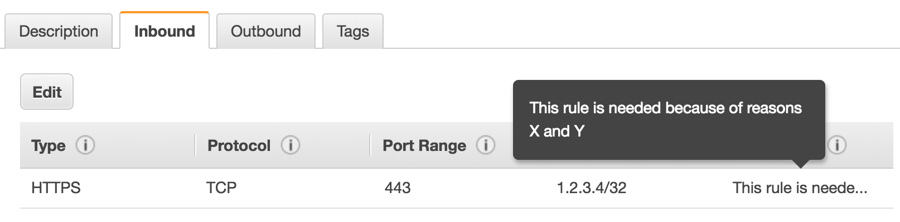

 It's been close to two years since I started working with [AWS CloudFormation](https://aws.amazon.com/cloudformation), the Infrastructure as Code solution by and for AWS. With CloudFormation you can describe and provision your entire AWS infrastructure in code.

 The entire AWS environment I work with is provisioned through CloudFormation - we only have read-only access to our AWS accounts. We now work with a number of different VPCs and many different AWS services. We currently have close to 300 stacks provisioned, describing the foundational networking and over a hundred different applications. All these stacks are deployed in three different accounts (testing, acceptance and production), with CloudFormation giving us the confidence that all these accounts are almost exactly the same (with minor exceptions such as that we run less resources in testing and acceptance to reduce costs).

 I've therefore touched a lot of CloudFormation in the last two years. It's a technology I would definitely recommend anyone to use. I believe in the concept of Infrastructure as Code in general, and CloudFormation certainly has done the job for us.

 As any other technology, CloudFormation isn't perfect and there are some things you can do to make your life easier. I'll discuss some tips and tricks and other things I wish I knew when I started with CloudFormation.


## What you need to know about CloudFormation
### Create a pipeline for custom resources
 You will get into situations where you wish to use a feature for an AWS resource and find that this feature is not yet supported in CloudFormation. Unfortunately, this is one of the bigger caveats for working with CloudFormation. Usually features are added to CloudFormation within a few weeks, but I've seen situations where it takes months until a new feature is added to CloudFormation.

 Luckily, there is a workaround: [custom resources](https://docs.aws.amazon.com/AWSCloudFormation/latest/UserGuide/template-custom-resources.html). In the past I wrote a blog post concerning [writing your own custom resource](https://sanderknape.com/2017/08/custom-cloudformation-resource-example-codedeploy/), and the good thing is that it really isn't that hard. If you're familiar with AWS Lambda, you can easily write a custom resource that adds a missing feature to CloudFormation through using the AWS CLI.

 Of course, you should be using CI/CD and automation to get your Lambda function into your environment. This might mean that there is some overhead attached to creating a custom resource: you need to build a deployment pipeline, write unit tests, pick a language, e.t.c.

 The tip here is to build a single deployment pipeline for all your custom resources once. Use a tool such as AWS SAM or the Serverless framework ([I've compared the two in an earlier blog post](https://sanderknape.com/2018/02/comparing-aws-sam-with-serverless-framework/)) and add any additional custom resources to your project. Per Lambda function you'll need about 10 to 15 lines of code to describe it, and with everything else already set up, you'll have your Lambda functions running in your environment in no time.

 Creating custom resources is a perfectly fine workaround, but cleaning them up after AWS has released the missing feature is also a great feeling. Whenever you miss a feature in CloudFormation, create a feature request at AWS Support. You'll never know what impact your request has made, but at least it can't hurt!


### Use exported values and Parameter Store for re-using configuration
 In software development there is this thing called a “[magic number](https://en.wikipedia.org/wiki/Magic_number_(programming))", which is essentially a number (or string) used without any further explanation of why that specific value is being used.

 For example. Let's say the outgoing IP address of your office is 1.2.3.4. You're using this IP address for a number of different services to whitelist access to only your office. Such a rule would look like this in CloudFormation:

```YAML
HttpSecurityGroupIngress:
    Type: "AWS::EC2::SecurityGroupIngress"
    Properties:
      GroupId: !Ref "PrivateSecurityGroup"
      IpProtocol: "tcp"
      FromPort: 443
      ToPort: 443
      CidrIp: "1.2.3.4/32"
```

 Where is that IP address coming from? Why are you using that IP address? Assuming not everyone knows the office IP by heart, some might not know at all and others might need to think about it for a second or two. But wait, this is YAML! So comments are supported! So instead, you might do the following:

```YAML
CidrIp: "1.2.3.4/32" # Office IP address
```

 This is already better, but still not optimal. You're still hardcoding an IP and with the comment, there is only more to read. So instead, let's do this:

```YAML
CidrIp: !ImportValue "OfficeIpAddress"
```

 [!ImportValue](https://docs.aws.amazon.com/AWSCloudFormation/latest/UserGuide/intrinsic-function-reference-importvalue.html) is one of the intrinsic functions that you can use to import values from another stack. You specify the office IP address in a single stack, export it, and you can easily use it in all your stacks. The benefits here are two-fold;

 * It's easier to read without the need of a comment
 * There is less duplicate code: there are no IP addresses everywhere in your code, but just in a single location.

 One caveat with exported values is that you can not change these while they are being used. This means that if you want to change the value, you need to create a new one, point all uses to the new value, and then remove the old exported value.

 In certain situations this can be fine (or even desired), but there might be situations where you want to be able to change the value at anytime. In that case: use Parameter Store. Parameter Store is a managed key/value store that integrates with CloudFormation [since the end of last year](https://aws.amazon.com/blogs/mt/integrating-aws-cloudformation-with-aws-systems-manager-parameter-store/). You can specify parameters in CloudFormation that are linked to keys in Parameter Store. Check out the [AWS::SSM::Parameter](https://docs.aws.amazon.com/AWSCloudFormation/latest/UserGuide/aws-resource-ssm-parameter.html) type to learn more about this.

 Using constants instead of hardcoded numbers or strings is a general best practice in software development. Let's use these concepts as much as possible when writing Infrastructure as Code as well.


### Use comments and where possible, descriptions
 One of the bigger differences between JSON and YAML is the fact that YAML supports comments. In the previous point I explained how using variables instead of magic values is to be preferred. However, this won't cover all use cases. Therefore, if you feel like your CloudFormation needs some explanation, definitely use a comment. Remember: [code is read much more often than it is written](https://danieljscheufler.wordpress.com/2016/12/27/code-is-read-more-often-than-it-is-written/), so whatever you can write down once to help yourself and others dozens or hundreds of times in the future, do it.

 Let's say that in general, you always enable [versioning for S3 buckets](https://docs.aws.amazon.com/AmazonS3/latest/dev/Versioning.html) to minimize the risk of accidentally loosing files. However, there might be one or two S3 buckets defined in your CloudFormation that don't have this enabled. And for good reason. Someone scrolling through your CloudFormation - potentially even to find something good to copy/paste - might find this resource and wonder why versioning is not enabled. Or even worse: copy the “bad example” and create a bucket without versioning enabled.

 In such a situation: add a comment to the resource. Preferably explicitly disable the setting and append the reason why it is not enabled. Mention that is typically is turned on, but that you didn't do it for this bucket for reasons X and Y. If it's a long story, refer to some internal documentation. This way you keep your documentation close to your code and you make it easy to see that you made an exception from the company policies or guidelines. And you prevent someone from accidentally copying this code.

 Another example here is again for security group rules. In the previous point I gave the example of opening up a service to the office IP address. Why however does the office need access to this resource? This is also something that you can very well add using a comment.

 However, in the case of security rules there is a better option. The [security group rule](https://docs.aws.amazon.com/AWSCloudFormation/latest/UserGuide/aws-properties-ec2-security-group-ingress.html) supports a “description” property. This description is also visible in the AWS Console. The context you're providing for why the security group rule exists is therefore both visible in your CloudFormation *and* in the Console. Therefore, always check if you can add a description to a resource before falling back to comments.

 Check out the following example for adding a security group rule description in CloudFormation:

```YAML
SecurityGroupIngress:
  Type: "AWS::EC2::SecurityGroupIngress"
  Properties:
    Description: "This rule is needed because of reasons X and Y"
    GroupName: !Ref "SecurityGroup"
    IpProtocol: tcp
    FromPort: 443
    ToPort: 443
    CidrIp: !ImportValue "OfficeIpAddress"
```

 


### Know your limits
 CloudFormation comes with a set of [limits](https://docs.aws.amazon.com/AWSCloudFormation/latest/UserGuide/cloudformation-limits.html) that is definitely worth looking at. At first they might seem reasonable but after a while, it's definitely possible you're gonna hit some of them. For example, take an infrastructure stack that contains one or multiple VPCs, subnets, routing tables, NACL rules, e.t.c.. As you're linking up different subnets with routing tables and NACL rules, the number of resources in your stack goes up quickly and might start approaching the limit of 200. I would definitely recommended not putting multiple VPCs in a single stack.

 If you have a stack with many outputs, keep in mind the maximum number of outputs is 60. As I explained in my previous point, you may have a stack with mainly exported values for reusable resources.

 And no: these limits can not be increased. Although I did hear the AWS CloudFormation team is revisiting these limits and considering making some changes here. Let's keep our hopes up.

 My biggest advice is to split up your stacks. The soft limit for the number of stacks is 200, but this limit can be increased. Refactoring your CloudFormation and moving resources between stacks is unfortunately another pain point. Which brings me to the next point.

### Moving and renaming your resources isn't all too great…
 There is no way to move your CloudFormation resources to other stacks, nor to rename them. Once a resource is defined in a stack, the only way to get it in a different stack is by fully re-creating the resource.

 For some resources, this is fine. Take a CodeDeploy application for example: you can create a new one in a new stack and remove the old one (though you will lose the deployment history). If you want to move a load balancer, you also can create it in a new stack, point your CNAME/EIP/e.t.c. to it and remove the old one after a little while. Still relatively easy.

 It gets harder when we start talking about VPCs, subnets or S3 buckets with large amounts of data in them. You can not remove a VPCs or subnets while there are still resources in it. The only way to move an S3 bucket is by creating a new one and syncing all the old data to the new data.

 I'm pretty sure there is a feature request open at the CloudFormation team to deal with these kind of situations. However, for now it's important to realise that when you go with a specific CloudFormation structure, you're pretty much stuck with it unless you accept a lot of re-work and potentially some downtime.

 In addition, you can not easily change the logical name of a resource. The logical name is the “YAML key” of your resource. E.g. in the following example the logical name is “MyCodeDeployApplication”.

```YAML
Resources:
  MyCodeDeployApplication:
    Type: "AWS::CodeDeploy::Application"
    Properties:
      ApplicationName: "app"
```

 CloudFormation isn't aware of “renames”. It just sees a resource removed and a resource added. In fact, if you rename the above CodeDeploy resource, you will get an error that the application “app” already exists as CloudFormation attempts to delete and create in parallel.

 You have two options to deal with these kind of issues;

 * *First add the second resource, then remove the original one*. If you first create the second resource, you can first start “using” that resource (which can mean anything in the context of CloudFormation resources) and then clean up the old one. You might minimize or remove some kind of downtime with this. One thing to keep in mind is that the second resource can not use the same name as the first one (e.g. with the CodeDeploy example: your ApplicationName can not be “app”). This can be annoying if you're following some kind of naming standard that you then have to work around.

 * *First remove the resource, then add the new one*. Depending on the resource it might be fine to just remove it for a few minutes. With a load balancer, this will very likely lead to some downtime. With the CodeDeploy application, you will not be able to deploy your application for a few minutes. It really depends on the resource whether or not this is an option.


### … nor do you want to rename your stack
 Luckily this one shouldn't be that big-of-a-deal in most cases, but it's certainly something to keep in mind: you can not change CloudFormation stack names. The only way to do this is by completely re-creating your stack with the new name. You'll have to recreate all resources in that stack and remove the old ones. As mentioned in my previous point, this will often be a big hassle, potentially with downtime.


## Upgrade your editor
 In your editor, CloudFormation is just YAML. Especially with big files, you might lose the overview and it's easy to make simple mistakes such as wrong indentation. Worst case you'll notice only after you deploy your stack, at which point CloudFormation will tell you something is wrong. Your stack will rollback, resources will be removed/re-added and before you know it, you're 10 minutes further. I always recommend to [shift left](https://en.wikipedia.org/wiki/Shift_left_testing) this kind of feedback in your process. Fail often, fail early.

 Luckily, there are some good resources out there that can help you with this. Friend Matthew Hodgkins recently wrote a blog post about [Upping your CloudFormation with Visual Studio Code](https://hodgkins.io/up-your-cloudformation-game-with-vscode). If you're using another editor, this post is also definitely worth checking out as most tips will also work for other editors. He mainly discusses installing several plugins to make working with YAML easier and has a great tip regarding easy access to CloudFormation documentation.

 My main advice would be to check out the AWS CloudFormation linter and especially the [editor plugins](https://github.com/awslabs/cfn-python-lint#editor-plugins). Yes, your editor can already tell you if you're writing incorrect CloudFormation. Notice a mistake you made that wasn't properly linted? Great news: the linter is open source so contribute your linter check!

## CloudFormation == AWS
 The last tip might seem like common sense, but it's so easy to forget and so easy to underestimate the work you need to put in CloudFormation. When you're writing CloudFormation, you're *actually describing your AWS infrastructure*. This means that you can not write CloudFormation without knowing and understanding the AWS resource you are describing. What might seem just like “a single line of code” in CloudFormation might bring you to hours of investigating which setting you need for your use case. CloudFormation really is just the easy part.

 Take, for example, the `AutomaticFailoverEnabled` property for the [AWS::ElastiCache::ReplicationGroup](https://docs.aws.amazon.com/AWSCloudFormation/latest/UserGuide/aws-resource-elasticache-replicationgroup.html) resource. When diving into what value you should use for this property you will dive into the big world of AWS Redis and whether or not to enable [clustered mode](https://docs.aws.amazon.com/AmazonElastiCache/latest/red-ug/cluster-create-determine-requirements.html). You may think that since Redis is a managed service provided by AWS that there is much less you need to worry about. That's true, but it doesn't mean AWS takes all the worrying away from you. There are still many options to consider and investigations to do to find the optimal, cost-effective solution for your use case.

 CloudFormation can also be a great way to get started with using a new resource. Whenever I start working with a new resource for the first time, the second thing I do (the first thing is just yolo'ing around in the console) is describing the resource in CloudFormation. As you go through all the properties and read into what each of them is about, you've already seen at least 60% of the documentation regarding that resource. It's really a great way to give you both a high-level and an in-depth view of a resource.

 A final tip is to always keep the [CloudFormation resource reference](https://docs.aws.amazon.com/AWSCloudFormation/latest/UserGuide/aws-template-resource-type-ref.html) nearby (bookmark it: now). Especially before AWS released their improved linter, this reference has helped me countless of times when I wasn't sure if I need to write `TopicName` or just `Name` for an SNS Topic and similar situations.


## Conclusion
 CloudFormation is a great tool for describing your AWS Infrastructure as Code. In this post I went through some of the things I learned while working with CloudFormation for the past two years. I hope you've seen a pattern of tips related to general software development best practices (such as when to use comments and the use of a linter). Now that operation teams write more code to describe infrastructure, this is a great example of where development and operations should come together and help each other.

 I'm curious if you have any other tips for working with CloudFormation. Let me know in the comments!

