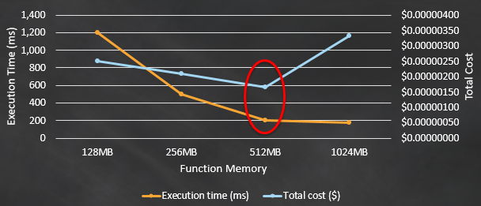

 

 Serverless computing has been a hot topic for the past few years and almost all of the cloud service providers have introduced many serverless services for their users and most of these services have actually made developer’s lives a lot easier than before. But serverless might not be for everyone and every use case because serverless has some downsides of its own.

## Is it Server Less?
 Even though it is called serverless these services have not really eliminated the use of distributed servers as its name suggests. But it has taken all of the responsibilities related to provisioning and maintaining servers from the developers and given them the freedom to just focus on writing and maintaining their code. Therefore serverless is actually supposed to mean that it is not without servers but the user need not worry about servers. In most of these services, users only have to pay for the time which they are using these services which is a huge advantage over traditional servers.

## AWS Lambda
 AWS Lambda is a FaaS ([Function as a Service](https://en.wikipedia.org/wiki/Function_as_a_service)) which is one of the most powerful services provided by Amazon Web Services. Lambda is a serverless compute service that lets its users run their code without provisioning or managing servers. As Lambda is available in all of the popular languages a developer can easily use Lambda to implement their web application backend and does not have to think about provisioning new servers, scaling them, security of the servers and all other things because AWS takes care of all these problems and has given Lambda users to just focus more on their business logic and code is secured and scalable in the application context.

 When it comes to writing code for Lambda it can be helpful to have an understanding of how a lambda function works and then it can help us to identify some of the best practices which need to be followed when using lambda functions and what is the actual importance of each best practice.

## Lambda under the hood
 Lambda service can be split into 2 main parts which are, Control Plane and Data Plane. The control plane is responsible for the management of APIs such as _CreateFunction_, _UpdateFunctionCode_, _PublishLayerVersion_ and also it is responsible for all integrations with other AWS services. Data at rest in the control plane is secured by AWS KMS and TLS has been used to make sure data in transit is protected.

 Data plane is the invoke API for a lambda, it handles invoking and execution of a lambda function. When invoked a data plane will invoke what is called a Lambda Worker which is the execution environment of the lambda which is a type of an EC2 instance. If there is an existing execution environment already set up for that lambda function version then instead of creating a new execution environment the data plane will use the existing worker to execute the lambda code.

 The whole set of workers, worker managers, load balancers are set up to take care of provisioning and managing required to compute instances for Lambda, and it is the responsibility of the application developers to utilize the best practices to make sure their business logic is written in the best possible way to avoid any costly mistakes.

## AWS Lambda best practices
 Best practices for AWS Lambda will be discussed under 3 main pillars in this article. Which are,

 * Function code and dependencies
 * Function configuration
 * Logging and monitoring

## Function code and dependencies
 Under the function code and dependencies, we are discussing some of the best practices which can be used to optimize function execution times, pricing while shedding some light on potential security risks as well.

## Separate the lambda handler from service logic
 The entry point for a lambda function will be its handler function. And 3 variables are passed into this handler function for each lambda triggering event with the first parameter containing all details related to the triggering event. It is a best practice to have the business logic in a separate service layer rather than having it implemented in the handler function itself as it creates the pathway for much clear and readable code and also most importantly it makes it much easier to write unit-testable code for your business logic

## Reuse the execution environment
 Even though lambda workers expire after a specified amount of time, they will be reused as long as they are up and running. Therefore by making sure we take advantage of this reusability execution times can be greatly reduced. Database connections, SDKs can be initialized outside of the handler function while static resources can be saved in the /tmp folder and make sure these are reused so that the time of reinitializing can be saved and it can help to reduce the execution time.

 As we are reusing the execution environment it is important to make sure we don't save any sensitive information in the execution environment as these environments are being reused there can be a potential data leak which can lead to many problems.

## Use environment variables to manage operational parameters
 Environment variables can be used to manage operational parameters such as a name of an S3 bucket rather than hard-coding these into the code so that these lambda functions can be deployed into different environments without updating the code. Even further we can use other AWS services like SSM Parameter Store to store these variables which will make it much easier to manage parameters for different environments especially with other 3rd party frameworks such as serverless.

## Deploy common code to a lambda layer
 A lambda layer is a .zip archive that can contain additional code or data. When setting up the execution environment lambda will extract the content in the layer to the `/opt` directory in the execution environment. By utilizing lambda layers, code and dependencies can be easily shared between multiple functions. And also by adding heavy dependencies such as AWS SDK which probably will be reused in many lambda functions we can greatly reduce the package size of the lambda function which will result in faster deployments.

## Keep an eye on the package size
 As any business grows, applications and business logics handled by these applications grow as well. Therefore the package size of a lambda function will grow with time. As the package size grows it will affect the deployment time and most importantly it can greatly increase the cold start time of the lambda function as well. When a lambda function is created initially all of the dependencies have to be either installed or extracted from a .zip file. This initial time which takes to set up the execution environment is called the cold start and as the package size grows this time will increase and therefore it is important to make sure to keep the package size optimized.

## Avoid using recursive code
 When code is written to invoke the lambda function recursively until a certain criterion is met, this can lead to unexpected amounts of function invocations and escalated costs. Even though lambda functions cost a lot less when compared to an EC2 instance for simple REST API use cases when met with longer execution times, lambda functions can be really expensive. Therefore it is advised to avoid recursive invocations of lambda functions.

## Function configuration
 Lambda is a Function as a Service where developers can develop and deploy their business logic as separate functions. And then the function has to be configured carefully to make sure the function has the required permission and also to make sure the function is executing the business logic in the most optimized way. Following some best practices can be followed to make sure the function is configured in the best possible way.

## One lambda, One IAM role
 Always maintain a 1:1 mapping between lambda and IAM roles. If IAM roles are reused when one function is permitted to access an AWS KMS key then every other function which uses the same IAM role will have access to the KMS rule which might be exploitation waiting to happen. And when creating lambda roles always use the least privilege model and make sure no lambda has additional permissions than what it requires.

## Controlled VPC access for lambda
 Lambda functions always operate inside a shared VPC and can make network requests to any address via the public internet including other AWS APIs. And private VPCs are used to make sure some resources operate in private and to make sure other services are accessing these private resources in a controlled environment. Therefore it is important to make sure only the lambda function which needs access to these resources is enabled VPC access. And also it is important to note that once the function is VPC enabled add traffic coming from the lambda function is subject to the routing rules of the VPC.

## Reserved concurrency for critical functions
 Lambda functions have a default concurrent execution limit of 1000 across all functions in a given region which is a soft limit. And if this limit is reached then the lambda functions start to decline incoming requests. And this can cause some very business-critical functions to fail which can result in revenue loss. Therefore reserved concurrency can be a great option to make sure critical functions are less likely to fail due to the concurrency limit.

 A specific amount of concurrent requests can be saved for a specific Lambda function to make sure that amount is reserved for your business-critical application. Then, even when the concurrent limit is hit, the reserved limit will not be consumed by other function invocations and will be available for the specified business-critical function.

## Find the right balance between memory and execution time
 CPU for Lambda is assigned proportionally to the memory assigned to the lambda function. Therefore sometimes assigning more memory helps a function to execute faster and to reduce costs. But this can be tricky as the memory increases and the costs also increase and it is important to note that after a certain level the reduction of the execution becomes far less significant compared to the rise in cost and clearly depicted in the graph below. Therefore, it is very important to find the correct balance between memory and execution time to make sure lambda operates in an optimized environment.

 

## Logging and Monitoring
 One of the most overlooked parts of using any service is logging and monitoring the service once implemented. After making sure everything is set up and configured properly it is equally important to make sure that everything is running smooth and important metrics are captured to optimize and improve the process/service usage even further.

## Set up AWS CloudWatch logs
 Usually, application logs are generated and viewed in the application server in which the application is deployed in even though this can be debatable when it comes to best practices. This is not possible with lambda since there is no server which the application developers can access. Therefore AWS has set up a mechanism for the lambda functions to be able to save logs to Amazon CloudWatch and with that application developers need to make sure lambda functions are given proper permission to save the logs in CloudWatch. This can be further improved by setting up alerts for any critical logs like errors in production using CloudWatch triggers.

## Setup cloud watch alarms for concurrent requests
 Lambda functions are configured to automatically scale extremely quickly to make sure it is capable of handling the incoming requests. While the concurrency limits can affect the availability of the application, these high number of invocations can also cause higher costs as well. Therefore it is important to keep an eye on when such a higher number of concurrent invocations are received as this might be due to a malicious attack. Therefore setting up cloud watch alarms to monitor _ConcurrentExecutions_ can greatly help to identify such attacks early and also to monitor lambda costs as well.

## AWS X-Ray
 When enabled AWS X-Ray is capable of providing an end to end view of requests as they travel through the application which enables analyzing and debuging lambda based applications. As a result, this enables the identification of performance issues and errors which can help greatly, in the long run, to make sure lambda is running in an optimized environment.

## AWS Config
 AWS Config might not contribute directly to the performance or security enhancement of a lambda function. But AWS Config is capable of tracking configuration changes to a lambda function such as runtime environment details, handler name, code size, security groups associated with, IAM roles, etc. This gives an overall view of a lambda function which might be important for compliance requirements and audits.

## Conclusion
 Lambda is a serverless compute service offered by AWS which is following the model **Function as a Service**. This removes most of the problems which a developer might have to worry about and allows a user to focus more on business logic. At the same time, this might lead a developer to make mistakes when configuring or when writing code due to the different nature of the Lambda execution environment. Therefore it is important to keep the best practices in mind to make sure the business logic is executed in an optimized, secured environment.

## References
 * https://docs.aws.amazon.com/whitepapers/latest/serverless-architectures-lambda/security-best-practices.html

 * https://www.softkraft.co/aws-lambda-architecture/

 * https://docs.aws.amazon.com/lambda/latest/dg/best-practices.html

 * https://aws.amazon.com/blogs/architecture/best-practices-for-developing-on-aws-lambda/

 * https://pages.awscloud.com/rs/112-TZM-766/images/Overview-AWS-Lambda-Security.pdf

 * https://docs.aws.amazon.com/whitepapers/latest/security-overview-aws-lambda/lambda-executions.html

 * https://aws.amazon.com/blogs/compute/using-lambda-layers-to-simplify-your-development-process/